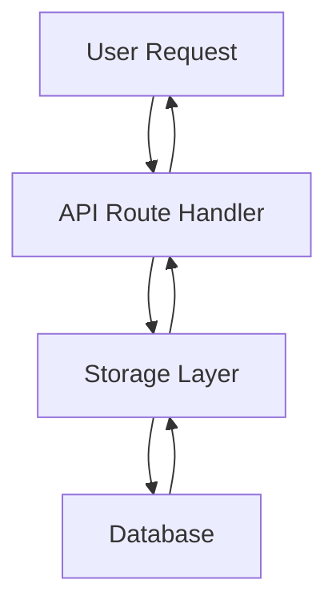
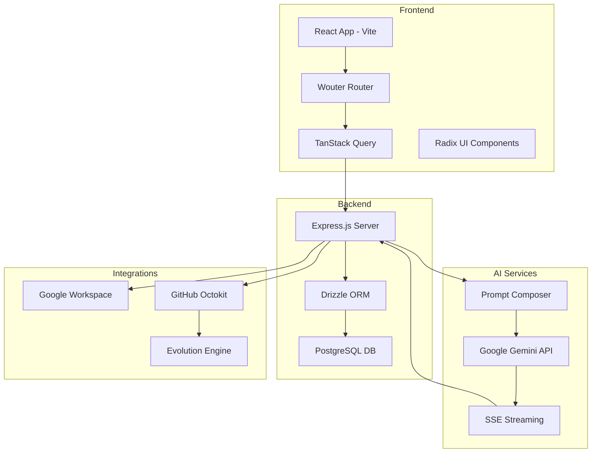

# Meowstik AI Coding Instructions

## 🚨 THE ANTEATER PROTOCOL - Recovery & Refactor Phase

**Repository Status**: This codebase is in a **Recovery & Refactor Phase**. Previously generated by automated agents, it may contain disorganized code, unused dependencies, or incomplete implementations.

**Your Role**: You are the **Lead Architect and Cleanup Crew**. Your goal is to untangle the mess, strictly document the system, and stabilize the application using the Google Gen AI SDK.

---

## 🚀 MANDATORY INITIATION: Full Codebase Audit

Before writing any new feature code, you **MUST** perform a Full Codebase Audit:

1. **Scan**: Read every file in the repository
2. **Glossary**: Create/Update [`docs/refactor/educational_glossary.md`](../docs/refactor/educational_glossary.md) defining every concept, function, and structure found
3. **Reality Check**: Compare the intended logic (comments/docs) against the actual execution flow
4. **Report**: Generate [`docs/refactor/theory_vs_reality_diff.md`](../docs/refactor/theory_vs_reality_diff.md) listing specific discrepancies (The "Diffs")

---

## 🚨 CORE WORKFLOW (Non-Negotiable)

**"Write. Debate. Iterate. Code."**

1. **NEVER** write code immediately
2. **ALWAYS** generate/update a `README.md` or Design Document in the specific feature directory first
3. **Present** the plan (flowchart/text) for user review
4. **Once approved**, write the implementation

---

## 🚧 Handling Incomplete Features

If you encounter an incomplete or broken feature, you **MUST NOT** simply flag it. You **MUST** provide a **Pathway to Resolution** in [`docs/refactor/incomplete_features_audit.md`](../docs/refactor/incomplete_features_audit.md).

**Requirement**: Create an **Illustrated Guide** (ASCII Art, MermaidJS, or detailed steps) showing how to refactor it correctly.

**Output**: An **Implementation Plan** outlining the "Better Way."

---

## 📝 Documentation Standards

### Hyperlinks
- **Every** reference to a function, file, or variable in markdown **MUST** be a hyperlink
- Example: [`server/storage.ts`](../server/storage.ts), [`shared/schema.ts`](../shared/schema.ts)

### Visuals
- Use **MermaidJS** or **ASCII art** for every logic flow
- Example:


### Location
- All architectural docs go into [`docs/refactor/`](../docs/refactor/)
- Feature-specific docs: Every new feature gets a `README.md` in its own folder

---

## 🔍 The "Full Pass" Audit Outputs

When analyzing files, you **MUST** produce/update the following in [`docs/refactor/`](../docs/refactor/):

1. **[Educational Glossary](../docs/refactor/educational_glossary.md)**: A dictionary of every term and variable in the project
2. **[Project Cliff Notes](../docs/refactor/project_cliff_notes.md)**: A high-level summary of the project's capabilities
3. **[Theory vs. Reality Diffs](../docs/refactor/theory_vs_reality_diff.md)**:
   - **Theory**: What the code claims to do (comments, variable names)
   - **Reality**: What the code actually does
   - **Diff**: The gap we need to close
4. **[Incomplete Features Audit](../docs/refactor/incomplete_features_audit.md)**: Features that need resolution pathways

---

## 🛠 Tech Stack Constraints

- **Environment**: Replit (Node.js 20, PostgreSQL 16)
- **AI Engine**: Google Gen AI SDK (Gemini)
- **Security**: Verify firewall/network settings for external API calls (Google AI)

---

## ⚠️ Known Issues / Context

- **Origin**: "Anteater working alone vs. Replit Agent"
- **State**: The code is likely messy. **Do NOT assume previous code is correct**. Verify everything.

---

## 🎯 Interaction Style

- Be **pedantic** about documentation
- Use **hyperlinks aggressively**
- If you see a mess, **flag it and propose the diagram for the fix**

---

## Big Picture Architecture

Meowstik is a full-stack AI assistant platform with deep integrations.

- **Frontend**: React (Vite) + Tailwind CSS + Radix UI. Routing via [`wouter`](https://github.com/molefrog/wouter)
- **Backend**: Express.js server. Database is PostgreSQL managed by Drizzle ORM
- **AI Core**: Google Gemini ([`@google/genai`](https://www.npmjs.com/package/@google/genai)). Responses are streamed via Server-Sent Events (SSE)
- **Integrations**: Google Workspace ([`googleapis`](https://github.com/googleapis/google-api-nodejs-client)), GitHub ([`@octokit/rest`](https://github.com/octokit/rest.js)), and Gemini Live
- **Evolution System**: Feedback-driven self-improvement via GitHub PRs ([`server/services/evolution-engine.ts`](../server/services/evolution-engine.ts))

### Architecture Diagram



---

## Key Files & Directories

### Core Schema & Database
- [`shared/schema.ts`](../shared/schema.ts): **Source of truth** for database tables and Zod validation schemas
- [`server/storage.ts`](../server/storage.ts): Database abstraction layer using the **Repository Pattern**. Use the `storage` singleton

### API Layer
- [`server/routes/`](../server/routes/): Modular API route handlers
  - [`drive.ts`](../server/routes/drive.ts): Google Drive integration
  - [`gmail.ts`](../server/routes/gmail.ts): Gmail integration
  - [`evolution.ts`](../server/routes/evolution.ts): Evolution system endpoints

### AI Services
- [`server/services/prompt-composer.ts`](../server/services/prompt-composer.ts): Assembles system prompts from modular markdown files in [`prompts/`](../prompts/)
- [`prompts/`](../prompts/): Modular markdown prompt files
  - [`core-directives.md`](../prompts/core-directives.md)
  - [`personality.md`](../prompts/personality.md)
  - [`tools.md`](../prompts/tools.md)

### Frontend Components
- [`client/src/pages/preview.tsx`](../client/src/pages/preview.tsx): Sandboxed iframe logic for live code preview
- [`client/src/components/ui/`](../client/src/components/ui/): Shadcn UI components

---

## Project Conventions

### Database Operations
- **Database First**: Always update [`shared/schema.ts`](../shared/schema.ts) first when changing data models
- Use `npm run db:push` to apply schema changes
- **Repository Pattern**: All DB access must go through `IStorage` interface in [`server/storage.ts`](../server/storage.ts)

### API Development
- **API Validation**: Use Zod schemas from [`shared/schema.ts`](../shared/schema.ts) with `req.body` in Express routes
- **Error Handling**: Wrap API routes in try/catch and use the `errorHandler` middleware
- **Modular Routing**: Register new feature routers in [`server/routes/index.ts`](../server/routes/index.ts)

### Frontend Development
- **Frontend State**: Use TanStack Query (`useQuery`, `useMutation`) for all server interactions
- **Routing**: Use `wouter` for client-side routing

### AI Integration
- **AI Streaming**: Implement SSE using `res.setHeader("Content-Type", "text/event-stream")`
- **Prompts**: Do NOT hardcode system prompts. Edit the markdown files in [`prompts/`](../prompts/)

---

## Developer Workflows

### Development
```bash
npm run dev          # Starts full-stack environment
npm run dev:client   # Frontend only (Vite dev server on port 5000)
```

### Database
```bash
npm run db:push      # Apply schema changes to PostgreSQL
```

### Type Checking & Building
```bash
npm run check        # Run TypeScript type checking
npm run build        # Generate production bundle via script/build.ts
npm run start        # Start production server
```

### Testing & Diagnostics
```bash
npm run test:tts-auth      # Test TTS authentication
npm run diagnose:tts-iam   # Diagnose TTS IAM issues
```

---

## Common Patterns

### Repository Pattern Example
```typescript
// ❌ DO NOT access database directly
import { db } from './db';
const chats = await db.select().from(chats);

// ✅ USE the storage singleton
import { storage } from './storage';
const chats = await storage.getChats();
```

### Zod Integration Example
```typescript
import { insertChatSchema } from '@/shared/schema';

app.post('/api/chats', async (req, res) => {
  const result = insertChatSchema.safeParse(req.body);
  if (!result.success) {
    return res.status(400).json({ error: result.error });
  }
  // Proceed with validated data
  const chat = await storage.createChat(result.data);
  res.json(chat);
});
```

### SSE Implementation Example
```typescript
app.get('/api/stream', (req, res) => {
  res.setHeader("Content-Type", "text/event-stream");
  res.setHeader("Cache-Control", "no-cache");
  res.setHeader("Connection", "keep-alive");
  
  // Stream data
  res.write(`data: ${JSON.stringify(chunk)}\n\n`);
  
  // End stream
  res.end();
});
```

### TanStack Query Example
```typescript
import { useQuery, useMutation } from '@tanstack/react-query';

// Fetching data
const { data, isLoading } = useQuery({
  queryKey: ['chats'],
  queryFn: async () => {
    const res = await fetch('/api/chats');
    return res.json();
  }
});

// Mutating data
const mutation = useMutation({
  mutationFn: async (newChat) => {
    const res = await fetch('/api/chats', {
      method: 'POST',
      headers: { 'Content-Type': 'application/json' },
      body: JSON.stringify(newChat)
    });
    return res.json();
  }
});
```

---

## 📚 Additional Documentation

For more detailed documentation, refer to:

- **[System Overview](../docs/SYSTEM_OVERVIEW.md)**: Complete system architecture
- **[Database Schemas](../docs/01-database-schemas.md)**: Detailed database documentation
- **[UI Architecture](../docs/02-ui-architecture.md)**: Frontend architecture
- **[Prompt Lifecycle](../docs/03-prompt-lifecycle.md)**: How prompts are composed and processed
- **[Features](../docs/FEATURES.md)**: Complete feature list
- **[Quick Start](../docs/QUICK_START.md)**: Getting started guide

---

## 🔒 Security Considerations

- Never commit secrets or API keys to the repository
- Use environment variables for sensitive configuration
- Validate all user inputs with Zod schemas
- Sanitize data before database operations
- Use parameterized queries (Drizzle ORM handles this automatically)

---

## 🐛 Debugging

### Common Issues
1. **Database connection errors**: Check PostgreSQL is running and `.env` is configured
2. **TypeScript errors**: Run `npm run check` to see all type errors
3. **Build failures**: Check for missing dependencies or outdated imports
4. **API errors**: Check Express middleware order and error handlers

### Useful Commands
```bash
# Check database connection
psql $DATABASE_URL

# View running processes
ps aux | grep node

# Check logs
tail -f logs/*.md
```

---

## 🎓 Learning Resources

- [Drizzle ORM Documentation](https://orm.drizzle.team/)
- [Google Gemini API Docs](https://ai.google.dev/docs)
- [TanStack Query](https://tanstack.com/query/latest)
- [Wouter Router](https://github.com/molefrog/wouter)
- [Radix UI](https://www.radix-ui.com/)
