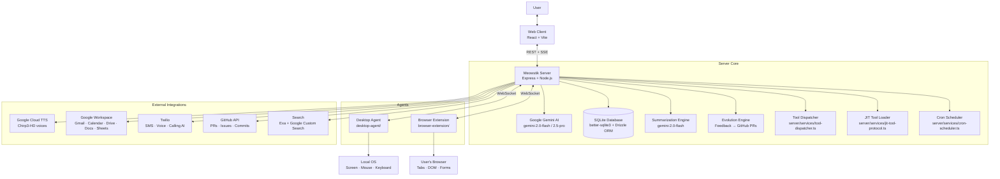
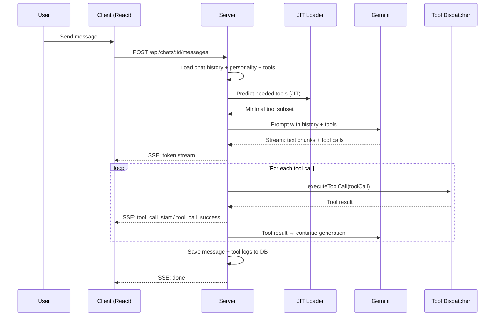
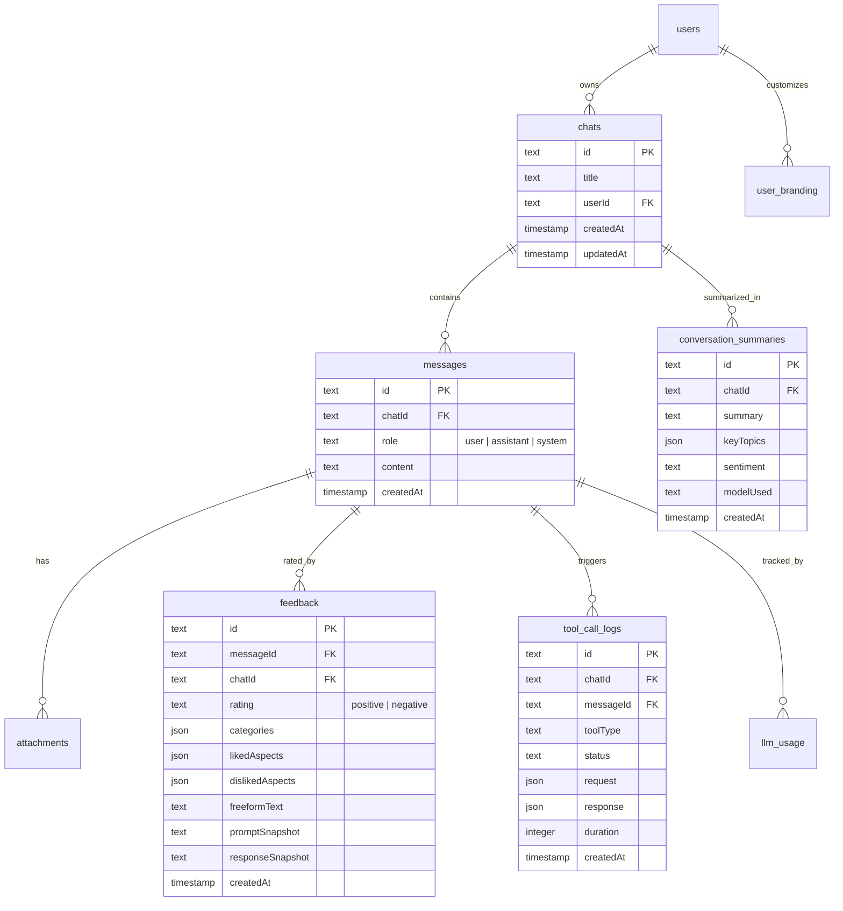

# Architecture

Meowstik uses a hub-and-spoke architecture. The **server** is the single orchestration point — it runs the AI inference pipeline, dispatches tool calls, manages state, and coordinates all connected agents.

---

## System Overview



---

## Request Lifecycle

Every chat message goes through this pipeline:



---

## Directory Structure

```
Meowstik/
├── server/                     # Express backend (port 5000)
│   ├── index.ts                # App entry point
│   ├── routes.ts               # All HTTP routes (~2300 lines)
│   ├── storage.ts              # Database abstraction (Drizzle ORM)
│   ├── db.ts                   # SQLite connection
│   ├── gemini-tools.ts         # Tool declarations for Gemini function calling
│   ├── integrations/           # Third-party service connectors
│   │   ├── expressive-tts.ts   # Google Cloud TTS (Chirp3-HD)
│   │   ├── gemini-live.ts      # Gemini Live streaming API
│   │   ├── gmail.ts            # Gmail API
│   │   ├── google-calendar.ts  # Calendar API
│   │   ├── google-drive.ts     # Drive API
│   │   ├── google-docs.ts      # Docs API
│   │   ├── google-sheets.ts    # Sheets API
│   │   ├── google-contacts.ts  # People API
│   │   ├── github.ts           # GitHub Octokit
│   │   ├── twilio.ts           # Twilio SMS/Voice
│   │   ├── web-search.ts       # Google + Exa search
│   │   └── ...
│   └── services/               # Core business logic
│       ├── tool-dispatcher.ts  # Executes Gemini tool calls
│       ├── evolution-engine.ts # Feedback → patterns → PRs
│       ├── summarization-engine.ts  # Conversation/feedback summarization
│       ├── jit-tool-protocol.ts    # Just-in-time tool selection
│       ├── prompt-composer.ts      # Assembles LLM context
│       ├── cron-scheduler.ts       # Scheduled task runner
│       ├── computer-use.ts         # Vision-based desktop automation
│       ├── ssh-service.ts          # SSH session management
│       └── ...
├── client/                     # React frontend (Vite)
│   ├── src/pages/              # Route pages
│   ├── src/components/         # UI components
│   └── src/hooks/              # React hooks
├── shared/                     # Shared types between server + client
│   └── schema.ts               # Drizzle table definitions + Zod schemas
├── desktop-agent/              # Node.js OS control agent
├── browser-extension/          # Chrome extension
├── prompts/                    # LLM system prompt fragments
│   ├── personality.md          # Character + communication style
│   ├── core-directives.md      # Operational instructions
│   └── tools.md                # Tool usage instructions
└── docs/                       # This documentation
```

---

## Database Schema (Core Tables)



---

## Prompt Assembly

The system prompt is assembled dynamically per request by `server/services/prompt-composer.ts`:

1. **Core directives** (`prompts/core-directives.md`) — operational rules
2. **Personality** (`prompts/personality.md`) — character, tone, voice style tags
3. **Tool instructions** (`prompts/tools.md`) — how to use tools correctly
4. **User branding** — custom persona name/style if user has configured it
5. **Chat history** — recent messages (windowed)
6. **Attachments** — any files/images in the current message

---

## Real-time Communication

The server uses **Server-Sent Events (SSE)** for streaming:

```
POST /api/chats/:id/messages
  → Response: text/event-stream

Events emitted:
  data: {"type": "token", "content": "..."} 
  data: {"type": "tool_call_start", "toolCallId": "...", "toolType": "..."}
  data: {"type": "tool_call_success", "toolCallId": "...", "duration": 123}
  data: {"type": "tool_call_failure", "toolCallId": "...", "error": "..."}
  data: {"type": "done"}
```

Desktop Agent and Browser Extension use **WebSockets** for bidirectional communication.
