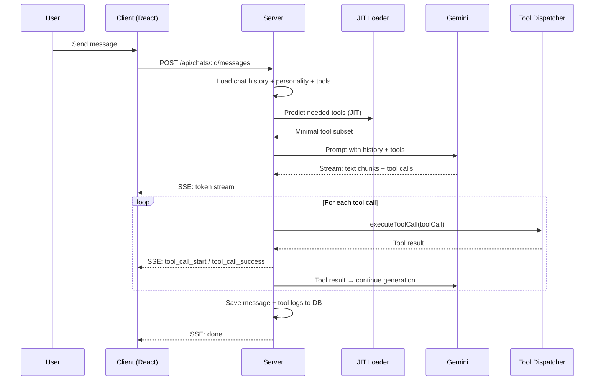
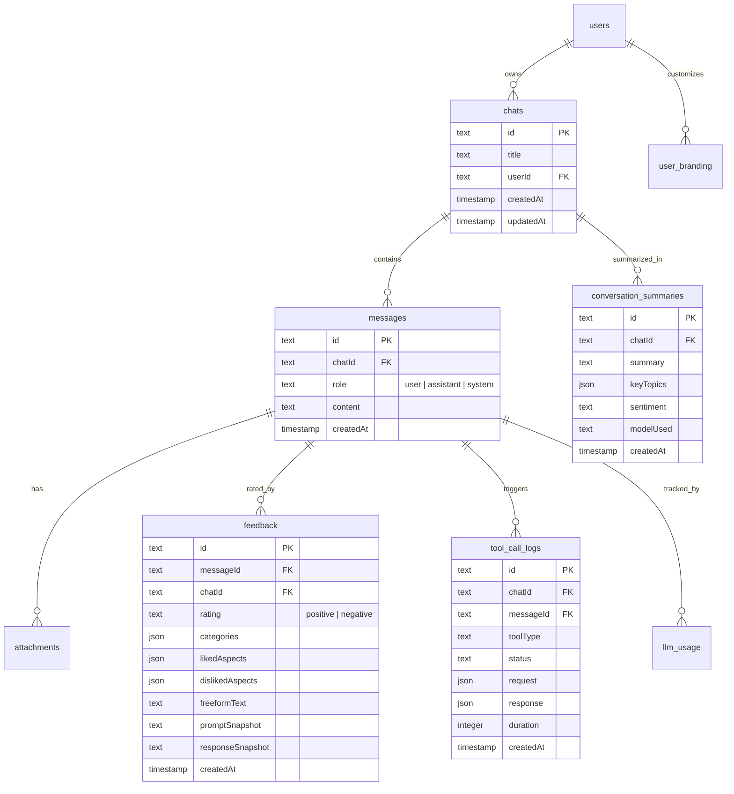

# Architecture

Meowstik is now best understood as a **local-first runtime**. The codebase still contains clear frontend/backend boundaries for development, but for a local install the important model is one app/runtime coordinating UI, tools, memory, and integrations.

Older references to **server**, **client**, or **desktop agent** in this document should be read as implementation details or optional relay paths.

---

## System Overview

```mermaid
graph TD
    User[User] <--> Runtime[Meowstik Local Runtime]

    subgraph "Runtime Core"
        Runtime --> Client[React UI\nVite]
        Runtime --> Server[Node Services\nExpress + Node.js]
        Server --> Gemini[Google Gemini AI\ngemini-2.0-flash / 2.5-pro]
        Server --> TTS[Google Cloud TTS\nChirp3-HD]
        Server --> DB[(SQLite Database\nbetter-sqlite3 + Drizzle ORM)]
        Server --> Memory[logs/Short_Term_Memory.md\nFile-based session memory]
        Server --> SE[Summarization Engine\ngemini-2.0-flash]
        SE --> EE[Evolution Engine\nFeedback → GitHub PRs]
        Server --> Dispatcher[Tool Dispatcher\nserver/services/tool-dispatcher.ts]
        Server --> JIT[JIT Tool Loader\nserver/services/jit-tool-protocol.ts]
        Server --> Cron[Cron Scheduler\nserver/services/cron-scheduler.ts]
        Server --> CU[Computer Use\ncomputer-use + desktop-service]
    end

    subgraph "Optional Connections"
        Server <-->|"MCP"| MCP[MCP Servers]
        Server <-->|"WebSocket"| Extension[Browser Extension\nbrowser-extension/]
        Server <-->|"WebSocket"| Desktop[Desktop Relay\nlegacy/advanced]
    end

    subgraph "External"
        Server <-->|"SMS/Voice"| Twilio[Twilio]
        Server <-->|"SSH"| SSH[SSH Gateway\nRemote Servers]
        Server --> GWorkspace["Google Workspace\nGmail · Calendar · Drive · Docs · Sheets"]
        Server --> GitHub["GitHub API\nPRs · Issues · Commits"]
        Server --> Search["Web Search\nExa + Google CSE"]
    end

    CU --> LocalOS["Local OS\nScreen · Mouse · Keyboard"]
    Extension --> Browser["User's Browser\nTabs · DOM · Forms"]
```



---

## Request Lifecycle

Every chat message goes through this pipeline:



---

## Directory Structure

```
Meowstik/
├── server/                     # Express backend (port 5000)
│   ├── index.ts                # App entry point
│   ├── routes.ts               # All HTTP routes (~2300 lines)
│   ├── storage.ts              # Database abstraction (Drizzle ORM)
│   ├── db.ts                   # SQLite connection
│   ├── gemini-tools.ts         # Tool declarations for Gemini function calling
│   ├── integrations/           # Third-party service connectors
│   │   ├── expressive-tts.ts   # Google Cloud TTS (Chirp3-HD)
│   │   ├── gemini-live.ts      # Gemini Live streaming API
│   │   ├── gmail.ts            # Gmail API
│   │   ├── google-calendar.ts  # Calendar API
│   │   ├── google-drive.ts     # Drive API
│   │   ├── google-docs.ts      # Docs API
│   │   ├── google-sheets.ts    # Sheets API
│   │   ├── google-contacts.ts  # People API
│   │   ├── github.ts           # GitHub Octokit
│   │   ├── twilio.ts           # Twilio SMS/Voice
│   │   ├── web-search.ts       # Google + Exa search
│   │   └── ...
│   └── services/               # Core business logic
│       ├── tool-dispatcher.ts  # Executes Gemini tool calls
│       ├── evolution-engine.ts # Feedback → patterns → PRs
│       ├── summarization-engine.ts  # Conversation/feedback summarization
│       ├── jit-tool-protocol.ts    # Just-in-time tool selection
│       ├── prompt-composer.ts      # Assembles LLM context
│       ├── cron-scheduler.ts       # Scheduled task runner
│       ├── computer-use.ts         # Vision-based desktop automation
│       ├── ssh-service.ts          # SSH session management
│       └── ...
├── client/                     # React frontend (Vite)
│   ├── src/pages/              # Route pages
│   ├── src/components/         # UI components
│   └── src/hooks/              # React hooks
├── shared/                     # Shared types between server + client
│   └── schema.ts               # Drizzle table definitions + Zod schemas
├── desktop-agent/              # Node.js OS control agent
├── browser-extension/          # Chrome extension
├── prompts/                    # LLM system prompt fragments
│   ├── personality.md          # Character + communication style
│   ├── core-directives.md      # Operational instructions
│   └── tools.md                # Tool usage instructions
└── docs/                       # This documentation
```

---

## Database Schema (Core Tables)



---

## Prompt Assembly

The system prompt is assembled dynamically per request by `server/services/prompt-composer.ts`:

1. **Agent identity** — runtime branding (`You are {displayName}, referred to as {agentName}`)
2. **Environment metadata** — machine/runtime context from `formatEnvironmentMetadata()`
3. **Core directives** (`prompts/core-directives.md`) — operational rules
4. **Personality** (`prompts/personality.md`) — character, tone, voice style tags
5. **Tool instructions** (`prompts/tools.md`) — how to use tools correctly
6. **Short-term memory** — `logs/Short_Term_Memory.md` when present
7. **Recent execution history** — tail of `logs/execution_log.md` when present
8. **Database-backed to-do list** — pending/in-progress tasks for the current user
9. **Family context** — injected by `getFamilyContext()` when present
10. **Thoughts forward cache** — `logs/cache.md` from the last turn when enabled
11. **External skills summary** — discovered instruction/skill summaries from `externalSkillsService`
12. **Final instructions** — mandatory end-of-turn instructions appended by `getFinalInstructions()`

Only three prompt files are currently loaded from `prompts/`: `core-directives.md`, `personality.md`, and `tools.md`. Earlier stray files in that directory that were not referenced by the runtime loader were removed.

---

## Real-time Communication

The server uses **Server-Sent Events (SSE)** for streaming:

```
POST /api/chats/:id/messages
  → Response: text/event-stream

Events emitted:
  data: {"type": "token", "content": "..."} 
  data: {"type": "tool_call_start", "toolCallId": "...", "toolType": "..."}
  data: {"type": "tool_call_success", "toolCallId": "...", "duration": 123}
  data: {"type": "tool_call_failure", "toolCallId": "...", "error": "..."}
  data: {"type": "done"}
```

Desktop Agent and Browser Extension use **WebSockets** for bidirectional communication.

---

## Memory System

Meowstik has **two distinct memory layers** that serve different purposes:

### 1. Short-Term Memory (File-Based)

**Location:** `logs/Short_Term_Memory.md`  
**Managed by:** `server/services/prompt-composer.ts`

This is a human-readable markdown file that is loaded verbatim into the system prompt on every turn. The AI can write to it (and other `logs/` files) to persist context across sessions.

```
logs/
├── Short_Term_Memory.md   ← main memory file, injected into every prompt
├── STM_APPEND.md          ← AI writes here; auto-appended to STM and deleted
├── cache.md               ← thoughts-forward from last turn
└── *.md                   ← named log files (via `append` tool)
```

**How it works:**
1. On each request, `prompt-composer.ts` reads `Short_Term_Memory.md`
2. If `STM_APPEND.md` exists, its contents are appended to `Short_Term_Memory.md` and it is deleted
3. Both the memory and cache are included in the assembled system prompt

**What the AI stores here:** user preferences, ongoing tasks, names, facts the user wants remembered, session continuity notes.

### 2. Conversation Summaries (Database)

**Location:** `conversation_summaries` table in SQLite  
**Managed by:** `server/services/summarization-engine.ts`

Structured AI-generated summaries produced by the Summarization Engine. These are used by the **Evolution Engine** for pattern analysis — not for live prompt injection.

| Layer | Purpose | Storage | Injection point |
|-------|---------|---------|-----------------|
| Short-Term Memory | Session context, user facts | `logs/Short_Term_Memory.md` | Every prompt |
| Conversation Summaries | Pattern analysis feed | SQLite `conversation_summaries` | Evolution Engine only |
