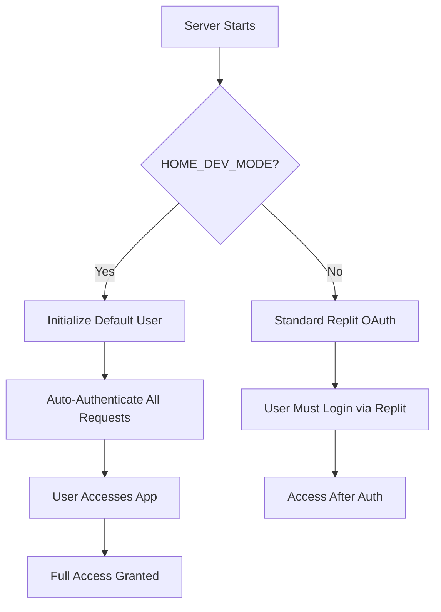

# Home Dev Mode - Developer Authentication Bypass

## Overview

Home Dev Mode is a simplified authentication system designed specifically for local development environments. It bypasses the standard Replit OAuth flow and auto-logs you in as a default developer user.

## ⚠️ Security Warning

**NEVER enable HOME_DEV_MODE in production environments!**

This mode completely bypasses authentication and should ONLY be used on your local development machine where you have full control over who accesses the application.

## Setup

### 1. Enable Home Dev Mode

Add the following to your `.env` file:

```bash
HOME_DEV_MODE=true
```

### 2. (Optional) Customize Developer Email

By default, the developer user email is `developer@home.local`. You can customize it:

```bash
HOME_DEV_EMAIL=your-email@example.com
```

### 3. Start the Server

```bash
npm run dev
```

### 3. Access the Application

Navigate to `http://localhost:5000` in your browser. You will be automatically logged in as the default developer user.

## How It Works

### Backend

1. **Initialization**: When the server starts with `HOME_DEV_MODE=true`, it automatically creates a default developer user in the database:
   ```typescript
   {
     id: "home-dev-user",
     email: process.env.HOME_DEV_EMAIL || "developer@home.local",
     firstName: "Developer",
     lastName: "User"
   }
   ```

2. **Authentication Middleware**: The `checkAuthStatus` middleware automatically attaches developer credentials to all requests, bypassing the standard authentication flow.

3. **Protected Routes**: The `isAuthenticated` middleware allows all requests through when in home dev mode.

### Frontend

1. **Login Page**: The login page detects home dev mode by attempting to access the `/api/auth/user` endpoint without credentials.

2. **Auto-Redirect**: If the endpoint is accessible (indicating home dev mode), the login page automatically redirects to the home page.

3. **User Context**: The `useAuth` hook works normally, returning the auto-authenticated developer user.

## Architecture



## Files Modified

### Server-Side

- **`server/homeDevAuth.ts`**: New module implementing home dev authentication logic
- **`server/routes/middleware.ts`**: Updated `checkAuthStatus` to support home dev mode
- **`server/replitAuth.ts`**: Updated `isAuthenticated` to bypass checks in home dev mode
- **`server/index.ts`**: Added home dev mode initialization on server startup

### Client-Side

- **`client/src/pages/login.tsx`**: Added home dev mode detection and auto-redirect

### Configuration

- **`.env.example`**: Added `HOME_DEV_MODE` documentation

## Benefits

1. **No OAuth Setup Required**: Skip the complex OAuth configuration for local development
2. **Faster Development**: No login required - immediate access to the application
3. **Full Feature Access**: Access all authenticated features without restrictions
4. **Simple Toggle**: Enable/disable with a single environment variable

## Limitations

1. **Single User Only**: All requests are authenticated as the same default developer user
2. **No Multi-User Testing**: Cannot test multi-user scenarios in home dev mode
3. **No Session Management**: Sessions are mocked and don't persist across server restarts

## Reverting to Standard Auth

To disable home dev mode and use standard Replit authentication:

1. Set `HOME_DEV_MODE=false` (or remove the variable) in your `.env` file
2. Restart the server
3. You will need to login via Replit OAuth

## Troubleshooting

### Problem: Auto-login not working

**Solution**: Ensure `HOME_DEV_MODE=true` is set in your `.env` file and restart the server.

### Problem: Database errors about missing user

**Solution**: The default user is created automatically on startup. Check the server logs for any initialization errors.

### Problem: Still seeing login page

**Solution**: Clear your browser cache and cookies, then refresh. The login page should detect home dev mode and redirect automatically.

## Comparison: Home Dev Mode vs. Standard Auth

| Feature | Home Dev Mode | Standard Auth |
|---------|---------------|---------------|
| Setup Complexity | Minimal (1 env var) | Complex (OAuth config) |
| Login Required | No | Yes |
| Multi-User Support | No | Yes |
| Session Persistence | Mocked | Full |
| Production Ready | ❌ NO | ✅ Yes |
| Local Development | ✅ Recommended | Optional |

## Related Files

- <a href="../server/homeDevAuth.ts">`server/homeDevAuth.ts`</a> - Home dev auth implementation
- <a href="../server/routes/middleware.ts">`server/routes/middleware.ts`</a> - Auth middleware
- <a href="../server/replitAuth.ts">`server/replitAuth.ts`</a> - Standard Replit auth
- <a href="../client/src/pages/login.tsx">`client/src/pages/login.tsx`</a> - Login page
