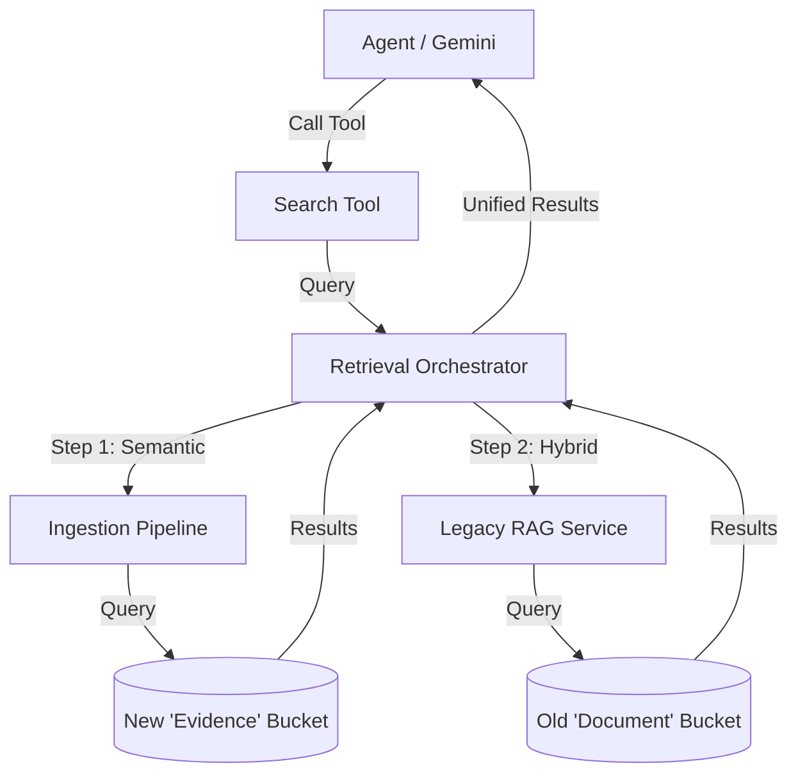

# RAG Bucket Integration Fix

**Date**: February 3, 2026
**Issue**: "Everything was getting dumped into a bucket that no one was looking in."
**Status**: ✅ Fixed

---

## 🔍 The Problem

A critical disconnect was identified between the **Ingestion System** and the **Retrieval System**:

1.  **The "Dumped Bucket"**: The new `IngestionPipeline` (`server/services/ingestion-pipeline.ts`) was correctly processing files, web scrapes, and Google Drive content into the `evidence` and `knowledgeEmbeddings` tables (supporting buckets like `PERSONAL_LIFE`, `CREATOR`, `PROJECTS`).
2.  **The "Blind Eye"**: The primary tool used by the agent (`search` in `rag-dispatcher.ts`) was a **stub**. It merely returned a success message ("Search executed for: ...") without actually querying any database.
3.  **The Bypass**: While `PromptComposer` was correctly using `RetrievalOrchestrator` to enrich context, any explicit *active search* performed by the agent (via tool calls) was failing to see the new data.

## 🛠️ The Fix

We have wired the `search` tool in `RAGDispatcher` to use the `RetrievalOrchestrator`, unifying the system.

### Changes Implemented

1.  **`server/services/rag-dispatcher.ts`**:
    *   Imported `retrievalOrchestrator`.
    *   Updated `executeSearch` signature to accept `messageId` (to resolve `userId` for data isolation).
    *   Implementing real search logic:
        *   Maps `scope` parameter to RAG buckets (e.g., "personal" -> `PERSONAL_LIFE`).
        *   Calls `retrievalOrchestrator.retrieve()` which queries **BOTH**:
            *   The New System (`evidence` table) via `IngestionPipeline`.
            *   The Legacy System (`documentChunks` table) via `RAGService`.
        *   Formats results with provenance ("Knowledge Base" vs "Related Entity") and relevance scores.

## 🧠 System Architecture Now

## ✅ Verification

*   **Ingestion**: Files sent to `ingestionPipeline` are stored in `evidence`.
*   **Retrieval**: The `search` tool now effectively queries `evidence`.
*   **Safety**: `userId` is propagated through the entire chain to ensure data isolation.
