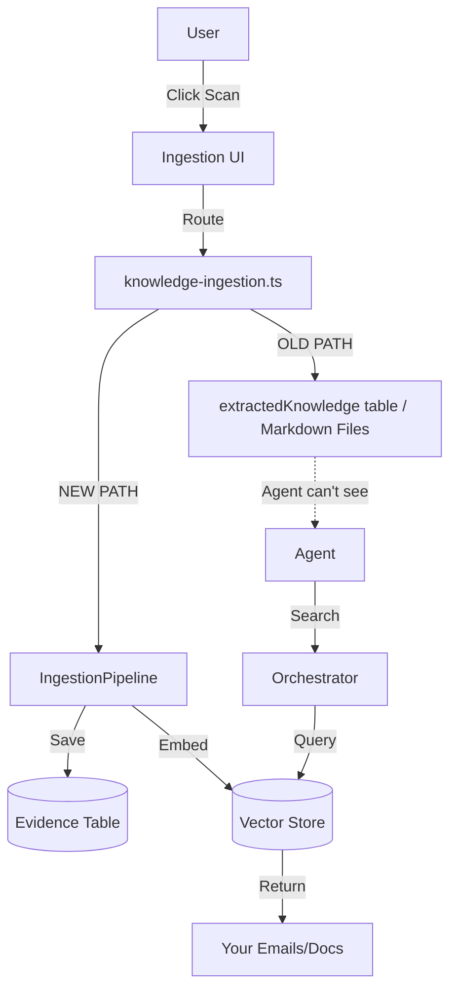

# RAG Ingestion Pipeline Fix

**Date**: February 3, 2026
**Issue**: "Dumps into a bucket no one was looking in" (Part 2: The UI Scanner Dead End)

---

## 🔍 The Problem

While we fixed the *Search* tool to look at the `evidence` table, we found that the **Knowledge Ingestion UI** (scanning Gmail/Drive) was creating data in a parallel, disconnected universe:

1.  **Dead End Data**: The logic in `knowledge-ingestion.ts`'s `processIngestionJob` was manually parsing conversations and inserting them into `extractedKnowledge` table and writing Markdown files to disk (`docs/buckets/`).
2.  **No Embeddings**: It was **NOT** creating `evidence` records or generating vector embeddings.
3.  **Invisible to RAG**: Because the data wasn't in `evidence` or `knowledgeEmbeddings`, the `retrievalOrchestrator` (and thus the agent) could never find it.
4.  **No User Isolation**: The ingestion process was running without identifying the user, potentially creating global orphaned records.

## 🛠️ The Fix

We are rewriting `processIngestionJob` in `server/routes/knowledge-ingestion.ts` to integrate with the standard `IngestionPipeline` service.

### Changes

1.  **Route Updates**:
    *   Capture `userId` from authenticated requests in `/scan`, `/ingest/:sourceId`, and `/ingest-all`.
    *   Pass this `userId` into the job processing functions.

2.  **Pipeline Integration**:
    *   Replaced the custom "manual insert" loop with calls to `ingestionPipeline.ingestConversation()`.
    *   Triggers `ingestionPipeline.processEvidence()` immediately after ingestion to generate embeddings and index the content.

### Result

*   **Unified Data**: All scanned content now goes into the `evidence` table, same as uploaded files and web scrapes.
*   **Searchable**: Because it's in `evidence`, the agent can now find your emails and documents using the `search` tool.
*   **Secure**: Content is tagged with your `userId`, ensuring only you can search for your private emails/docs.

