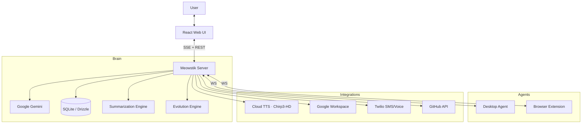

# Meowstik Documentation

> **AI Personal Assistant & Meta-Agent Platform**

Meowstik is a personal AI assistant built on Google Gemini. It's not just a chat app — it gives the AI real agency over your digital world: browsing the web, running shell commands, reading and sending email, controlling your desktop, making phone calls, and continuously improving itself through feedback.

---

## Documentation Index

| Document | What it covers |
|----------|---------------|
| **[QUICK_START.md](./QUICK_START.md)** | Get running in 5 minutes |
| **[ARCHITECTURE.md](./ARCHITECTURE.md)** | System design, data flow, component overview |
| **[FEATURES.md](./FEATURES.md)** | Full feature list with status |
| **[TOOLS.md](./TOOLS.md)** | Every tool Gemini can call, with parameters |
| **[TTS.md](./TTS.md)** | Voice synthesis — Chirp3-HD, voices, expressive styles |
| **[SUMMARIZATION_ENGINE.md](./SUMMARIZATION_ENGINE.md)** | Conversation & feedback summarization |
| **[EVOLUTION_ENGINE.md](./EVOLUTION_ENGINE.md)** | Self-improvement loop via feedback → GitHub PRs |
| **[AGENTS.md](./AGENTS.md)** | Desktop Agent and Browser Extension setup |
| **[INTEGRATIONS.md](./INTEGRATIONS.md)** | Google, Twilio, GitHub, ElevenLabs |
| **[DEPLOYMENT.md](./DEPLOYMENT.md)** | Local dev, Replit, env vars |
| **[copilot/index.md](./copilot/index.md)** | Instructions for GitHub Copilot working on this repo |

---

## What Meowstik Is

Meowstik is a **hub-and-spoke meta-agent platform**. The server is the central brain; agents ("limbs") connect via WebSocket to receive instructions and stream results back.

```
User ──► Web UI ──► Server (Express + Gemini + SQLite)
                       │
            ┌──────────┼──────────┐
            ▼          ▼          ▼
       Desktop      Browser     Twilio
        Agent      Extension   SMS/Voice
       (OS ctrl)  (tab ctrl)  (phone AI)
```

The AI has direct tool access to: filesystem, shell, Gmail, Google Calendar/Drive/Docs, GitHub, phone calls, web search, desktop clicks, database queries, and more.

---

## Architecture in One Diagram



---

## Current Tech Stack

| Layer | Technology |
|-------|-----------|
| AI Model | Google Gemini (`gemini-2.0-flash`, `gemini-2.5-pro`) |
| Backend | Node.js 20 + Express 4 |
| Database | SQLite via `better-sqlite3` + Drizzle ORM |
| Frontend | React 18 + Vite + Tailwind CSS + shadcn/ui |
| Voice | Google Cloud TTS Chirp3-HD |
| Real-time | Server-Sent Events (SSE) |
| Auth | Google OAuth 2.0 + `passport` |

---

## Key Design Principles

1. **Real tools, not simulated** — Gemini calls actual functions that execute against real systems
2. **Cheap inference for routine work** — Gemini Flash for summarization/classification, Pro for complex reasoning
3. **Self-improvement loop** — feedback → summarization → pattern analysis → GitHub PRs
4. **Personality over plain text** — expressive voice styles make TTS responses feel natural
5. **Human in the loop** — Evolution Engine creates PRs for review, never auto-merges
