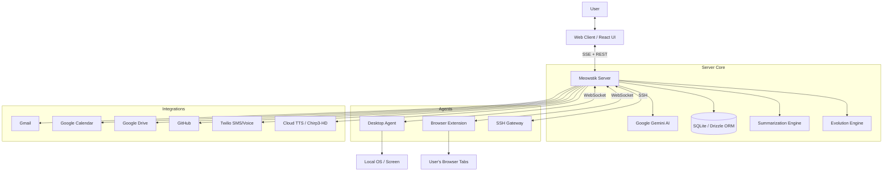
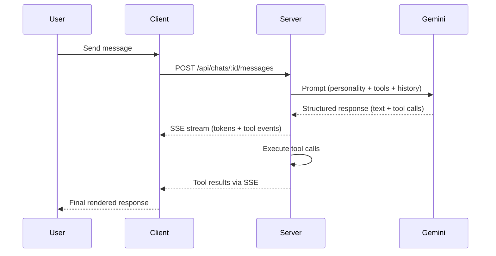
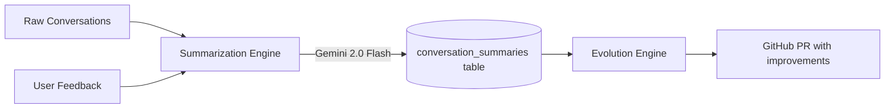
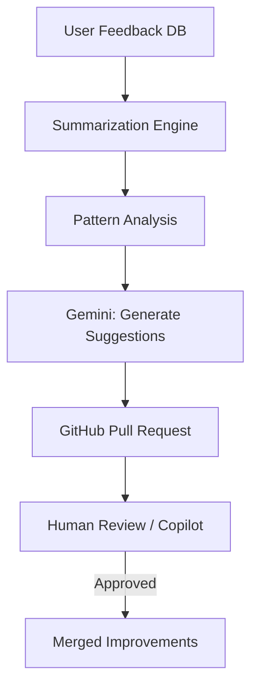
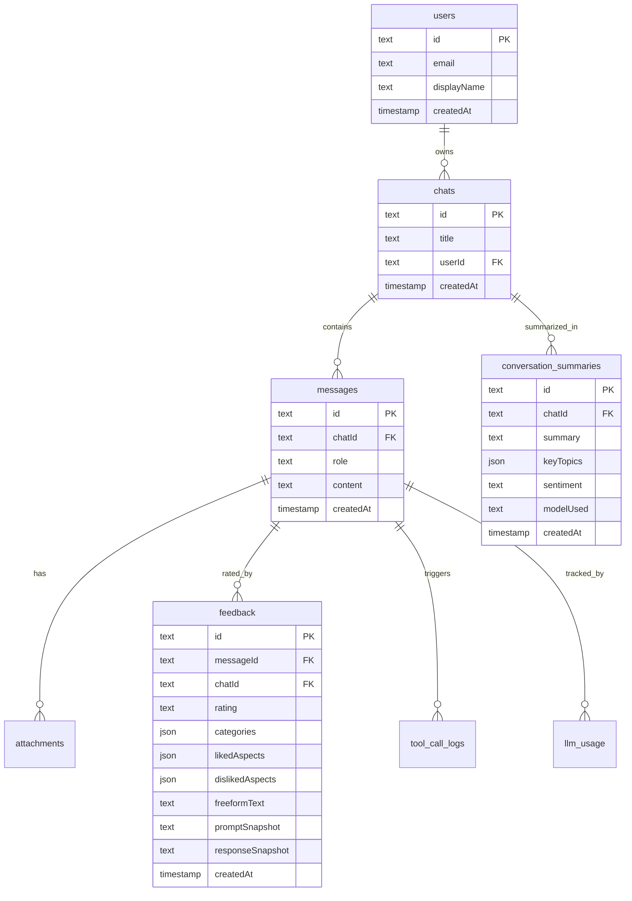

# Meowstik Documentation

> **The AI Personal Assistant & Meta-Agent Platform**

Meowstik is a comprehensive AI assistant built on Google Gemini. It's not just a chat app — it's a meta-agent platform that gives the AI real agency over your digital world: browsing the web, writing code, managing files, sending emails, controlling your desktop, and more.

---

## Table of Contents

1. [Architecture Overview](#architecture-overview)
2. [Chat & Conversation](#chat--conversation)
3. [Voice & TTS (Chirp3-HD)](#voice--tts-chirp3-hd)
4. [Tools & Capabilities](#tools--capabilities)
5. [Summarization Engine](#summarization-engine)
6. [Evolution Engine](#evolution-engine)
7. [Desktop Agent](#desktop-agent)
8. [Browser Extension](#browser-extension)
9. [Twilio SMS & Voice](#twilio-sms--voice)
10. [Data Model](#data-model)
11. [API Reference](#api-reference)

---

## Architecture Overview

Meowstik is a monorepo with a hub-and-spoke architecture. The **server** is the central brain; agents ("limbs") connect via WebSockets to receive instructions and stream back results.



### Stack

| Layer | Technology |
|-------|-----------|
| AI Model | Google Gemini (gemini-2.0-flash, gemini-2.5-pro) |
| Backend | Node.js + Express |
| Database | SQLite via Drizzle ORM |
| Frontend | React + Vite + Tailwind CSS |
| TTS | Google Cloud Text-to-Speech (Chirp3-HD) |
| Real-time | Server-Sent Events (SSE) |

---

## Chat & Conversation

The core loop: user sends a message → Gemini generates a response with optional tool calls → tools execute → results stream back.



**Key endpoints:**
- `POST /api/chats` — create a new conversation
- `GET /api/chats/:id/messages` — fetch message history
- `POST /api/chats/:id/messages` — send a message (returns SSE stream)

**Personality:** Meowstik expresses emotion through voice style tags in responses:

| Tag | Effect |
|-----|--------|
| `[style: cheerful]` | Upbeat, enthusiastic tone |
| `[style: neutral]` | Clear, informational |
| `[style: empathy]` | Warm, reassuring |
| `[style: sad]` | Gentle, apologetic |
| `[style: surprised]` | Excited, intrigued |
| `[style: tense]` | Serious, focused |

---

## Voice & TTS (Chirp3-HD)

Meowstik uses **Google Cloud Text-to-Speech with Chirp3-HD** — Google's highest-quality 2025 neural voices. These voices understand natural language style cues (no SSML needed).

**Default voice:** `Kore` (Female · American · Natural)

### Available Voices

| Name | Gender | Character |
|------|--------|-----------|
| **Kore** *(default)* | Female | Natural, balanced |
| Puck | Male | Upbeat, American |
| Charon | Male | Informative |
| Fenrir | Male | Excitable |
| Aoede | Female | Breezy |
| Leda | Female | Youthful |
| Orus | Male | Firm |
| Zephyr | Female | Bright |
| Schedar | Female | Even |
| Sulafat | Female | Warm |

All voices use the `en-US-Chirp3-HD-{Name}` endpoint. Voice style is controlled by natural language style tags (`[style: cheerful]`) embedded in the response text.

### Voice Lab

The Voice Lab UI lets users preview all voices in real time and set their preferred default. Voice preferences are persisted per user in the `user_branding` table.

---

## Tools & Capabilities

Meowstik has a rich set of built-in tools that Gemini can invoke during a conversation. Tools are declared in `prompts/tools.md` and dispatched by `server/services/tool-dispatcher.ts`.

### Tool Categories

#### 🌐 Web & Information
| Tool | Description |
|------|-------------|
| `web_search` | Search the web and return structured results |
| `browser_load` | Load a URL and extract page content |
| `http_get/post/put` | Make arbitrary HTTP requests |

#### 💻 System & Files
| Tool | Description |
|------|-------------|
| `terminal` | Execute shell commands |
| `file_get` | Read a file from the filesystem |
| `file_put` | Write/create a file |
| `db_query` | Run SELECT queries on the SQLite database |
| `db_insert` | Insert rows into the database |

#### 📧 Google Workspace
| Tool | Description |
|------|-------------|
| Gmail | Read, send, search emails |
| Google Calendar | Create, list, update events |
| Google Drive | Upload, download, search files |
| Google Docs | Create and edit documents |
| Google Sheets | Read and write spreadsheet data |
| Google Tasks | Manage task lists |
| Google Contacts | Look up contacts |

#### 🐙 Developer Tools
| Tool | Description |
|------|-------------|
| GitHub | Create PRs, issues, commits, branches |
| SSH | Connect to remote servers, run commands |
| Arduino | Flash and communicate with microcontrollers |
| ADB | Control Android devices |

#### 📱 Communication
| Tool | Description |
|------|-------------|
| Twilio SMS | Send and receive SMS messages |
| `say` | Trigger TTS speech output |
| `soundboard` | Play audio sound effects |

### Just-In-Time (JIT) Tool Loading

The JIT protocol (`server/services/jit-tool-protocol.ts`) predicts which tools are likely needed for an incoming message and loads only those into the context window — keeping prompts lean and fast.

---

## Summarization Engine

**Location:** `server/services/summarization-engine.ts`

The Summarization Engine compresses raw conversations and feedback into structured summaries using **Gemini 2.0 Flash** (cheap, fast). These summaries are the foundation of the Evolution Engine's self-improvement loop.



### API

```typescript
// Summarize a single chat
summarizeConversation(chatId: string): Promise<ConversationSummary>

// Summarize a batch of feedback (used by Evolution Engine)
summarizeFeedbackBatch(feedbackItems: Feedback[]): Promise<FeedbackSummary>

// Cached version — checks DB first
getOrCreateSummary(chatId: string): Promise<ConversationSummary>
```

### Types

```typescript
interface ConversationSummary {
  chatId: string;
  summary: string;          // 2-3 sentence summary
  keyTopics: string[];      // Extracted topics
  sentiment: "positive" | "neutral" | "negative";
  createdAt: Date;
}

interface FeedbackSummary {
  patterns: string[];       // Observed behavioral patterns
  commonIssues: string[];   // Frequently reported problems
  improvementAreas: string[]; // Suggested areas to improve
  createdAt: Date;
}
```

### Database

Summaries are stored in the `conversation_summaries` table:

| Column | Type | Description |
|--------|------|-------------|
| `id` | text (PK) | nanoid |
| `chatId` | text (FK → chats) | Source conversation |
| `summary` | text | 2-3 sentence summary |
| `keyTopics` | json (string[]) | Extracted topics |
| `sentiment` | text | positive / neutral / negative |
| `modelUsed` | text | Gemini model that generated it |
| `createdAt` | timestamp | When generated |

---

## Evolution Engine

**Location:** `server/services/evolution-engine.ts`

The Evolution Engine closes the feedback loop: it collects user ratings, analyzes patterns (aided by the Summarization Engine), generates improvement suggestions, and opens GitHub PRs for human review.



### Flow

1. **Collect** — fetch up to 100 recent feedback entries from DB
2. **Summarize** — `summarizeFeedbackBatch()` produces AI-extracted patterns
3. **Analyze** — combine structural patterns (low category scores, disliked aspects) with AI patterns
4. **Suggest** — Gemini generates 2-5 prioritized improvement suggestions
5. **PR** — create a GitHub branch, commit an evolution report, open a PR, tag `@copilot`

### Feedback Data

Users rate responses via the feedback UI. Each entry captures:
- `rating`: positive / negative
- `categories`: scored dimensions (accuracy, helpfulness, clarity, completeness)
- `likedAspects` / `dislikedAspects`: structured aspect tags
- `freeformText`: open-ended comment
- `promptSnapshot` / `responseSnapshot`: full context for replay

---

## Desktop Agent

**Location:** `desktop-agent/`

A Node.js agent that connects to the server via WebSocket and provides full OS control:

- **Screen capture** — real-time screenshots and video stream
- **Mouse & keyboard** — inject clicks, keystrokes, and shortcuts via `@nut-tree-fork/nut-js`
- **Global hotkeys** — trigger actions from anywhere on the desktop

**Use case examples:**
> "Click the Submit button in VS Code's source control panel"  
> "Take a screenshot and tell me what's on screen"  
> "Open Terminal and run `git status`"

---

## Browser Extension

**Location:** `browser-extension/`

A Chrome extension with a side-panel chat interface. The extension connects to the Meowstik server and can:

- Read the active tab's URL and page content
- Manipulate the DOM
- Fill out forms
- Summarize pages inline

**Use case examples:**
> "Summarize this article"  
> "Extract all links from this page"  
> "Fill out this checkout form with my saved address"

---

## Twilio SMS & Voice

Meowstik integrates with **Twilio** for phone communication:

### SMS
- Receive inbound SMS and process them through the AI pipeline
- Send outbound SMS via the `twilio_sms` tool
- Conversation history tracked per phone number in `sms_messages` table

### Voice / Phone
- Handle inbound calls with an AI receptionist (TwiML response)
- Voicemail transcription and storage
- Call conversation logs in `call_conversations` table

**Configuration:** Set `TWILIO_ACCOUNT_SID`, `TWILIO_AUTH_TOKEN`, and `TWILIO_PHONE_NUMBER` environment variables.

---

## Data Model

Core tables in the SQLite database:



---

## API Reference

### Chat

| Method | Path | Description |
|--------|------|-------------|
| POST | `/api/chats` | Create a new chat |
| GET | `/api/chats` | List all chats |
| GET | `/api/chats/:id` | Get chat by ID |
| POST | `/api/chats/:id/messages` | Send a message (SSE stream) |
| GET | `/api/chats/:id/messages` | Get message history |
| GET | `/api/chats/:id/tool-calls` | Get recent tool calls for chat |

### LLM Usage

| Method | Path | Description |
|--------|------|-------------|
| GET | `/api/llm/usage` | Get all LLM usage |
| GET | `/api/llm/usage/recent` | Get recent usage |
| GET | `/api/llm/usage/chat/:chatId` | Get usage for a specific chat |

### JIT Tools

| Method | Path | Description |
|--------|------|-------------|
| POST | `/api/jit/predict` | Predict tools needed for a message |
| POST | `/api/jit/context` | Get JIT tool context |
| GET | `/api/jit/examples` | Get JIT examples |

### Codebase Analysis

| Method | Path | Description |
|--------|------|-------------|
| POST | `/api/codebase/analyze` | Analyze a codebase directory |
| GET | `/api/codebase/progress` | Get analysis progress |

### Debug

| Method | Path | Description |
|--------|------|-------------|
| GET | `/api/debug/database` | List all tables |
| GET | `/api/debug/database/:tableName` | Browse a table |
| GET | `/api/debug/llm` | LLM interaction logs |
| GET | `/api/debug/errors` | Error logs |
| GET | `/api/debug/system-prompt-breakdown` | Inspect system prompt assembly |

---

*Last updated: reflects current codebase state including Summarization Engine and Chirp3-HD TTS.*
