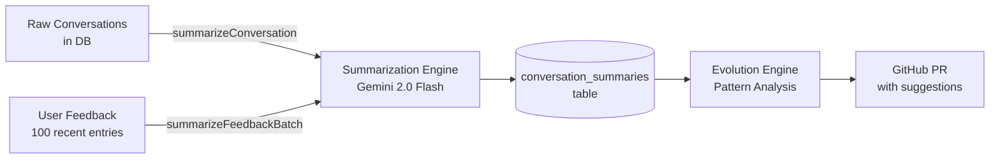

# Summarization Engine

The Summarization Engine compresses raw conversations and feedback into structured, reusable summaries. It's the data pipeline that powers the Evolution Engine's self-improvement loop.

**Location:** `server/services/summarization-engine.ts`

---

## Purpose

Without summarization, the Evolution Engine would have to send full conversation transcripts and raw feedback dumps to Gemini for analysis — expensive and slow. The Summarization Engine pre-processes this data using **Gemini 2.0 Flash** (cheap, fast) so that pattern analysis can work on distilled signal rather than raw noise.



---

## API

```typescript
import {
  summarizeConversation,
  summarizeFeedbackBatch,
  getOrCreateSummary
} from "./services/summarization-engine";
```

### `summarizeConversation(chatId: string): Promise<ConversationSummary>`

Fetches all messages in a chat (up to 100), sends them to Gemini 2.0 Flash, and returns a structured summary. **Persists the result to the database.**

```typescript
const summary = await summarizeConversation("chat_abc123");
// {
//   chatId: "chat_abc123",
//   summary: "User asked for help debugging a Node.js memory leak...",
//   keyTopics: ["memory leak", "Node.js", "heap profiling"],
//   sentiment: "positive",
//   createdAt: Date
// }
```

### `summarizeFeedbackBatch(feedbackItems: Feedback[]): Promise<FeedbackSummary>`

Analyzes up to 50 feedback entries and extracts high-level patterns. Used directly by the Evolution Engine before pattern analysis.

```typescript
const fbSummary = await summarizeFeedbackBatch(feedbackItems);
// {
//   patterns: ["Users frequently ask follow-up clarifications"],
//   commonIssues: ["Responses too long for simple questions"],
//   improvementAreas: ["Shorter default response length", "Better code formatting"],
//   createdAt: Date
// }
```

### `getOrCreateSummary(chatId: string): Promise<ConversationSummary>`

Cached version of `summarizeConversation`. Checks the database first — if a summary already exists for this `chatId`, returns it without calling the LLM. Otherwise generates and stores a new one.

```typescript
// Fast — returns cached summary if available
const summary = await getOrCreateSummary("chat_abc123");
```

---

## Types

```typescript
interface ConversationSummary {
  chatId: string;
  summary: string;           // 2-3 sentence narrative summary
  keyTopics: string[];       // ["topic1", "topic2", ...]
  sentiment: "positive" | "neutral" | "negative";
  createdAt: Date;
}

interface FeedbackSummary {
  patterns: string[];         // Observed behavioral patterns
  commonIssues: string[];     // Frequently reported problems
  improvementAreas: string[]; // Suggested focus areas for improvement
  createdAt: Date;
}
```

---

## Database — `conversation_summaries` Table

| Column | Type | Description |
|--------|------|-------------|
| `id` | `text` (PK) | nanoid auto-generated |
| `chatId` | `text` (FK → `chats.id`) | Source conversation, cascades on delete |
| `summary` | `text` | 2-3 sentence narrative |
| `keyTopics` | `text` (JSON `string[]`) | Extracted topic tags |
| `sentiment` | `text` | `positive` \| `neutral` \| `negative` |
| `modelUsed` | `text` | Model that generated the summary |
| `createdAt` | `integer` (timestamp ms) | Generation timestamp |

**Storage methods** (in `server/storage.ts`):
```typescript
storage.createConversationSummary(data: InsertConversationSummary)
storage.getConversationSummary(chatId: string)   // most recent for chat
storage.getRecentSummaries(limit: number)
```

---

## Model

Uses **`gemini-2.0-flash`** — chosen because:
- Very cheap per token
- Fast response time
- Sufficient quality for summarization tasks
- Leaves expensive model budget for complex reasoning (Evolution Engine suggestions, main chat)

The model constant is defined at the top of `summarization-engine.ts`:
```typescript
const MODEL = "gemini-2.0-flash";
```

---

## Integration with Evolution Engine

The Evolution Engine's `analyzeFeedbackPatterns()` function calls `summarizeFeedbackBatch()` as its first step:

```typescript
// In evolution-engine.ts
export async function analyzeFeedbackPatterns(): Promise<FeedbackPattern[]> {
  const feedbackEntries = await storage.getFeedback(100);
  if (feedbackEntries.length === 0) return [];

  // Step 1: AI-extracted patterns via Summarization Engine
  const feedbackSummary = await summarizeFeedbackBatch(feedbackEntries);

  // Step 2: Structural analysis (low scores, disliked aspects)
  // ... manual pattern extraction ...

  // Step 3: Append AI patterns
  for (const issue of feedbackSummary.commonIssues) {
    patterns.push({ category: "ai_summarized", issue, ... });
  }

  return patterns.sort(bySeverity);
}
```

This means every evolution cycle benefits from both:
- **Structural analysis** — objective metrics (score thresholds, disliked aspect counts)
- **Semantic analysis** — AI-interpreted patterns the structural approach might miss

---

## Future Uses

- **Conversation history compression** — summarize old messages to stay within context window limits
- **User preference learning** — extract communication preferences from summaries
- **Cross-conversation patterns** — identify topics the user returns to repeatedly
