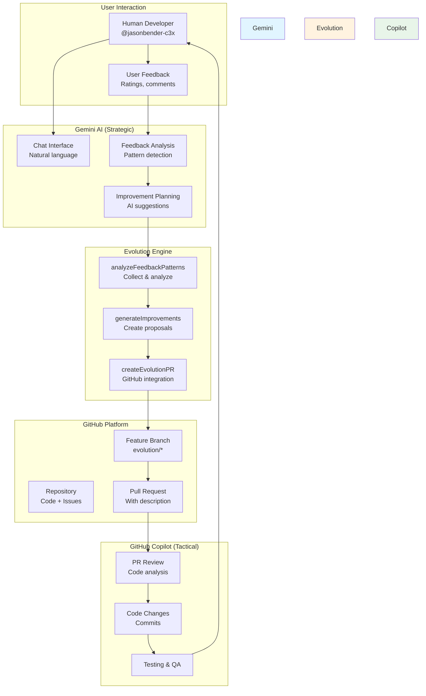
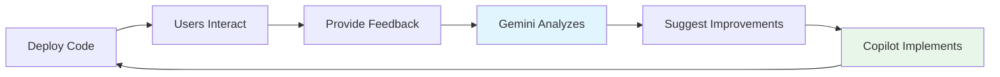
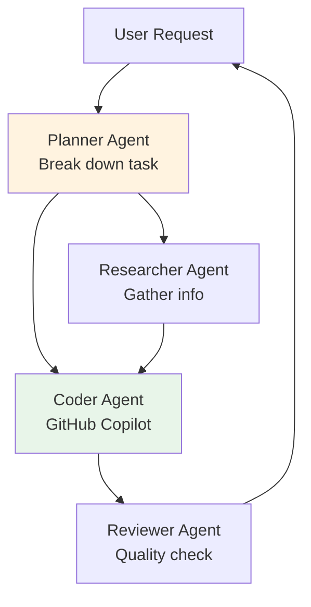

# LLM Orchestration Guide: How Gemini Can Orchestrate GitHub Copilot

**Purpose**: Technical documentation on the collaborative AI workflow  
**Audience**: Developers, AI engineers, and project maintainers  
**Version**: 1.0 | January 15, 2026

---

## Overview

Meowstik implements a **multi-AI orchestration system** where different AI agents collaborate on development tasks:

- **Gemini (LLM)** = Strategic planning, problem analysis
- **GitHub Copilot** = Tactical implementation, code quality  
- **Human Developer** = Oversight, decisions, deployment

This guide explains how these agents communicate and collaborate.

---

## Architecture



---

## Communication Protocol

### 1. Feedback Collection

Gemini collects user feedback through multiple channels:

```typescript
// When user rates a response
await storage.createFeedback({
  chatId,
  messageId,
  rating: "positive" | "negative" | "neutral",
  freeformText: "Optional comment",
  category: "accuracy" | "helpfulness" | "speed"
});
```

**Stored in PostgreSQL**: `feedback` table

### 2. Pattern Analysis

Evolution engine analyzes feedback patterns:

```typescript
// server/services/evolution-engine.ts

export async function analyzeFeedbackPatterns(): Promise<FeedbackPattern[]> {
  // Get recent feedback
  const feedback = await storage.getFeedback(100);
  
  // Filter negative feedback
  const issues = feedback.filter(f => f.rating === "negative");
  
  // Group by category
  const patterns = groupByCategory(issues);
  
  // Identify common themes
  return patterns.map(p => ({
    category: p.category,
    issue: p.commonIssue,
    frequency: p.count,
    examples: p.samples,
    severity: calculateSeverity(p)
  }));
}
```

### 3. Improvement Generation

Gemini AI generates improvement suggestions:

```typescript
export async function generateImprovements(
  patterns: FeedbackPattern[]
): Promise<ImprovementSuggestion[]> {
  
  const prompt = `
    Analyze these user feedback patterns and suggest code improvements:
    ${JSON.stringify(patterns, null, 2)}
    
    For each pattern, provide:
    1. Root cause analysis
    2. Specific file/function to change
    3. Proposed code changes
    4. Rationale and expected impact
  `;
  
  const model = genAI.getGenerativeModel({ model: "gemini-pro" });
  const result = await model.generateContent(prompt);
  
  return parseImprovements(result.response.text());
}
```

### 4. GitHub PR Creation

Evolution engine creates a PR:

```typescript
export async function createEvolutionPR(
  report: EvolutionReport
): Promise<PRResult> {
  
  const agent = await getEvolutionAgent(); // "Agentia Compiler"
  const branchName = `evolution/improvements-${Date.now()}`;
  
  // 1. Create branch
  await github.createBranch(repo.owner, repo.repo, branchName);
  
  // 2. Commit changes
  for (const file of report.changedFiles) {
    await github.createOrUpdateFileWithAgent(
      repo.owner,
      repo.repo,
      file.path,
      file.content,
      `🤖 ${agent.signature} - ${file.description}`,
      branchName,
      agent
    );
  }
  
  // 3. Open PR with detailed description
  const pr = await github.createPullRequestWithAgent(
    repo.owner,
    repo.repo,
    {
      title: `🤖 Evolution: ${report.summary}`,
      head: branchName,
      base: 'main',
      body: formatPRDescription(report)
    },
    agent
  );
  
  return { success: true, prUrl: pr.html_url, prNumber: pr.number };
}
```

### 5. Copilot Activation

**Manual Trigger**: User tags Copilot in PR comment:

```markdown
@copilot implement this plan
```

**Automated Trigger** (future): Evolution engine could auto-tag:

```typescript
// Future enhancement
await github.createIssueComment(
  repo.owner,
  repo.repo,
  pr.number,
  `@copilot This PR contains AI-generated improvements. Please review and implement.\n\nSummary: ${report.summary}`
);
```

### 6. Copilot Implementation

GitHub Copilot:
1. Analyzes the PR description
2. Reviews proposed changes
3. Implements code modifications
4. Runs tests and validation
5. Commits with descriptive messages
6. Replies to original comment

### 7. Human Review & Merge

Developer reviews and merges:

```bash
# Review PR
gh pr view 123

# Review code changes
gh pr diff 123

# Merge if approved
gh pr merge 123 --squash
```

---

## Sequence Diagram

```mermaid
sequenceDiagram
    participant User as Human Developer
    participant Gemini as Gemini AI
    participant Evolution as Evolution Engine
    participant GitHub as GitHub API
    participant Copilot as GitHub Copilot
    
    User->>Gemini: Use chat interface
    Gemini-->>User: Provide responses
    
    User->>Gemini: Rate response negatively
    Gemini->>Database: Store feedback
    
    Note over Evolution: Triggered periodically or manually
    
    Evolution->>Database: Fetch feedback (last 100)
    Evolution->>Evolution: analyzeFeedbackPatterns()
    Evolution->>Evolution: Identify: "SSH errors confusing"
    
    Evolution->>Gemini: Request improvement suggestions
    Note over Gemini: AI generates proposals
    Gemini-->>Evolution: Suggested changes
    
    Evolution->>GitHub: createBranch("evolution/ssh-docs")
    Evolution->>GitHub: commitFile("docs/SSH_ANALYSIS.md")
    Evolution->>GitHub: createPullRequest({...})
    
    GitHub-->>User: 🔔 PR notification
    User->>GitHub: Open PR #123
    User->>GitHub: Comment: "@copilot implement this plan"
    
    GitHub-->>Copilot: Trigger with mention
    Copilot->>GitHub: Fetch PR details
    Copilot->>Copilot: Analyze requirements
    Copilot->>GitHub: Create commits
    Copilot->>GitHub: Reply with commit hash
    
    User->>GitHub: Review changes
    User->>GitHub: Approve & merge
    
    GitHub->>Database: Update main branch
    Note over Gemini: Learns from merged code
```



---

## API Integration Points

### Gemini → Evolution Engine

```typescript
// server/routes/evolution.ts

router.post('/api/evolution/analyze', async (req, res) => {
  const patterns = await analyzeFeedbackPatterns();
  const report = await generateImprovements(patterns);
  res.json(report);
});

router.post('/api/evolution/create-pr', async (req, res) => {
  const { report } = req.body;
  const result = await createEvolutionPR(report);
  res.json(result);
});
```

### Evolution Engine → GitHub

```typescript
// server/integrations/github.ts

export async function createBranch(
  owner: string,
  repo: string,
  branchName: string
): Promise<void> {
  const octokit = await getUncachableGitHubClient();
  
  // Get main branch SHA
  const { data: ref } = await octokit.git.getRef({
    owner,
    repo,
    ref: 'heads/main'
  });
  
  // Create new branch
  await octokit.git.createRef({
    owner,
    repo,
    ref: `refs/heads/${branchName}`,
    sha: ref.object.sha
  });
}

export async function createOrUpdateFileWithAgent(
  owner: string,
  repo: string,
  path: string,
  content: string,
  message: string,
  branch: string,
  agent: AgentAuthor
): Promise<void> {
  const octokit = await getUncachableGitHubClient();
  
  // Check if file exists
  let sha: string | undefined;
  try {
    const { data } = await octokit.repos.getContent({
      owner,
      repo,
      path,
      ref: branch
    });
    if ('sha' in data) sha = data.sha;
  } catch (e) {
    // File doesn't exist, will create
  }
  
  // Create or update file
  await octokit.repos.createOrUpdateFileContents({
    owner,
    repo,
    path,
    message,
    content: Buffer.from(content).toString('base64'),
    branch,
    sha,
    committer: {
      name: agent.name,
      email: agent.email
    },
    author: {
      name: agent.name,
      email: agent.email
    }
  });
}

export async function createPullRequestWithAgent(
  owner: string,
  repo: string,
  params: {
    title: string;
    head: string;
    base: string;
    body: string;
  },
  agent: AgentAuthor
): Promise<any> {
  const octokit = await getUncachableGitHubClient();
  
  const { data } = await octokit.pulls.create({
    owner,
    repo,
    title: params.title,
    head: params.head,
    base: params.base,
    body: params.body
  });
  
  return data;
}
```

### GitHub → Copilot

**Trigger Methods:**

1. **Manual Mention**:
   ```markdown
   @copilot implement this plan
   ```

2. **Issue Assignment**:
   ```bash
   gh issue create --assignee @copilot
   ```

3. **PR Review Request**:
   ```bash
   gh pr create --reviewer @copilot
   ```

---

## PR Description Format

Evolution engine creates detailed PR descriptions for Copilot:

```markdown
## 🤖 Evolution: Improve SSH Error Handling

### Analysis

User feedback indicates confusion around SSH tool availability:
- 15 negative ratings on SSH-related responses
- Common complaint: "ssh-keygen not found" errors
- Impact: Blocks deployment workflows

### Root Cause

The `generateSshKey()` function relies on PATH environment variable to find `ssh-keygen`. In some environments, /usr/bin is not in PATH, causing false negatives.

### Proposed Solution

1. **Use explicit paths**: `/usr/bin/ssh-keygen` instead of `ssh-keygen`
2. **Add pre-flight checks**: Verify tool availability before use
3. **Better error messages**: Distinguish "not found" from "permission denied"
4. **Update prompts**: Add environment awareness to LLM

### Files Changed

- `server/services/ssh-service.ts` - Use explicit paths
- `prompts/core-directives.md` - Add environment guidance
- `docs/SSH_DEPLOYMENT_ANALYSIS.md` - Comprehensive documentation

### Testing

- ✅ Verified `/usr/bin/ssh-keygen` exists
- ✅ Tested key generation with explicit path
- ✅ Added error logging for debugging

### @copilot Action Items

1. Review proposed changes
2. Implement fixes to ssh-service.ts
3. Update LLM system prompts
4. Add unit tests for environment detection
5. Validate with integration tests

### References

- Issue #578
- `TWILIO_IMPLEMENTATION_SUMMARY.md`
- `docs/ssh-gateway-guide.md`
```

---

## Benefits of This Architecture

### 1. Separation of Concerns

| Agent | Strength | Limitation |
|-------|----------|------------|
| **Gemini** | Strategic thinking, pattern recognition | Cannot write production code |
| **Copilot** | Code implementation, best practices | Needs clear requirements |
| **Human** | Final judgment, deployment | Limited time, cognitive load |

### 2. Continuous Improvement



### 3. Scalability

- **Parallel Work**: Multiple evolution PRs can run simultaneously
- **Async Processing**: Feedback analysis doesn't block user interactions
- **Distributed Load**: GitHub handles PR management and CI/CD

### 4. Audit Trail

Every change has:
- ✅ User feedback as justification
- ✅ AI analysis and reasoning
- ✅ PR with full context
- ✅ Code review by Copilot
- ✅ Human approval before merge

---

## Configuration

### Environment Variables

```bash
# GitHub Integration
REPLIT_CONNECTORS_HOSTNAME=connectors.repl.it
REPL_IDENTITY=<replit_token>

# AI Models
GEMINI_API_KEY=<your_key>

# Agent Configuration
EVOLUTION_AGENT_NAME="Agentia Compiler"
EVOLUTION_AGENT_EMAIL="compiler@agentia.dev"
```

### Agent Registry

```typescript
// shared/schema.ts

export const agents = pgTable('agents', {
  id: uuid('id').primaryKey().defaultRandom(),
  name: text('name').notNull().unique(),
  displayName: text('display_name').notNull(),
  email: text('email').notNull(),
  githubSignature: text('github_signature'),
  capabilities: text('capabilities').array(),
  status: text('status').default('active'),
  createdAt: timestamp('created_at').defaultNow(),
  updatedAt: timestamp('updated_at').defaultNow()
});
```

### Seed Data

```bash
npm run seed:agents
```

This creates the "Agentia Compiler" agent for evolution engine.

---

## Future Enhancements

### 1. Auto-Tag Copilot

```typescript
// Automatically tag Copilot in evolution PRs
await github.createIssueComment(
  owner,
  repo,
  prNumber,
  `@copilot This PR contains AI-generated improvements based on user feedback. Please review and implement.\n\n${summary}`
);
```

### 2. Structured PR Templates

```markdown
---
type: evolution
priority: high
automation: copilot
---

## Summary
[AI-generated summary]

## Copilot Instructions
- [ ] Review analysis
- [ ] Implement changes to ${files}
- [ ] Add tests
- [ ] Update documentation
```

### 3. Feedback Loop

```typescript
// After PR merge, update LLM prompts
await updateSystemPrompt({
  section: 'ssh_handling',
  content: mergedChanges,
  source: `PR #${prNumber}`
});
```

### 4. Multi-Agent Orchestration



---

## Troubleshooting

### Issue: PR Not Created

**Symptom**: Evolution engine runs but no PR appears

**Debug**:
```typescript
// Check logs
console.log('Creating PR:', {
  owner: repo.owner,
  repo: repo.repo,
  branch: branchName
});

// Verify GitHub token
const octokit = await getUncachableGitHubClient();
const { data } = await octokit.users.getAuthenticated();
console.log('Authenticated as:', data.login);
```

### Issue: Copilot Not Responding

**Symptom**: Tagged Copilot but no response

**Solutions**:
- Ensure correct mention format: `@copilot` (not `@github-copilot`)
- Check if Copilot has repo access
- Verify PR description is clear and actionable

### Issue: Feedback Not Collected

**Symptom**: No patterns detected despite user feedback

**Debug**:
```typescript
// Check feedback in database
const feedback = await storage.getFeedback(100);
console.log('Feedback count:', feedback.length);
console.log('Negative:', feedback.filter(f => f.rating === 'negative').length);
```

---

## API Reference

### Feedback Storage

```typescript
interface Feedback {
  id: string;
  chatId: string;
  messageId: string;
  rating: 'positive' | 'negative' | 'neutral';
  freeformText?: string;
  category?: string;
  createdAt: Date;
}

// Create feedback
await storage.createFeedback(feedback: InsertFeedback): Promise<Feedback>

// Get feedback
await storage.getFeedback(limit: number): Promise<Feedback[]>
```

### Evolution Engine

```typescript
// Analyze patterns
analyzeFeedbackPatterns(): Promise<FeedbackPattern[]>

// Generate improvements
generateImprovements(patterns: FeedbackPattern[]): Promise<ImprovementSuggestion[]>

// Create evolution report
createEvolutionReport(suggestions: ImprovementSuggestion[]): Promise<EvolutionReport>

// Create GitHub PR
createEvolutionPR(report: EvolutionReport): Promise<PRResult>
```

### GitHub Integration

```typescript
// Branch operations
createBranch(owner: string, repo: string, name: string): Promise<void>

// File operations
createOrUpdateFileWithAgent(
  owner: string,
  repo: string,
  path: string,
  content: string,
  message: string,
  branch: string,
  agent: AgentAuthor
): Promise<void>

// PR operations
createPullRequestWithAgent(
  owner: string,
  repo: string,
  params: PRParams,
  agent: AgentAuthor
): Promise<PullRequest>
```

---

## Conclusion

This orchestration system creates a **collaborative AI workflow** where:

1. **Gemini** identifies problems through feedback analysis
2. **Evolution Engine** proposes solutions via GitHub PRs
3. **GitHub Copilot** implements the actual code changes
4. **Humans** provide oversight and final approval

This combines the best of:
- AI strategic thinking
- AI tactical implementation  
- Human judgment

The result is a **self-improving system** that gets better with use.

---

**Version**: 1.0  
**Last Updated**: January 15, 2026  
**Author**: GitHub Copilot (@copilot)  
**Related**: `SSH_DEPLOYMENT_ANALYSIS.md`
