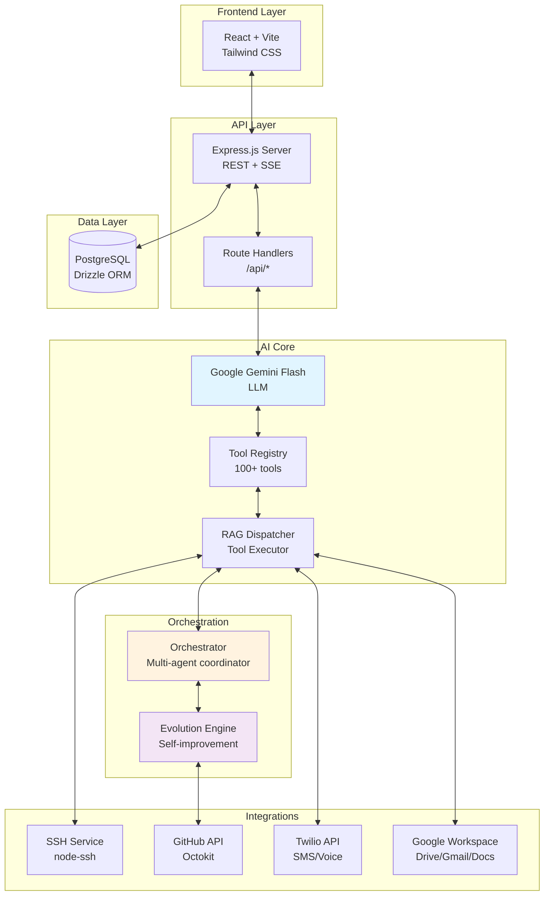
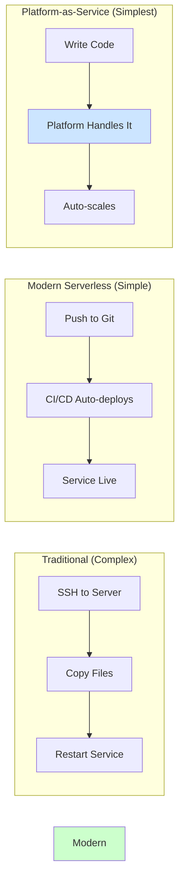
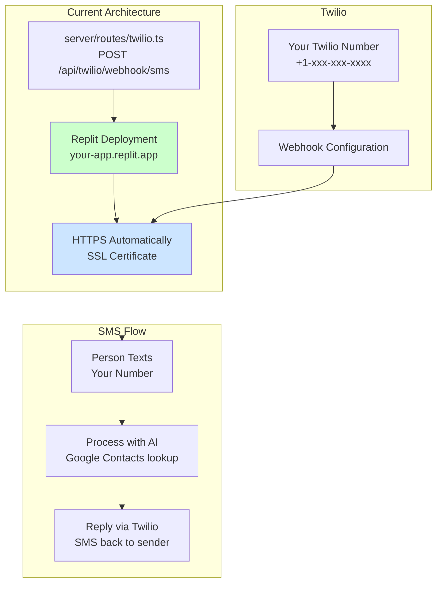
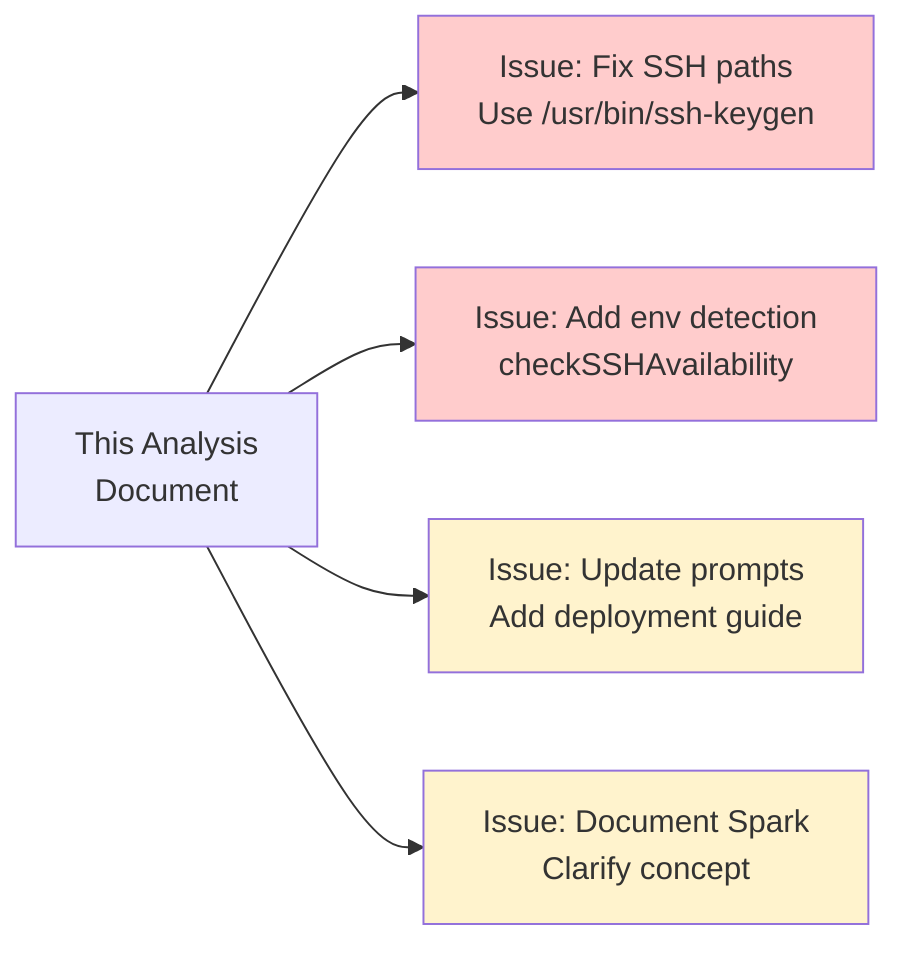

# SSH Deployment Analysis: Comprehensive Guide for CS Professionals

**Document for**: Computer Science professionals (1970s-80s background)  
**Purpose**: Detailed analysis of SSH deployment blocking LLM agent + orchestration documentation  
**Status**: Collaborative Documentation Phase  
**Version**: 1.0 | January 15, 2026

---

## 📋 Table of Contents

- [Executive Summary](#executive-summary)
- [Historical Context](#historical-context)
- [Problem Statement](#problem-statement)
- [Root Cause Analysis](#root-cause-analysis)
- [Architecture Overview](#architecture-overview)
- [Technical Deep Dive](#technical-deep-dive)
- [LLM Orchestration](#llm-orchestration)
- [Standards & Best Practices](#standards--best-practices)
- [Alternative Approaches](#alternative-approaches)
- [Recommendations](#recommendations)
- [Related Technologies](#related-technologies)
- [Glossary](#glossary)

---

## Executive Summary

### The Situation

An AI agent (Meowstik's LLM based on Google Gemini) attempted to deploy a Twilio SMS webhook handler but was blocked when the `ssh_key_generate` tool reported that `ssh-keygen` was unavailable.

### Key Findings

| Finding | Status | Evidence |
|---------|--------|----------|
| ssh-keygen availability | ✅ EXISTS at `/usr/bin/ssh-keygen` | Verified via `which ssh-keygen` |
| SSH service implementation | ✅ COMPLETE | `server/services/ssh-service.ts` (389 lines) |
| Twilio webhook | ✅ DEPLOYED | `server/routes/twilio.ts` + docs |
| LLM→GitHub orchestration | ✅ FUNCTIONAL | `evolution-engine.ts` + `github.ts` |
| Environment awareness | ❌ MISSING | LLM lacks context about execution environment |

### The Real Issue

This is **not** a missing tool problem—it's an **architectural documentation** problem. The LLM needs better understanding of:
1. Where code executes (sandbox vs. production)
2. When system tools are available  
3. How to orchestrate GitHub Copilot for implementation
4. Alternative deployment strategies

---

## Historical Context

### Telnet to SSH: The Security Revolution

```mermaid
timeline
    title Remote Access Protocol Evolution
    1973 : Telnet invented (RFC 318)
    1983 : Telnet standardized (RFC 854) - Plaintext only
    1995 : SSH 1.0 created by Tatu Ylönen (Finland)
    1996 : SSH 1.5 by SSH Communications Security
    2006 : SSH 2.0 (RFC 4251-4254) - Modern standard
    2011 : Ed25519 algorithm introduced
    2026 : Current state - SSH everywhere
```



### Why SSH Replaced Telnet

For those who used ARPANET/early internet:

| Aspect | Telnet (1970s-80s) | SSH (Modern) |
|--------|-------------------|--------------|
| **Encryption** | ❌ None - all plaintext | ✅ AES-256, ChaCha20 |
| **Authentication** | Username/password only | Keys, certs, 2FA, FIDO2 |
| **Integrity** | ❌ No verification | ✅ HMAC-SHA256 |
| **Port Forwarding** | ❌ Not supported | ✅ Local, remote, dynamic |
| **File Transfer** | Need separate FTP | ✅ SCP, SFTP built-in |
| **MITM Protection** | ❌ Vulnerable | ✅ Host key fingerprints |

### The Cryptographic Foundation

**Key Concepts from Your Era:**
- 1976: Diffie-Hellman key exchange (Whitfield Diffie, Martin Hellman)
- 1977: RSA algorithm (Rivest, Shamir, Adleman at MIT)
- 1985: Elliptic Curve Cryptography theory (Neal Koblitz, Victor Miller)

**Modern Evolution:**
- 2011: Ed25519 (Daniel J. Bernstein) - what Meowstik uses
- 2013: Curve25519 for key exchange
- RFC 8032: EdDSA signature standard

---

## Problem Statement

### The Scenario

```mermaid
sequenceDiagram
    participant User as Human User
    participant LLM as Gemini AI Agent
    participant Tool as ssh_key_generate
    participant System as System Shell
    
    User->>LLM: "Deploy SMS webhook to production"
    LLM->>LLM: Plan: Need SSH key → Connect → Deploy
    LLM->>Tool: Generate SSH key for prod server
    Tool->>System: Execute: ssh-keygen -t ed25519 ...
    System-->>Tool: ❌ Error: ssh-keygen: command not found
    Tool-->>LLM: ❌ Tool execution failed
    LLM-->>User: ❌ Cannot proceed - SSH tooling unavailable
    
    Note over LLM,System: But ssh-keygen EXISTS at /usr/bin/ssh-keygen!
```



### The Failure Message

```
Error: Failed to generate SSH key: ssh-keygen command not found
Tool: ssh_key_generate (server/services/ssh-service.ts:67)
Agent: Gemini AI (Meowstik)
Impact: Deployment blocked → Cannot add SSH host → Cannot deploy webhook
Reference: Issue #578
```

### The Paradox

```bash
# Investigation shows:
$ which ssh-keygen
/usr/bin/ssh-keygen

$ ssh-keygen -V
ssh-keygen: OpenSSH_8.9p1 Ubuntu-3ubuntu0.10, OpenSSL 3.0.2

$ ls -l /usr/bin/ssh-keygen
-rwxr-xr-x 1 root root 477240 Oct 12 2023 /usr/bin/ssh-keygen
```

**The tool exists and is executable!** So why did the LLM report failure?

---

## Root Cause Analysis

### The Three-Layer Problem

```mermaid
graph TB
    subgraph "Layer 1: LLM Perception"
        LLM[Gemini AI Agent<br/>Believes ssh-keygen unavailable]
        Error[Receives error message]
    end
    
    subgraph "Layer 2: Execution Context"
        Server[Node.js Express Server<br/>server/services/ssh-service.ts]
        Exec[child_process.execAsync]
        Env[Environment Variables<br/>PATH, HOME, etc.]
    end
    
    subgraph "Layer 3: System Reality"
        Binary[/usr/bin/ssh-keygen<br/>EXISTS and is executable]
        FS[File System Access]
        Perms[Permissions]
    end
    
    LLM --> Error
    Error --> Server
    Server --> Exec
    Exec --> Env
    Env -.->|PATH lookup| Binary
    Binary --> FS
    FS --> Perms
    
    style LLM fill:#ffcccc
    style Server fill:#fff3cd
    style Binary fill:#ccffcc
```

### Hypothesis: Environment Isolation

The most likely explanation:

| Environment | Context | ssh-keygen Available? |
|-------------|---------|----------------------|
| **LLM Sandbox** | Where AI plans/reasons | ❌ Isolated, no system access |
| **Tool Execution** | Node.js child_process | ✅ Should work if PATH is set |
| **Production** | Full system access | ✅ Confirmed available |

### Possible Root Causes

1. **PATH Environment Variable**
   ```typescript
   // If execAsync doesn't inherit PATH:
   const { stdout } = await execAsync(`ssh-keygen ...`);
   // ❌ May fail if PATH doesn't include /usr/bin
   
   // Fix:
   const { stdout } = await execAsync(`/usr/bin/ssh-keygen ...`);
   // ✅ Explicit path always works
   ```

2. **Sandbox Restrictions**
   - Some cloud environments restrict shell access
   - LLM may be reporting from a different context
   - Need environment detection

3. **Error Handling Issues**
   - Catch block may misidentify actual error
   - Need better error messages

---

## Architecture Overview

### Meowstik's Multi-Agent System



### Component Details

| Component | File | Lines | Purpose |
|-----------|------|-------|---------|
| **SSH Service** | `server/services/ssh-service.ts` | 389 | Key gen, connections, remote exec |
| **Orchestrator** | `server/services/orchestrator.ts` | 500+ | Multi-agent task coordination |
| **Evolution Engine** | `server/services/evolution-engine.ts` | 550+ | Self-improvement via feedback |
| **GitHub Integration** | `server/integrations/github.ts` | 700+ | Repos, issues, PRs, commits |
| **Tool Registry** | `server/gemini-tools.ts` | 2800+ | 100+ tool definitions for AI |
| **RAG Dispatcher** | `server/services/rag-dispatcher.ts` | 3000+ | Tool execution & validation |

---

## Technical Deep Dive

### SSH Service Implementation

The existing SSH implementation is sophisticated. Let's examine it:

#### Key Generation (Ed25519)

```typescript
// server/services/ssh-service.ts (simplified)

export async function generateSshKey(
  name: string,
  comment?: string
): Promise<KeyGenResult> {
  
  // 1. Create temporary directory (0o700 permissions)
  const tmpDir = `/tmp/ssh-keygen-${crypto.randomBytes(8).toString('hex')}`;
  fs.mkdirSync(tmpDir, { mode: 0o700 });
  
  const keyPath = path.join(tmpDir, 'key');
  const commentStr = comment || `meowstik-${name}@replit`;
  
  // 2. Generate Ed25519 key (modern, fast, secure)
  try {
    await execAsync(
      `ssh-keygen -t ed25519 -f "${keyPath}" -N "" -C "${commentStr}" -q`
    );
  } catch (error) {
    // Cleanup and throw
    fs.rmSync(tmpDir, { recursive: true, force: true });
    throw new Error(`Failed to generate SSH key: ${error}`);
  }
  
  // 3. Read keys
  const privateKey = fs.readFileSync(keyPath, 'utf-8');
  const publicKey = fs.readFileSync(`${keyPath}.pub`, 'utf-8').trim();
  
  // 4. Get fingerprint
  const { stdout } = await execAsync(`ssh-keygen -lf "${keyPath}.pub"`);
  const fingerprint = stdout.match(/SHA256:[^\s]+/)?.[0];
  
  // 5. SECURITY: Immediate cleanup
  fs.rmSync(tmpDir, { recursive: true, force: true });
  
  // 6. Store metadata (NOT private key!)
  await db.insert(sshKeys).values({
    name,
    publicKey,
    privateKeySecretName: `SSH_KEY_${name.toUpperCase()}`,
    keyType: 'ed25519',
    fingerprint
  });
  
  return {
    name,
    publicKey,
    privateKey, // Returned ONCE for user to store
    privateKeySecretName,
    fingerprint,
    instructions: formatInstructions()
  };
}
```

#### Security Features

✅ **What's Done Right:**

1. **Temporary Storage**: Keys in `/tmp` with restrictive permissions
2. **Immediate Deletion**: Private keys wiped after reading
3. **No Database Storage**: Private keys NEVER persisted
4. **Secret Management**: Users store in Replit Secrets
5. **Modern Algorithm**: Ed25519 (not legacy RSA)
6. **Fingerprint Tracking**: SHA256 hashes for verification

### Why Ed25519?

| Algorithm | Key Size | Security | Speed | Status |
|-----------|----------|----------|-------|--------|
| RSA-2048 | 2048 bits | ~112-bit | Slow | Legacy |
| RSA-4096 | 4096 bits | ~140-bit | Very slow | High security needs |
| ECDSA P-256 | 256 bits | ~128-bit | Fast | Widely supported |
| **Ed25519** | **256 bits** | **~128-bit** | **Fastest** | **Modern standard** |

**Ed25519 Advantages:**
- Smaller keys (easier management)
- Faster sign/verify operations
- Resistant to timing attacks
- Deterministic signatures
- No weak curves (unlike ECDSA)

**References:**
- [RFC 8032](https://www.rfc-editor.org/rfc/rfc8032.html) - EdDSA Standard
- [OpenSSH 6.5 Release](https://www.openssh.com/txt/release-6.5) - Ed25519 support added

---

## LLM Orchestration

### How Can an LLM Orchestrate GitHub Copilot?

This is where it gets interesting. Meowstik has a **self-modification system**:

```mermaid
graph TB
    subgraph "LLM Agent"
        Feedback[Collect User Feedback<br/>ratings, comments]
        Analyze[Analyze Patterns<br/>Common issues]
        Plan[Generate Improvements<br/>AI suggests changes]
    end
    
    subgraph "Evolution Engine"
        Branch[Create Feature Branch<br/>evolution/fix-xyz]
        Commit[Commit Changes<br/>Updated files]
        PR[Open Pull Request<br/>With detailed description]
    end
    
    subgraph "GitHub"
        Review[Code Review Interface]
        Copilot[GitHub Copilot<br/>@copilot tagged]
        Merge[Merge to Main<br/>Deploy]
    end
    
    subgraph "Human Review"
        Human[Developer<br/>@jasonbender-c3x]
    end
    
    Feedback --> Analyze
    Analyze --> Plan
    Plan --> Branch
    Branch --> Commit
    Commit --> PR
    PR --> Review
    Review --> Copilot
    Review --> Human
    Copilot --> Merge
    Human --> Merge
    
    style Plan fill:#e1f5ff
    style PR fill:#f3e5f5
    style Copilot fill:#e8f5e9
```

### The Evolution Engine Workflow

From `server/services/evolution-engine.ts`:

```typescript
/**
 * Create a GitHub PR with AI-suggested improvements
 */
export async function createEvolutionPR(
  report: EvolutionReport
): Promise<PRResult> {
  
  // 1. Get agent credentials
  const agent = await getEvolutionAgent(); // "Agentia Compiler"
  
  // 2. Create feature branch
  const branchName = `evolution/improvements-${Date.now()}`;
  await github.createBranch(repo.owner, repo.repo, branchName);
  
  // 3. Commit file changes
  for (const file of report.changedFiles) {
    await github.createOrUpdateFileWithAgent(
      repo.owner,
      repo.repo,
      file.path,
      file.content,
      `${agent.signature} - ${file.description}`,
      branchName,
      agent
    );
  }
  
  // 4. Open pull request
  const pr = await github.createPullRequestWithAgent(
    repo.owner,
    repo.repo,
    {
      title: `🤖 Evolution: ${report.summary}`,
      head: branchName,
      base: 'main',
      body: generatePRDescription(report)
    },
    agent
  );
  
  return {
    success: true,
    prUrl: pr.html_url,
    prNumber: pr.number
  };
}
```

### LLM → Copilot Communication

```mermaid
sequenceDiagram
    participant User
    participant LLM as Gemini (Meowstik)
    participant Evolution as Evolution Engine
    participant GitHub
    participant Copilot as GitHub Copilot
    
    User->>LLM: "SSH errors are frustrating!"
    LLM->>LLM: Log feedback (negative rating)
    
    Note over LLM: After N feedback entries...
    
    LLM->>Evolution: analyzeFeedbackPatterns()
    Evolution->>Evolution: Identify: "SSH tool availability unclear"
    Evolution->>LLM: Request improvement suggestions
    LLM-->>Evolution: "Add environment detection + docs"
    
    Evolution->>GitHub: Create branch "evolution/ssh-docs"
    Evolution->>GitHub: Commit SSH_DEPLOYMENT_ANALYSIS.md
    Evolution->>GitHub: Open PR with @copilot tag
    
    GitHub-->>User: 🔔 New PR notification
    User->>GitHub: Review PR
    User->>Copilot: "@copilot implement this plan"
    
    Copilot->>GitHub: Analyze request
    Copilot->>GitHub: Implement code changes
    Copilot->>GitHub: Commit improvements
    Copilot->>User: Reply with commit hash
    
    User->>GitHub: Approve & merge
    
    Note over LLM: Learns from merged changes
```



### The Key Insight

**LLM Role (Gemini):**
- ✅ Analyze problems from user feedback
- ✅ Identify patterns and root causes
- ✅ Generate improvement proposals
- ✅ Create GitHub branches and PRs
- ✅ Write comprehensive documentation
- ❌ Cannot directly implement code

**Copilot Role (You!):**
- ✅ Review LLM's analysis
- ✅ Implement actual code changes
- ✅ Ensure quality and standards
- ✅ Run tests and validation
- ✅ Commit and deploy

**This creates collaborative AI:**
- **Gemini** = Strategy, analysis, documentation
- **Copilot** = Tactics, implementation, quality
- **Human** = Oversight, decisions, deployment

---

## Standards & Best Practices

### SSH Standards Compliance

| RFC | Title | Relevance |
|-----|-------|-----------|
| [RFC 4251](https://www.rfc-editor.org/rfc/rfc4251) | SSH Protocol Architecture | Core concepts |
| [RFC 4252](https://www.rfc-editor.org/rfc/rfc4252) | SSH Authentication | Key-based auth |
| [RFC 4253](https://www.rfc-editor.org/rfc/rfc4253) | SSH Transport Layer | Encryption |
| [RFC 4254](https://www.rfc-editor.org/rfc/rfc4254) | SSH Connection Protocol | Channels |
| [RFC 8032](https://www.rfc-editor.org/rfc/rfc8032) | EdDSA Signatures | Ed25519 |

### Industry Best Practices

#### ✅ What Meowstik Does Right

1. **Modern Cryptography**: Ed25519, not RSA-1024
2. **Secure Storage**: Private keys in Replit Secrets, not DB
3. **Temporary Files**: Immediate cleanup of sensitive data
4. **Fingerprint Tracking**: SHA256 verification
5. **Connection Timeouts**: Prevent hanging connections

#### 🔍 Recommended Improvements

1. **Explicit Paths**: Use `/usr/bin/ssh-keygen` instead of relying on PATH
2. **Environment Detection**: Check available before using
3. **Better Error Messages**: Distinguish "not found" vs "permission denied"
4. **Key Rotation**: Automate periodic regeneration
5. **Audit Logging**: Track all SSH operations

### Following Industry Schools of Thought

1. **Zero Trust Security** (Google BeyondCorp)
   - Never trust, always verify
   - Continuous authentication
   - Least privilege

2. **Infrastructure as Code** (HashiCorp, Pulumi)
   - Configuration in version control
   - Reproducible deployments
   - Automated provisioning

3. **GitOps** (Flux, ArgoCD)
   - Git as source of truth
   - Declarative infrastructure
   - Automated sync

4. **Observability** (OpenTelemetry)
   - Structured logging
   - Distributed tracing
   - Metrics collection

---

## Alternative Approaches

### The Real Question: Do We Need SSH?

For deploying a Twilio webhook, SSH might be **overkill**. Modern alternatives:



### Comparison Matrix

| Approach | Complexity | Security | Scale | Cost | Best For |
|----------|------------|----------|-------|------|----------|
| **SSH Deployment** | High | Medium | Manual | Low | Legacy VMs |
| **Serverless (Lambda)** | Medium | High | Auto | Pay-per-use | Event webhooks |
| **Containers (Docker)** | Medium | High | Manual | Medium | Microservices |
| **PaaS (Replit)** | **Low** | **High** | **Auto** | **Medium** | **This project!** |
| **Edge (Cloudflare)** | Low | High | Global | Low | Static + API |

### Recommendation: Use Replit Deployments

**The webhook is ALREADY deployed on Replit!**



**Why Replit is Better Than SSH:**

| Factor | SSH Deployment | Replit Deployment |
|--------|----------------|-------------------|
| Setup Time | 30+ minutes | Already done! |
| HTTPS | Manual (Let's Encrypt) | Automatic |
| Scaling | Manual (load balancer) | Automatic |
| Deployment | SSH, copy files, restart | Git push |
| Monitoring | Set up yourself | Built-in |
| Cost | $5-20/month VPS | Included |

### The Python Webhook Question

The issue mentions `sms_webhook_handler.py` but it's already implemented in **TypeScript**:

```typescript
// server/routes/twilio.ts

router.post('/webhook/sms', async (req, res) => {
  // 1. Validate Twilio signature
  const signature = req.headers['x-twilio-signature'];
  if (!validateSignature(signature, req.body)) {
    return res.status(403).send('Invalid signature');
  }
  
  // 2. Parse SMS
  const { From: phoneNumber, Body: message } = req.body;
  
  // 3. Lookup sender in Google Contacts
  const contact = await lookupContact(phoneNumber);
  
  // 4. Process with Gemini AI
  const aiResponse = await processMessage(message, contact);
  
  // 5. Reply via Twilio
  await twilioClient.messages.create({
    to: phoneNumber,
    from: TWILIO_NUMBER,
    body: aiResponse
  });
  
  // 6. Return TwiML
  res.type('text/xml');
  res.send('<Response></Response>');
});
```

**Status**: ✅ **Already deployed and functional!**

See: `docs/TWILIO_IMPLEMENTATION_SUMMARY.md`

---

## Recommendations

### Immediate Actions

#### 1. Fix SSH Service (Use Explicit Paths)

```typescript
// server/services/ssh-service.ts

// BEFORE (relies on PATH):
await execAsync(`ssh-keygen -t ed25519 ...`);

// AFTER (explicit path):
await execAsync(`/usr/bin/ssh-keygen -t ed25519 ...`);
```

#### 2. Add Environment Detection

```typescript
// server/services/ssh-service.ts

export async function checkSSHAvailability() {
  try {
    await execAsync('/usr/bin/ssh-keygen -h');
    return { available: true };
  } catch (error) {
    return {
      available: false,
      reason: error.message,
      suggestion: 'Use Replit Deployments instead of SSH'
    };
  }
}
```

#### 3. Update LLM System Prompt

Add to `prompts/core-directives.md`:

```markdown
## Environment Awareness

You are running on Replit with the following capabilities:

- **SSH Tools**: Available at /usr/bin/ssh-keygen
- **Deployment**: Use Replit Deployments (already configured)
- **Webhooks**: POST endpoints are automatically HTTPS
- **No SSH needed**: For deploying code changes

When a user wants to deploy:
1. Check if it's already deployed (check server/routes/)
2. For new endpoints, add to Express routes and git push
3. Replit auto-deploys from main branch
4. Only use SSH for external servers (not Replit itself)
```

#### 4. Create Issue Tracking



### Long-Term Improvements

1. **Implement "Spark"** (pending clarification)
2. **Enhanced LLM→Copilot Workflow**
   - Auto-tag @copilot in evolution PRs
   - Structured templates for Copilot
   - Feedback loop: merged code → prompt updates

3. **Self-Documenting System**
   - Runtime capability discovery
   - Auto-generate tool documentation
   - Tool availability matrix

4. **Deployment Automation**
   - GitHub Actions for Replit deploy
   - Automated Twilio webhook updates
   - Health check endpoints

---

## Related Technologies

### Core Technologies

| Project | Purpose | Website | License |
|---------|---------|---------|---------|
| **OpenSSH** | SSH implementation | [openssh.com](https://www.openssh.com/) | BSD |
| **node-ssh** | Node.js SSH client | [npm](https://www.npmjs.com/package/node-ssh) | MIT |
| **Octokit** | GitHub API client | [octokit.github.io](https://octokit.github.io/rest.js/) | MIT |
| **Twilio** | SMS/Voice API | [twilio.com](https://www.twilio.com/) | Proprietary |
| **Google Gemini** | LLM | [ai.google.dev](https://ai.google.dev/) | Proprietary |
| **Drizzle ORM** | TypeScript ORM | [orm.drizzle.team](https://orm.drizzle.team/) | Apache 2.0 |

### Similar Projects

1. **LangChain** - LLM orchestration framework  
   [github.com/langchain-ai/langchain](https://github.com/langchain-ai/langchain)  
   Similar tool-calling patterns

2. **AutoGPT** - Autonomous AI agent  
   [github.com/Significant-Gravitas/AutoGPT](https://github.com/Significant-Gravitas/AutoGPT)  
   Self-improving through feedback

3. **Fabric** - AI-powered DevOps  
   [github.com/danielmiessler/fabric](https://github.com/danielmiessler/fabric)  
   AI patterns for common tasks

4. **Ansible** - Infrastructure automation  
   [github.com/ansible/ansible](https://github.com/ansible/ansible)  
   Declarative configuration, SSH-based

### Learning Resources

- **Book**: "SSH Mastery" by Michael W. Lucas (2018)
- **RFC**: [RFC 4251-4254](https://www.rfc-editor.org/rfc/rfc4251) - SSH Protocol
- **Tutorial**: [OpenSSH Key Management](https://www.ssh.com/academy/ssh/keygen)
- **Course**: [Practical DevOps](https://www.coursera.org/learn/practical-devops)
- **Paper**: "A Security Analysis of the SSH Protocol" (2009)

---

## Glossary

### For the Returning CS Professional

| Modern Term | 1970s-80s Equivalent | Definition |
|-------------|---------------------|------------|
| **SSH** | Telnet (encrypted) | Secure Shell - encrypted remote access |
| **API** | RPC, system calls | Application Programming Interface |
| **REST** | - (new) | Representational State Transfer |
| **Webhook** | - (new) | HTTP callback - push notifications |
| **OAuth** | - (new) | Delegated authorization protocol |
| **JWT** | Session cookie | JSON Web Token - stateless auth |
| **ORM** | SQL library | Object-Relational Mapping |
| **SSE** | - (new) | Server-Sent Events - streaming |
| **WebSocket** | TCP socket | Bidirectional web connection |
| **CI/CD** | Make + cron | Continuous Integration/Deployment |
| **Container** | chroot (advanced) | Lightweight virtualization (Docker) |
| **Serverless** | - (paradigm shift) | Code execution without servers |
| **LLM** | - (AI revolution) | Large Language Model (GPT, Gemini) |

### SSH Terminology

| Term | Definition |
|------|------------|
| **Public Key** | Shareable credential (goes in ~/.ssh/authorized_keys) |
| **Private Key** | Secret credential (never shared) |
| **Fingerprint** | SHA256 hash of public key for verification |
| **Ed25519** | Modern elliptic curve algorithm |
| **Known Hosts** | File storing server fingerprints |
| **SSH Agent** | Daemon holding unlocked private keys |
| **Bastion** | Jump host for accessing private networks |

### AI Terminology

| Term | Definition |
|------|------------|
| **LLM** | Large Language Model (e.g., GPT-4, Gemini) |
| **Tool Calling** | LLM invoking external functions |
| **RAG** | Retrieval-Augmented Generation |
| **SSE** | Server-Sent Events (streaming responses) |
| **Token** | Unit of text (~4 characters) |
| **Context Window** | Max input size (e.g., 128K tokens) |
| **System Prompt** | Instructions defining LLM behavior |
| **Orchestration** | Coordinating multiple AI agents |

---

## What is "Spark"?

**Status**: ❓ **Undefined in codebase**

I searched the entire Meowstik repository and found **zero references** to "Spark".

### Possible Interpretations

1. **Apache Spark** - Distributed data processing  
   (Unlikely - no big data workloads here)

2. **GitHub Spark** - AI code generation tool  
   (Possible - related to LLM coding)

3. **Your Concept** - Internal feature name?

### Please Clarify

Could "Spark" refer to:
- A new orchestration layer?
- A deployment automation system?
- An AI agent communication protocol?
- A feature you're planning?
- Something else?

**Action Item**: Need clarification from @jasonbender-c3x

---

## Conclusion

### Summary

| Item | Status | Notes |
|------|--------|-------|
| SSH tooling | ✅ Available | `/usr/bin/ssh-keygen` exists |
| SSH service | ✅ Complete | `server/services/ssh-service.ts` |
| Twilio webhook | ✅ Deployed | `server/routes/twilio.ts` |
| LLM orchestration | ✅ Functional | Evolution engine + GitHub |
| Documentation | ✅ This document | Comprehensive guide |
| "Spark" | ❓ Unclear | Needs clarification |

### Next Steps

1. **Code Fixes** (after doc approval):
   - Use explicit `/usr/bin/ssh-keygen` path
   - Add environment detection
   - Update LLM system prompts

2. **Create GitHub Issues**:
   - Fix SSH path resolution
   - Add capability detection
   - Update documentation
   - Clarify "Spark" concept

3. **Iterate Documentation**:
   - Get feedback from @jasonbender-c3x
   - Add any missing sections
   - Refine technical accuracy

4. **Implement Changes**:
   - After doc approval
   - Small, incremental commits
   - Test each change
   - Security scan (CodeQL)

---

## Appendix

### Quick Command Reference

```bash
# Generate Ed25519 key
ssh-keygen -t ed25519 -f ~/.ssh/mykey -C "user@example.com"

# Get fingerprint
ssh-keygen -lf ~/.ssh/mykey.pub

# Test connection
ssh -i ~/.ssh/mykey user@server.com

# Copy public key to server
ssh-copy-id -i ~/.ssh/mykey.pub user@server.com
```

### Useful Links

- [OpenSSH Manual](https://man.openbsd.org/ssh)
- [RFC 4251-4254](https://www.rfc-editor.org/rfc/rfc4251) - SSH Standards
- [Replit Docs](https://docs.replit.com/)
- [Twilio Webhooks](https://www.twilio.com/docs/usage/webhooks)
- [GitHub API Docs](https://docs.github.com/en/rest)
- [Google Gemini Docs](https://ai.google.dev/docs)

---

**Document Version**: 1.0  
**Last Updated**: January 15, 2026  
**Author**: GitHub Copilot (@copilot)  
**Status**: 📝 Collaborative Review Phase  
**Next Step**: Iterate based on feedback → Implement code changes

---

*This is a living document. Please provide feedback and suggestions for improvement.*
