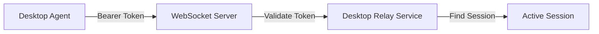
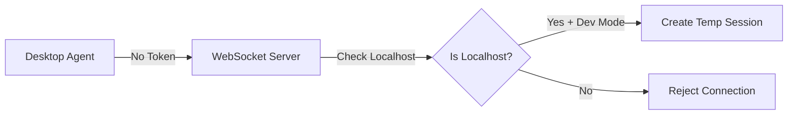

# Desktop Agent Localhost Development Mode

> Tokenless connection for easier local development

---

## Overview

For local development, the Meowstik Desktop Agent supports **tokenless connections** when connecting to `localhost` or `127.0.0.1`. This eliminates the need to generate session tokens during development, making the workflow faster and more convenient.

### Key Features

- 🔓 **No Token Required** - Connect without generating session tokens
- 🏠 **Localhost Only** - Only works for `localhost` and `127.0.0.1` connections
- 🔒 **Production Safe** - Automatically disabled in production (`NODE_ENV=production`)
- 🎯 **Automatic Detection** - Agent automatically detects localhost URLs

---

## How It Works

### Normal (Production) Flow



### Development Flow (Localhost)



---

## Usage

### Starting the Agent (Development Mode)

```bash
# Connect to local server without token
meowstik-agent --relay ws://localhost:5000/ws/desktop/agent/

# Or with WebSocket Secure (if using SSL locally)
meowstik-agent --relay wss://localhost:5000/ws/desktop/agent/
```

### Expected Output

```
🐱 Meowstik Desktop Agent starting...
📡 Connecting to relay: ws://localhost:5000/ws/desktop/agent/
🔓 Development Mode: Connecting to localhost without token
✅ Connected to relay
```

### Starting the Agent (Production Mode)

```bash
# Token is required for non-localhost connections
meowstik-agent --token YOUR_SESSION_TOKEN --relay wss://your-app.replit.app/ws/desktop
```

---

## Server Configuration

### Environment Variables

The server checks `NODE_ENV` to enable/disable tokenless connections:

```bash
# Development mode (tokenless allowed for localhost)
NODE_ENV=development

# Production mode (token always required)
NODE_ENV=production
```

### Security Checks

The server performs the following checks before allowing tokenless connections:

1. **Environment Check**: `NODE_ENV !== "production"`
2. **IP Address Check**: Remote address is `127.0.0.1`, `::1`, or `::ffff:127.0.0.1`
3. **URL Check**: Agent checks if relay URL contains `localhost` or `127.0.0.1`

All three conditions must be met for tokenless connection to succeed.

---

## Architecture

### Agent Changes

**File**: `desktop-agent/src/index.ts`

#### Interface Update

```typescript
interface AgentConfig {
  relayUrl: string;
  token?: string; // Now optional for localhost
  captureInterval: number;
  quality: number;
}
```

#### Connection Logic

```typescript
private async connect(): Promise<void> {
  const headers: Record<string, string> = {};
  
  // Only add Authorization header if token is provided
  if (this.config.token) {
    headers['Authorization'] = `Bearer ${this.config.token}`;
  }
  
  this.ws = new WebSocket(this.config.relayUrl, { headers });
}
```

#### CLI Validation

```typescript
const isLocalhost = relayUrl.includes('localhost') || relayUrl.includes('127.0.0.1');

if (!token && !isLocalhost) {
  console.error('❌ Error: --token is required for non-localhost connections');
  process.exit(1);
}
```

### Server Changes

#### Desktop Relay Service

**File**: `server/services/desktop-relay-service.ts`

##### New Session Type

```typescript
interface DesktopSession {
  id: string;
  token: string | null; // null for development sessions
  // ... other fields
  isDevSession: boolean; // Indicates tokenless development session
}
```

##### Create Development Session

```typescript
createDevSession(): string {
  const sessionId = this.generateSessionId();
  const session: DesktopSession = {
    id: sessionId,
    token: null,
    isDevSession: true,
    // ... other defaults
  };
  
  this.sessions.set(sessionId, session);
  return sessionId;
}
```

#### WebSocket Handler

**File**: `server/websocket-desktop.ts`

##### Connection Validation

```typescript
const isDevelopment = process.env.NODE_ENV !== "production";
const isLocalhost = 
  request.socket.remoteAddress === "127.0.0.1" ||
  request.socket.remoteAddress === "::1" ||
  request.socket.remoteAddress === "::ffff:127.0.0.1";

if (!token && !(isDevelopment && isLocalhost)) {
  socket.write("HTTP/1.1 401 Unauthorized\r\n\r\n");
  socket.destroy();
  return;
}

if (!token) {
  // Create temporary development session
  sessionId = desktopRelayService.createDevSession();
}
```

---

## Security Considerations

### Development Mode Safety

✅ **What IS allowed**:
- Tokenless connections from `localhost` when `NODE_ENV !== "production"`
- Temporary sessions that don't persist
- Same functionality as token-based sessions

❌ **What is NOT allowed**:
- Tokenless connections in production (`NODE_ENV=production`)
- Tokenless connections from non-localhost addresses
- Tokenless connections without valid localhost IP detection

### Production Mode

In production, tokenless connections are **completely disabled**:

```typescript
// This will ALWAYS fail in production
if (process.env.NODE_ENV === "production" && !token) {
  // Connection rejected
}
```

### Risk Mitigation

1. **IP Validation**: Server verifies connection originates from loopback interface
2. **Environment Gating**: Feature only works in development mode
3. **Temporary Sessions**: Development sessions don't persist or require cleanup
4. **Same Permissions**: Dev sessions have the same capabilities (no elevated privileges)

---

## Troubleshooting

### "Token is required" Error (Local Development)

**Error:**
```
❌ Error: --token is required for non-localhost connections
```

**Cause:** The relay URL doesn't contain `localhost` or `127.0.0.1`

**Solution:** Update the `--relay` argument:
```bash
# ❌ Wrong
meowstik-agent --relay ws://192.168.1.100:5000/ws/desktop/agent/

# ✅ Correct
meowstik-agent --relay ws://localhost:5000/ws/desktop/agent/
```

### Connection Rejected by Server

**Error:**
```
[Desktop WS] Agent connection rejected: no token (not localhost or production mode)
```

**Possible Causes:**

1. **Production Mode**: Server is running with `NODE_ENV=production`
   ```bash
   # Check server environment
   echo $NODE_ENV
   # Should be 'development' or unset for tokenless mode
   ```

2. **Proxy/Reverse Proxy**: Connection appears to come from non-localhost IP
   ```bash
   # Check if you're using a proxy
   # Direct connection may be required for development mode
   ```

3. **Docker/Container**: Agent is running in a container
   ```bash
   # Use --network host or configure proper port mapping
   docker run --network host meowstik-agent --relay ws://localhost:5000/ws/desktop/agent/
   ```

### Development Session Not Created

**Error:**
```
[Desktop WS] Agent connection rejected: invalid token
```

**Cause:** Server is attempting token validation instead of creating dev session

**Solution:**
1. Verify `NODE_ENV` is not set to `production`
2. Ensure connection is truly from localhost
3. Check server logs for IP address detection

---

## Comparison: Development vs Production

| Feature | Development (Localhost) | Production |
|---------|------------------------|------------|
| Token Required | ❌ Optional | ✅ Required |
| Session Creation | Automatic | Manual (via API) |
| Environment | `NODE_ENV !== "production"` | `NODE_ENV=production` |
| IP Restriction | `127.0.0.1` only | Any |
| Use Case | Local testing | Deployed app |
| Security Level | Low (local only) | High |

---

## Best Practices

### For Development

1. **Use Localhost URLs**: Always use `localhost` or `127.0.0.1` in development
   ```bash
   meowstik-agent --relay ws://localhost:5000/ws/desktop/agent/
   ```

2. **Set NODE_ENV Properly**: Ensure development mode is active
   ```bash
   export NODE_ENV=development
   npm run dev
   ```

3. **Monitor Logs**: Check both agent and server logs for connection issues
   ```bash
   # Server logs
   [Desktop WS] Creating development session for localhost agent (tokenless)
   
   # Agent logs
   🔓 Development Mode: Connecting to localhost without token
   ```

### For Production

1. **Always Use Tokens**: Never attempt tokenless connections in production
2. **Set NODE_ENV=production**: Ensures tokenless mode is completely disabled
3. **Use Session API**: Create sessions via `/api/desktop/sessions` endpoint

---

## Related Documentation

- [Installing the Desktop Agent](./ragent/install-desktop-agent.md) - Full installation guide
- [Desktop Collaboration](./ragent/collaborative-editing.md) - Using the agent for AI collaboration
- [Browser & Computer Use](./ragent/browser-computer-use.md) - AI automation features

---

## Example Workflows

### Quick Local Test

```bash
# Terminal 1: Start Meowstik server
export NODE_ENV=development
npm run dev

# Terminal 2: Start agent without token
cd desktop-agent
npm run dev -- --relay ws://localhost:5000/ws/desktop/agent/
```

### Production Deployment

```bash
# Terminal 1: Start production server
export NODE_ENV=production
npm start

# Terminal 2: Agent requires token
# First, create session via web UI or API to get token
meowstik-agent \
  --token abc123xyz789 \
  --relay wss://your-app.replit.app/ws/desktop
```

---

## FAQ

**Q: Why can't I use tokenless mode in production?**

A: Security. Without token validation, anyone who can reach your server could connect an agent. Localhost-only connections are safe in development but dangerous in production.

**Q: Can I use tokenless mode with a custom port?**

A: Yes, as long as the hostname is `localhost` or `127.0.0.1`:
```bash
meowstik-agent --relay ws://localhost:8080/ws/desktop/agent/  # ✅ Works
meowstik-agent --relay ws://127.0.0.1:3000/ws/desktop/agent/  # ✅ Works
```

**Q: What if I'm using Docker Compose?**

A: Use service names in your relay URL, but be aware that this won't trigger localhost detection. You may need to use token-based authentication even locally.

**Q: Can I force tokenless mode in production?**

A: No. This is intentionally restricted for security. Modify the source code at your own risk.

**Q: How do I know if my connection is using tokenless mode?**

A: Check the agent output:
```
🔓 Development Mode: Connecting to localhost without token
```

And server logs:
```
[Desktop WS] Creating development session for localhost agent (tokenless)
```
