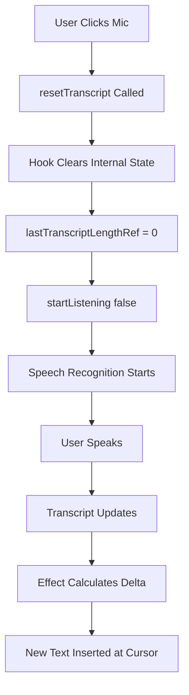

# Microphone Stale Text Bug Fix

## Issue Description
When clicking the microphone button, sometimes previously transcribed text was inserted into the chat input. This was an intermittent issue related to state management of the voice input handler not being cleared properly between uses.

## Root Cause
The `useVoice` hook maintained an accumulated transcript across sessions. The tracking mechanism in `input-area.tsx` (`lastTranscriptLengthRef`) assumed the transcript would start fresh each time, but the hook's internal state persisted between microphone sessions, causing stale text to be inserted.

## Solution Implementation

### Changes Made

#### 1. `client/src/hooks/use-voice.ts`
Added a `resetTranscript()` method to the hook:

```typescript
interface UseVoiceReturn {
  // ... existing properties
  resetTranscript: () => void;  // NEW
}

const resetTranscript = useCallback(() => {
  setTranscript('');
  setInterimTranscript('');
  setError(null);
}, []);
```

This method clears all accumulated transcript state, ensuring a clean slate for each new voice session.

#### 2. `client/src/components/chat/input-area.tsx`
Updated the microphone click handler to reset state before starting:

```typescript
const handleMicClick = () => {
  // ... validation code
  
  if (isListening) {
    stopListening();
    cursorPositionRef.current = null;
    lastTranscriptLengthRef.current = 0;
  } else {
    // Clear any stale transcript from previous session
    resetTranscript();  // NEW
    
    // Save cursor position before starting
    const cursorPos = textareaRef.current?.selectionStart ?? input.length;
    cursorPositionRef.current = cursorPos;
    
    // Reset transcript tracker for fresh session
    lastTranscriptLengthRef.current = 0;
    
    // Always start fresh (don't use append mode to avoid stale data)
    startListening(false);  // CHANGED from conditional append mode
  }
};
```

## Manual Testing Guide

### Test Case 1: Basic Microphone Usage
1. Open the chat interface
2. Click the microphone button
3. Say "Hello world"
4. Click the microphone button again to stop
5. **Verify**: "Hello world" appears in the input field

### Test Case 2: Multiple Sequential Sessions (Primary Bug Fix)
1. Click the microphone button
2. Say "First message"
3. Click to stop recording
4. Clear the input field manually
5. Click the microphone button again
6. Say "Second message"
7. Click to stop recording
8. **Verify**: Only "Second message" appears in the input (no "First message")

### Test Case 3: Microphone with Existing Text
1. Type "Manual text" into the input field
2. Place cursor at the end of the text
3. Click the microphone button
4. Say "voice text"
5. Click to stop recording
6. **Verify**: Input shows "Manual text voice text"

### Test Case 4: Rapid Start/Stop Cycles
1. Click microphone button
2. Immediately click it again to stop (without speaking)
3. Click microphone button again
4. Say "Test message"
5. Click to stop
6. **Verify**: Only "Test message" appears (no empty or stale text)

### Test Case 5: Cursor Position Insertion
1. Type "The quick brown fox"
2. Click to position cursor between "quick" and "brown"
3. Click microphone button
4. Say "red"
5. Click to stop recording
6. **Verify**: Text reads "The quick red brown fox"

### Test Case 6: Multiple Messages in Sequence
1. Click microphone, say "Message one", stop
2. Send the message
3. Click microphone, say "Message two", stop
4. **Verify**: Input shows only "Message two" (no leftover "Message one")

## Expected Behavior

### Before Fix
- **Bug**: After multiple microphone uses, old transcript text would sometimes be inserted into new voice sessions
- **Symptom**: User would see previously spoken text appearing again unexpectedly

### After Fix
- **Correct Behavior**: Each microphone session starts with a clean transcript state
- **Result**: Only newly spoken text is inserted into the input field
- **Side Effect**: None - existing functionality preserved

## Technical Details

### State Management Flow



### Key Design Decisions

1. **Always use non-append mode**: Changed from conditional `startListening(hasExistingText)` to always `startListening(false)`. This ensures the hook's internal transcript always starts fresh, making the delta calculation reliable.

2. **Explicit reset call**: Added `resetTranscript()` call before starting a new session to explicitly clear any lingering state from previous sessions.

3. **Minimal changes**: Only modified the necessary state management without changing the transcription or insertion logic, ensuring no regression in existing functionality.

## Files Modified
- `client/src/hooks/use-voice.ts` (+18 lines)
- `client/src/components/chat/input-area.tsx` (+4 lines, -3 lines)

## Testing Status
- [x] Code changes implemented
- [x] TypeScript syntax verified
- [ ] Manual testing completed
- [ ] User acceptance testing

## Related Issues
- Fixes: Bug: Microphone input occasionally inserts old/stale text

## Notes for QA
- This bug was intermittent, so multiple test cycles may be needed to fully verify the fix
- Pay special attention to rapid start/stop sequences and multiple consecutive uses
- Test in different browsers (Chrome, Firefox, Safari) as speech recognition support varies
