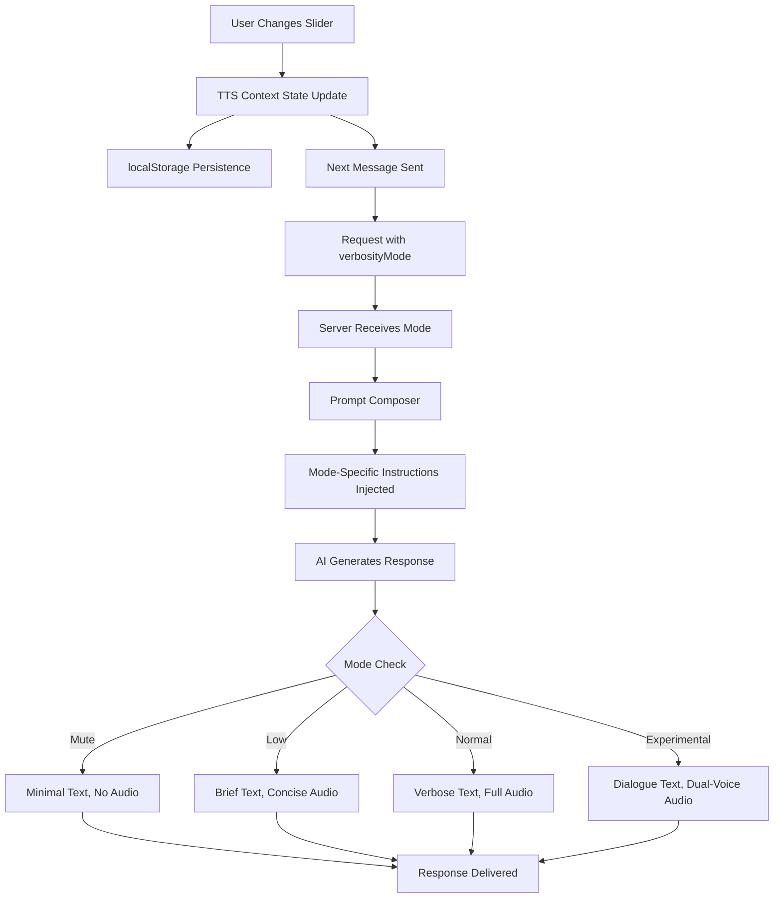

# Verbosity Slider: Before & After Comparison

## Overview

This document illustrates the changes made to the verbosity slider system to align text and speech output.

---

## Before: 6 Modes (Inconsistent)

```
┌─────────────────────────────────────────────────────────────────────┐
│                     OLD VERBOSITY MODES                              │
├─────────────────────────────────────────────────────────────────────┤
│                                                                      │
│  🔇 Mute      🔉 Low       🔊 Normal    🔊 High     ✨ Demo HD  📻 Podcast │
│                                                                      │
│  "No speech"  "Low verb,   "Normal,    "All chat   "Premium   "Dual-voice │
│               say only"    say only"   spoken"     voice"     style"     │
│                                                                      │
└─────────────────────────────────────────────────────────────────────┘

Problems:
❌ Low/Normal modes: Speech only via "say" tool, but text verbosity unclear
❌ High mode: All chat spoken, but text verbosity not specified
❌ Demo HD: Premium voice, but unclear how it differs from High
❌ Podcast: Dual-voice concept, but no alignment with text verbosity
❌ 6 modes created confusion - too many options without clear distinctions
❌ Text and speech controlled separately - inconsistent experience
```

---

## After: 4 Modes (Aligned)

```
┌─────────────────────────────────────────────────────────────────────┐
│                     NEW VERBOSITY MODES                              │
├─────────────────────────────────────────────────────────────────────┤
│                                                                      │
│     🔇 Mute         🔉 Low          🔊 Normal      🎙️ Experimental    │
│                                                                      │
│  "Silent         "Concise       "Verbose       "Dual-voice         │
│   (alerts only)"  text & speech" text & speech" discussion"        │
│                                                                      │
└─────────────────────────────────────────────────────────────────────┘

Improvements:
✅ Clear alignment: Each mode specifies BOTH text and speech behavior
✅ Consistent experience: Text verbosity matches speech verbosity
✅ Simplified: 4 clear modes instead of 6 confusing ones
✅ Better labels: User-facing descriptions match actual behavior
✅ Default makes sense: "Normal" is verbose by default (not minimal)
```

---

## Mode Comparison Matrix

| Aspect | Mute | Low | Normal | Experimental |
|--------|------|-----|--------|--------------|
| **Text Length** | 1 sentence | 1-3 sentences | Multiple paragraphs | Extended dialogue |
| **Speech Output** | None | Concise audio | Full audio | Dual-voice audio |
| **Use Case** | Focus mode | Quick answers | Learning/detail | Brainstorming |
| **Example Response Length** | 10-20 words | 20-50 words | 100-300 words | 200-500+ words |
| **Audio Duration** | 0 seconds | 5-10 seconds | 30-60 seconds | 60-120+ seconds |

---

## Prompt Injection Changes

### Before (6 modes with unclear behavior)

```typescript
// Low Mode (OLD)
"The user has LOW verbosity mode enabled. Keep responses concise.
- Use the `say` tool for voice output when appropriate
- Only speak explicit `say` tool calls - chat content is NOT read aloud"
// ❌ Text verbosity not explicitly controlled

// Normal Mode (OLD)
"The user has NORMAL verbosity mode enabled (default).
- Use the `say` tool for voice output when appropriate
- Only speak explicit `say` tool calls - chat content is NOT read aloud"
// ❌ Same as Low - no clear difference in text

// High Mode (OLD)
"The user has HIGH verbosity mode enabled.
- Use the `say` tool to speak your responses
- All text sent via `send_chat` will be passed through the `say` tool"
// ❌ Text verbosity not specified - only speech behavior
```

### After (4 modes with aligned behavior)

```typescript
// Low Mode (NEW)
"## VERBOSITY MODE: LOW (Concise Text & Speech)
The user has LOW verbosity mode enabled. Keep both text and speech responses concise.
- Keep responses brief and focused - aim for 1-3 sentences maximum
- Use the `say` tool to provide concise spoken summaries
- Provide only essential information without elaboration"
// ✅ Clear: Both text and speech are concise

// Normal Mode (NEW)
"## VERBOSITY MODE: NORMAL (Verbose Text & Speech)
The user has NORMAL verbosity mode enabled. Provide comprehensive, detailed responses in both text and speech.
- Use the `say` tool to speak your complete responses
- All text sent via `send_chat` (except code blocks) should also be spoken
- Provide thorough explanations with context and details"
// ✅ Clear: Both text and speech are verbose

// Experimental Mode (NEW)
"## VERBOSITY MODE: EXPERIMENTAL (Dual-Voice Discussion)
The user has EXPERIMENTAL mode enabled - generate a two-voice discussion format.
- Structure your response as a dialogue between two AI personas discussing the topic
- Use the `say` tool to present this discussion format
- Continue the discussion until the user interrupts (barge-in)"
// ✅ Clear: Unique dual-voice behavior for both text and speech
```

---

## User Flow Example

### Scenario: User asks "What is Python?"

#### Mute Mode 🔇
```
User: "What is Python?"

Text Response: "Python is a programming language."
Audio: (none)
```

#### Low Mode 🔉
```
User: "What is Python?"

Text Response: "Python is a high-level programming language. 
It's known for its simple syntax and versatility."
Audio: "Python is a high-level programming language. 
It's known for its simple syntax and versatility."
```

#### Normal Mode 🔊
```
User: "What is Python?"

Text Response: "Python is a powerful, high-level programming language 
created by Guido van Rossum in 1991. It's designed with a philosophy that 
emphasizes code readability and simplicity, making it an excellent choice for 
beginners and experts alike.

Python supports multiple programming paradigms, including procedural, 
object-oriented, and functional programming. It's widely used in web 
development, data science, machine learning, automation, and more.

Some key features include:
- Clean, readable syntax
- Extensive standard library
- Cross-platform compatibility
- Large, active community
- Rich ecosystem of third-party packages (PyPI)

Would you like to know more about any specific aspect of Python?"

Audio: (Full text spoken aloud with natural pauses)
```

#### Experimental Mode 🎙️
```
User: "What is Python?"

Text Response:
Persona A: "That's a great question! Python is one of the most popular 
programming languages today. It was created back in 1991 by a Dutch programmer 
named Guido van Rossum."

Persona B: "I agree, and what makes Python really special is its design 
philosophy. The language emphasizes readability - it actually looks almost like 
plain English in many cases."

Persona A: "Exactly! That's why it's such a favorite for beginners. The syntax 
is clean and intuitive. For example, you don't need semicolons or curly braces 
like in many other languages."

Persona B: "Right, and beyond education, Python has become a powerhouse in 
professional development too. It's the go-to language for data science, machine 
learning, web development with frameworks like Django..."

Persona A: "And don't forget automation and scripting! Python's versatility is 
really unmatched. You can build everything from simple scripts to complex AI 
systems with the same language."

Audio: (Both personas' dialogue spoken with distinct voice characteristics, 
continuing until user interrupts)
```

---

## Technical Architecture



---

## Migration Path

### For Users

Existing verbosity settings are automatically migrated:

```typescript
// Backwards compatibility mapping
"quiet" → "low"
"verbose" → "normal"
"high" → "normal"
"demo-hd" → "normal"
"podcast" → "experimental"
```

No action required - settings will automatically update on next page load.

### For Developers

TypeScript types updated:
```typescript
// OLD
type VerbosityMode = "mute" | "low" | "normal" | "high" | "demo-hd" | "podcast";

// NEW
type VerbosityMode = "mute" | "low" | "normal" | "experimental";
```

Update any code that references the old mode names.

---

## Key Benefits

1. **🎯 Clarity**: Each mode has a clear, understandable purpose
2. **🔗 Alignment**: Text and speech always match in verbosity
3. **📊 Consistency**: Predictable behavior across all modes
4. **🎨 Simplicity**: 4 modes instead of 6 reduces choice paralysis
5. **📝 Better Defaults**: "Normal" is now verbose (more helpful by default)
6. **🔄 Flexibility**: Mid-session changes work seamlessly
7. **📖 Documentation**: Clear guidelines for users and developers

---

**Summary**: The new 4-mode system provides a **coherent multi-modal experience** where text and speech verbosity are **perfectly aligned**, eliminating confusion and providing clear user expectations.
