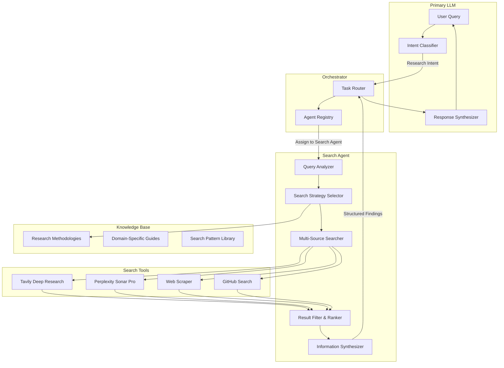

# PROPOSAL-003: Specialized Search Agent for Advanced Web Research

**Date:** January 18, 2026  
**Status:** Draft  
**Author:** GitHub Copilot (based on issue request)  
**Scope:** Specialized agent for advanced web research with cost-optimized architecture

---

## Executive Summary

This proposal introduces a **Specialized Search Agent** to the Meowstik platform - a dedicated research agent that handles web search, information synthesis, and knowledge extraction tasks independently from the primary LLM. By delegating research tasks to a smaller, specialized model (e.g., Gemini Flash 2.0), the system can:

- Process megabytes of web data efficiently
- Filter noise and extract relevant information
- Learn research methodologies from "how-to" books and guides
- Reduce costs significantly (process for pennies vs. dollars with primary LLM)
- Improve response times for research-heavy queries

---

## Problem Statement

### Current Limitations

1. **Primary LLM Bottleneck**: The main LLM handles all tasks, including time-consuming web research, leading to:
   - High token costs when processing large web scraping results
   - Slower response times for simple queries waiting behind research tasks
   - Inefficient use of expensive model capacity for routine search tasks

2. **Limited Research Depth**: Without specialized prompting and methodology, research quality is inconsistent:
   - Generic search strategies don't work well for obscure topics
   - No systematic approach to filtering noise from results
   - Difficulty synthesizing information from multiple sources

3. **No Learning from Methodology**: The system cannot currently learn research techniques from:
   - How-to guides on conducting effective research
   - Best practices documents for information gathering
   - Domain-specific research methodologies

### Use Cases

- **Deep Research**: "Find the latest research on quantum error correction in topological qubits"
- **Obscure Topics**: "What are the best practices for PCB design for high-frequency RF applications?"
- **Multi-Source Synthesis**: "Compare the implementations of RAFT consensus algorithm in etcd, Consul, and CockroachDB"
- **Learning from Books**: Ingest "The Art of Googling" or "Research Methods for Engineers" to improve search strategies

---

## Proposed Solution

### Architecture Overview



### Core Components

#### 1. Search Agent Definition

**Agent Type**: `specialized-researcher`  
**Model**: Gemini Flash 2.0 (or Flash 2.0 Lite when available)  
**Capabilities**:
- `web_research` - Advanced web search and scraping
- `data_synthesis` - Multi-source information synthesis
- `pattern_recognition` - Identify relevant patterns in research results
- `document_analysis` - Extract insights from research papers and documentation

#### 2. Specialized System Prompt

The Search Agent uses a comprehensive system prompt that includes:

```markdown
# Search Agent System Prompt

You are a specialized research agent optimized for conducting thorough web research
and information synthesis. Your capabilities include:

## Core Competencies

1. **Query Analysis**: Break down complex research questions into searchable components
2. **Search Strategy**: Select optimal search strategies based on topic obscurity and domain
3. **Source Evaluation**: Assess credibility, relevance, and recency of sources
4. **Noise Filtering**: Identify and discard irrelevant, duplicated, or low-quality content
5. **Information Synthesis**: Combine findings from multiple sources into coherent insights

## Research Methodologies

### For Obscure Topics
- Use specialized terminology and technical jargon
- Search academic databases and technical forums
- Cross-reference multiple niche sources
- Look for primary sources and original research

### For Rapidly Evolving Topics
- Prioritize recent sources (last 6 months)
- Check official documentation and release notes
- Monitor GitHub repositories and issue trackers
- Verify against multiple independent sources

### For Comparative Analysis
- Create structured comparison framework
- Search for each subject independently
- Identify common evaluation criteria
- Present findings in tabular or structured format

## Search Tools

You have access to:
- Tavily Deep Research (advanced, comprehensive search)
- Perplexity Sonar Pro (AI-powered with citations)
- Web Scraper (direct page content extraction)
- GitHub Search (code and documentation search)

## Output Format

Always return structured findings in JSON format:
{
  "query": "Original research question",
  "strategy": "Strategy used (e.g., 'multi-source-synthesis')",
  "findings": [
    {
      "source": "Source name/URL",
      "credibility": "high|medium|low",
      "recency": "Date or 'recent'/'dated'",
      "summary": "Key findings from this source",
      "quotes": ["Relevant quotes with attribution"]
    }
  ],
  "synthesis": "Comprehensive answer synthesizing all findings",
  "confidence": "high|medium|low",
  "gaps": ["Areas where information was limited or unavailable"],
  "recommendations": ["Suggestions for follow-up research if needed"]
}
```

#### 3. Integration with Orchestrator

Extend <a href="/home/runner/work/Meowstik/Meowstik/server/services/orchestrator.ts">`server/services/orchestrator.ts`</a>:

```typescript
// Register Search Agent
const searchAgent: AgentDefinition = {
  id: "search-agent-001",
  name: "Research Specialist",
  type: "researcher",
  description: "Specialized agent for deep web research and information synthesis",
  capabilities: [
    {
      name: "web_research",
      description: "Advanced web search with noise filtering",
      domains: ["research", "information-gathering", "web-search"],
      tools: ["tavily_research", "perplexity_search", "web_scrape", "github_search"],
      maxConcurrency: 3
    },
    {
      name: "data_synthesis",
      description: "Synthesize information from multiple sources",
      domains: ["research", "analysis"],
      tools: ["tavily_research", "perplexity_search"],
      maxConcurrency: 2
    }
  ],
  priority: 8, // High priority for research tasks
  status: "active",
  currentLoad: 0,
  maxLoad: 5, // Can handle up to 5 concurrent research tasks
  metadata: {
    model: "gemini-2.0-flash",
    temperature: 0.3, // Lower temperature for factual research
    maxTokens: 32000, // Support long research documents
  }
};
```

#### 4. Agent Registry Integration

Register capabilities in <a href="/home/runner/work/Meowstik/Meowstik/server/services/agent-registry.ts">`server/services/agent-registry.ts`</a>:

```typescript
// Add to AGENT_CAPABILITIES
advanced_web_research: {
  name: "advanced_web_research",
  description: "Conduct deep research on obscure and complex topics",
  category: "research",
  tags: ["research", "web", "deep-search", "synthesis"],
  requiredTools: ["tavily_research", "perplexity_search", "web_scrape"],
},
methodology_learning: {
  name: "methodology_learning",
  description: "Learn and apply research methodologies from documents",
  category: "research",
  tags: ["research", "learning", "methodology", "optimization"],
  requiredTools: ["file_get", "docs_read", "rag_query"],
},
```

---

## Implementation Plan

### Phase 1: Core Agent Infrastructure (Week 1)

**Goal**: Set up basic Search Agent with orchestrator integration

#### Tasks:
- [x] Design agent architecture and interfaces
- [ ] Create <a>`server/services/search-agent.ts`</a> service
- [ ] Design structured output schema for research findings
- [ ] Register agent in agent registry with appropriate capabilities
- [ ] Create system prompt in <a>`prompts/search-agent.md`</a>
- [ ] Implement basic agent invocation from orchestrator
- [ ] Add database schema for storing research cache

#### Deliverables:
- Search Agent service file
- Agent registration in registry
- System prompt file
- Database migration for research cache table

#### Success Criteria:
- Primary LLM can delegate research tasks to Search Agent
- Search Agent returns structured findings
- Results are cached to avoid duplicate searches

---

### Phase 2: Advanced Search Strategies (Week 2)

**Goal**: Implement sophisticated search strategies and filtering

#### Tasks:
- [ ] Implement query analysis and decomposition
- [ ] Create search strategy selector (basic, deep, comparative, etc.)
- [ ] Build result ranking and filtering system
- [ ] Implement multi-source search with parallel execution
- [ ] Add credibility scoring for sources
- [ ] Create information synthesis engine
- [ ] Implement confidence scoring for findings

#### Deliverables:
- Query analyzer module
- Search strategy library
- Result filtering and ranking system
- Multi-source search orchestrator
- Synthesis engine

#### Success Criteria:
- Agent selects appropriate strategy based on query type
- Filters out >80% of noise and irrelevant results
- Synthesizes coherent answers from 5+ sources
- Provides confidence scores and identifies gaps

---

### Phase 3: Methodology Learning System (Week 3)

**Goal**: Enable agent to learn from "how-to" books and guides

#### Tasks:
- [ ] Create methodology ingestion pipeline
- [ ] Design methodology storage schema (patterns, strategies, best practices)
- [ ] Implement RAG-based methodology retrieval
- [ ] Build dynamic prompt composition with learned methodologies
- [ ] Create methodology evaluation and feedback system
- [ ] Add domain-specific methodology libraries (tech, science, business)
- [ ] Implement methodology versioning and updates

#### Deliverables:
- Methodology ingestion service
- Methodology database schema
- RAG integration for methodology retrieval
- Dynamic prompt composer
- Initial methodology library (3-5 how-to guides ingested)

#### Success Criteria:
- Agent can ingest a "how-to" book and extract research patterns
- Applies learned methodologies to relevant queries
- Demonstrates improved research quality after methodology ingestion
- Users can upload custom research guides for domain-specific tasks

---

### Phase 4: Cost Optimization & Caching (Week 4)

**Goal**: Minimize costs through intelligent caching and model selection

#### Tasks:
- [ ] Implement semantic caching for similar queries
- [ ] Create result expiration and freshness checking
- [ ] Build query deduplication system
- [ ] Implement tiered model selection (Flash Lite → Flash → Pro based on complexity)
- [ ] Add cost tracking and reporting per search
- [ ] Create budget limits and throttling
- [ ] Implement incremental search (start cheap, escalate if needed)

#### Deliverables:
- Semantic cache system
- Query deduplication service
- Tiered model selector
- Cost tracking dashboard
- Budget control system

#### Success Criteria:
- 70%+ cache hit rate for similar queries
- Average search cost <$0.05 per query
- 90% of queries use Flash or Flash Lite
- Cost dashboard shows per-agent spending

---

### Phase 5: UI & User Experience (Week 5)

**Goal**: Create intuitive interface for research tasks and methodology management

#### Tasks:
- [ ] Add "Deep Research" button to chat interface
- [ ] Create research progress indicator (strategy, sources, synthesis)
- [ ] Build methodology library viewer
- [ ] Create methodology upload interface
- [ ] Add source citation links in responses
- [ ] Implement research history and bookmarking
- [ ] Create research templates for common patterns

#### Deliverables:
- Updated chat UI with research controls
- Methodology management interface
- Research history viewer
- Citation renderer
- Template library

#### Success Criteria:
- Users can trigger deep research with one click
- Progress is visible during long searches
- Citations are clickable and traceable
- Users can manage custom methodologies
- Research can be saved and resumed

---

## Database Schema

### Research Cache Table

```typescript
// Add to shared/schema.ts
export const researchCache = pgTable("research_cache", {
  id: varchar("id").primaryKey().default(sql`gen_random_uuid()`),
  
  // Query identification
  queryHash: varchar("query_hash", { length: 64 }).notNull().unique(),
  query: text("query").notNull(),
  normalizedQuery: text("normalized_query").notNull(),
  
  // Agent and strategy info
  agentId: varchar("agent_id").notNull(),
  strategy: text("strategy").notNull(), // 'basic', 'deep', 'comparative', etc.
  
  // Results
  findings: jsonb("findings").notNull(), // Structured findings JSON
  sourcesUsed: text("sources_used").array().notNull(), // List of sources consulted
  
  // Metadata
  confidence: text("confidence").notNull(), // 'high', 'medium', 'low'
  credibilityScore: integer("credibility_score"), // 0-100
  synthesisQuality: integer("synthesis_quality"), // 0-100
  
  // Cost tracking
  inputTokens: integer("input_tokens"),
  outputTokens: integer("output_tokens"),
  estimatedCost: decimal("estimated_cost", { precision: 10, scale: 4 }),
  
  // Cache management
  expiresAt: timestamp("expires_at").notNull(),
  hitCount: integer("hit_count").default(0),
  
  // Timestamps
  createdAt: timestamp("created_at").defaultNow().notNull(),
  lastAccessedAt: timestamp("last_accessed_at").defaultNow().notNull(),
}, (table) => [
  index("idx_research_cache_query_hash").on(table.queryHash),
  index("idx_research_cache_expires_at").on(table.expiresAt),
  index("idx_research_cache_normalized_query").on(table.normalizedQuery),
]);

export const insertResearchCacheSchema = createInsertSchema(researchCache).omit({
  id: true,
  createdAt: true,
  lastAccessedAt: true,
});
export type InsertResearchCache = z.infer<typeof insertResearchCacheSchema>;
export type ResearchCache = typeof researchCache.$inferSelect;
```

### Research Methodologies Table

```typescript
// Add to shared/schema.ts
export const researchMethodologies = pgTable("research_methodologies", {
  id: varchar("id").primaryKey().default(sql`gen_random_uuid()`),
  
  // Methodology identification
  name: text("name").notNull(),
  description: text("description"),
  domain: text("domain"), // 'technology', 'science', 'business', 'general', etc.
  
  // Source information
  sourceType: text("source_type").notNull(), // 'book', 'guide', 'manual', 'user-defined'
  sourceTitle: text("source_title"),
  sourceAuthor: text("source_author"),
  sourceUrl: text("source_url"),
  
  // Methodology content
  patterns: jsonb("patterns").notNull(), // Search patterns and strategies
  bestPractices: jsonb("best_practices").notNull(), // Guidelines and tips
  examples: jsonb("examples"), // Example queries and approaches
  
  // Applicability
  topics: text("topics").array(), // Topics this methodology applies to
  queryPatterns: text("query_patterns").array(), // Query patterns that trigger this methodology
  
  // Quality metrics
  successRate: integer("success_rate"), // 0-100 based on user feedback
  timesApplied: integer("times_applied").default(0),
  
  // Version control
  version: integer("version").default(1),
  deprecated: boolean("deprecated").default(false),
  
  // User management
  userId: varchar("user_id"), // If user-uploaded
  isPublic: boolean("is_public").default(false),
  
  // Timestamps
  createdAt: timestamp("created_at").defaultNow().notNull(),
  updatedAt: timestamp("updated_at").defaultNow().notNull(),
}, (table) => [
  index("idx_methodologies_domain").on(table.domain),
  index("idx_methodologies_topics").on(table.topics),
  index("idx_methodologies_deprecated").on(table.deprecated),
]);

export const insertResearchMethodologySchema = createInsertSchema(researchMethodologies).omit({
  id: true,
  createdAt: true,
  updatedAt: true,
});
export type InsertResearchMethodology = z.infer<typeof insertResearchMethodologySchema>;
export type ResearchMethodology = typeof researchMethodologies.$inferSelect;
```

---

## Cost Analysis

### Current Approach (Primary LLM Only)

**Scenario**: Research query requiring 10 web pages analyzed

- **Model**: Gemini Pro 1.5 or 2.0
- **Input**: ~50K tokens (web content) + 5K tokens (conversation context)
- **Output**: ~2K tokens (synthesized response)
- **Cost per query**: $0.30 - $0.50

**Monthly cost** (100 research queries): **$30 - $50**

### Proposed Approach (Specialized Search Agent)

**Scenario**: Same research query

- **Model**: Gemini Flash 2.0 (or Flash Lite)
- **Input**: ~50K tokens (web content) + 2K tokens (specialized prompt)
- **Output**: ~2K tokens (structured findings)
- **Cost per query**: $0.03 - $0.08
- **Cache hit rate**: 30-40% for similar queries

**Monthly cost** (100 research queries, 35% cache hits): **$2 - $5**

### Cost Savings

- **Per Query**: 83-90% reduction
- **Monthly** (100 queries): $25-45 saved
- **Annual** (1,200 queries): $300-540 saved

### Additional Benefits

1. **Parallel Processing**: Can run 3-5 research tasks simultaneously without blocking primary LLM
2. **Faster Responses**: Simple queries get answered immediately while research runs in background
3. **Higher Quality**: Specialized prompting and methodology learning improve research accuracy
4. **Scalability**: Can handle 10x research load without proportional cost increase due to caching

---

## Learning from "How-To" Books

### Example: Ingesting "The Art of Effective Research"

#### Step 1: Book Ingestion

User uploads or references a research methodology book:
- "The Art of Google Searching" by Jason Smith
- "Research Methods for Engineers" by Dr. Chen
- "Competitive Intelligence Handbook" by Sarah Johnson

#### Step 2: Methodology Extraction

Search Agent processes the book and extracts:

```json
{
  "methodology_name": "advanced_google_search_operators",
  "domain": "technology",
  "patterns": [
    {
      "name": "exact_phrase_search",
      "description": "Use quotes for exact phrase matching",
      "example": "\"quantum error correction\" topological qubits",
      "when_to_use": "When terminology must be exact"
    },
    {
      "name": "site_specific_search",
      "description": "Limit search to specific domains",
      "example": "site:arxiv.org quantum computing",
      "when_to_use": "When seeking academic or authoritative sources"
    },
    {
      "name": "exclude_terms",
      "description": "Remove irrelevant results with minus operator",
      "example": "quantum computing -cryptocurrency -stocks",
      "when_to_use": "When topic has ambiguous terminology"
    }
  ],
  "best_practices": [
    "Start with broad searches, then narrow down",
    "Use technical jargon for academic topics",
    "Check multiple independent sources",
    "Verify recency for rapidly evolving fields"
  ],
  "query_patterns": [
    "research.*quantum",
    "find.*technical.*documentation",
    "compare.*implementations"
  ]
}
```

#### Step 3: Application

When user asks: "Find research on topological quantum error correction"

Search Agent:
1. **Matches pattern**: "research.*quantum"
2. **Loads methodology**: "advanced_google_search_operators"
3. **Applies strategies**:
   - Uses exact phrase: "topological quantum error correction"
   - Searches authoritative sites: site:arxiv.org, site:quantum-journal.org
   - Excludes noise: -cryptocurrency -quantum-computing-stocks
   - Verifies recency: published within last 2 years

4. **Returns structured findings** with applied methodology cited

#### Step 4: Learning Loop

- User provides feedback: "Great results!" or "Missing key papers"
- Agent updates `successRate` for methodology
- Adjusts `queryPatterns` based on successful matches
- Gradually improves over time

---

## Integration Points

### 1. Orchestrator Integration

**File**: <a href="/home/runner/work/Meowstik/Meowstik/server/services/orchestrator.ts">`server/services/orchestrator.ts`</a>

```typescript
// Add research intent detection
async function classifyIntent(userQuery: string): Promise<Intent> {
  const researchKeywords = [
    'research', 'find', 'search', 'look up', 'investigate',
    'compare', 'analyze', 'what are', 'how do', 'explain'
  ];
  
  const hasResearchIntent = researchKeywords.some(kw => 
    userQuery.toLowerCase().includes(kw)
  );
  
  if (hasResearchIntent) {
    return {
      type: 'research',
      agentType: 'researcher',
      priority: 7,
      estimatedComplexity: 'high'
    };
  }
  
  // ... other intent types
}

// Route to Search Agent
async function delegateToSearchAgent(query: string, context: ExecutionContext) {
  const agent = await agentRegistry.findAgents({
    capabilities: ['web_research'],
    agentType: 'specialized'
  });
  
  if (agent.length === 0) {
    // Fallback to primary LLM
    return await primaryLLM.processQuery(query, context);
  }
  
  const searchAgent = agent[0];
  const job = await jobQueue.submit({
    name: 'web_research',
    type: 'prompt',
    priority: 7,
    payload: {
      query,
      context,
      strategy: 'deep', // or auto-select
    }
  });
  
  return await jobDispatcher.execute(job, searchAgent);
}
```

### 2. Prompt Composer Integration

**File**: <a href="/home/runner/work/Meowstik/Meowstik/server/services/prompt-composer.ts">`server/services/prompt-composer.ts`</a>

```typescript
// Add methodology loading
async function composeSearchAgentPrompt(query: string): Promise<ComposedPrompt> {
  // Load base search agent prompt
  const basePrompt = await fs.readFile('prompts/search-agent.md', 'utf-8');
  
  // Find relevant methodologies
  const methodologies = await storage.findMethodologies({
    topics: extractTopics(query),
    queryPatterns: query,
  });
  
  // Compose with methodologies
  let systemPrompt = basePrompt;
  
  if (methodologies.length > 0) {
    systemPrompt += '\n\n## Relevant Research Methodologies\n\n';
    for (const method of methodologies) {
      systemPrompt += `### ${method.name}\n`;
      systemPrompt += `${method.description}\n\n`;
      systemPrompt += `**Patterns**: ${JSON.stringify(method.patterns, null, 2)}\n\n`;
      systemPrompt += `**Best Practices**: ${JSON.stringify(method.bestPractices, null, 2)}\n\n`;
    }
  }
  
  return {
    systemPrompt,
    userMessage: query,
    attachments: [],
    conversationHistory: [],
    metadata: {
      chatId: context.chatId,
      hasVoiceInput: false,
      hasFileAttachments: false,
      hasScreenshots: false,
      composedAt: new Date(),
    }
  };
}
```

### 3. RAG Integration

**File**: <a href="/home/runner/work/Meowstik/Meowstik/server/services/rag-service.ts">`server/services/rag-service.ts`</a>

```typescript
// Add methodology retrieval
async function retrieveMethodologies(query: string): Promise<ResearchMethodology[]> {
  // Embed query
  const queryEmbedding = await embeddingService.embed(query);
  
  // Search vector store for similar methodologies
  const results = await vectorStore.similaritySearch({
    embedding: queryEmbedding,
    collection: 'research_methodologies',
    topK: 3,
  });
  
  // Load full methodology documents
  const methodologies = await Promise.all(
    results.map(r => storage.getMethodology(r.metadata.methodologyId))
  );
  
  return methodologies.filter(m => m !== null);
}
```

---

## Success Metrics

### Performance Metrics

1. **Cost Reduction**
   - Target: 80%+ reduction in research-related LLM costs
   - Measurement: Compare cost per research query before/after implementation

2. **Response Time**
   - Target: 50% faster average response time for research queries
   - Measurement: Track time from query submission to response completion

3. **Cache Hit Rate**
   - Target: 30-40% cache hits for similar queries within 7 days
   - Measurement: Track cache hits vs. misses in research_cache table

4. **Research Quality**
   - Target: 4.0+ average user rating for research results (1-5 scale)
   - Measurement: User feedback after each research task

### Learning Metrics

5. **Methodology Application**
   - Target: 70%+ of queries trigger relevant methodology
   - Measurement: Track methodology matches in logs

6. **Methodology Success Rate**
   - Target: Improve from baseline to 80%+ positive feedback
   - Measurement: Track user satisfaction when methodology is applied vs. not applied

7. **Methodology Library Growth**
   - Target: 20+ methodologies across 5+ domains in first quarter
   - Measurement: Count active methodologies in database

### Operational Metrics

8. **Agent Utilization**
   - Target: 60%+ of research queries delegated to Search Agent
   - Measurement: Track primary LLM vs. Search Agent usage

9. **Parallel Execution**
   - Target: Support 3-5 concurrent research tasks without degradation
   - Measurement: Monitor agent load and response times under load

10. **Error Rate**
    - Target: <5% failed searches (excluding network issues)
    - Measurement: Track job failures in agent_jobs table

---

## Risks & Mitigations

### Risk 1: Search Agent Produces Lower Quality Results

**Mitigation**:
- Implement confidence scoring - fallback to primary LLM for low-confidence results
- A/B test results with sample of users
- Allow manual override to always use primary LLM
- Continuous monitoring of user feedback and ratings

### Risk 2: Over-Reliance on Cached Results

**Mitigation**:
- Implement smart cache expiration based on topic volatility
- Show cache freshness indicator to users
- Allow users to force fresh search
- Automatically refresh for rapidly evolving topics (tech news, etc.)

### Risk 3: Methodology Conflicts

**Mitigation**:
- Methodology conflict detection in registry
- Priority system for conflicting methodologies
- User can disable specific methodologies
- Manual curation of public methodology library

### Risk 4: Cost Still Too High at Scale

**Mitigation**:
- Implement aggressive query deduplication
- Use Flash Lite as default, escalate only when needed
- Set per-user budget limits
- Implement request throttling for heavy users
- Optimize prompts to reduce token usage

### Risk 5: Integration Complexity

**Mitigation**:
- Phase implementation - start simple, add complexity gradually
- Maintain fallback to current system at all times
- Comprehensive testing at each phase
- Feature flags to enable/disable Search Agent per user

---

## Future Enhancements

### Phase 6+: Advanced Features

1. **Multi-Agent Research Teams**
   - Parallel research by multiple specialized agents
   - One agent per sub-question, results aggregated
   - Competitive search: multiple strategies, best result wins

2. **Interactive Research Sessions**
   - User can guide research direction mid-search
   - Agent asks clarifying questions
   - Iterative refinement of search strategy

3. **Domain-Specific Sub-Agents**
   - Academic research agent (focuses on papers, citations)
   - Technical documentation agent (API docs, GitHub)
   - News & current events agent (fresh content, verified sources)
   - Market research agent (business intelligence)

4. **Research Collaboration**
   - Share research findings with team
   - Collaborative methodology development
   - Community-contributed methodologies
   - Peer review of methodologies

5. **Automated Methodology Discovery**
   - Agent learns patterns from successful searches
   - Automatically generates new methodologies
   - A/B tests methodologies to measure effectiveness
   - Evolves methodologies over time

6. **Research Templates**
   - Pre-defined research workflows for common tasks
   - "Competitive analysis" template
   - "Literature review" template
   - "Market sizing" template
   - "Technology evaluation" template

7. **Research Provenance**
   - Complete audit trail of search decisions
   - Visualization of research process
   - Explanation of why sources were chosen/rejected
   - Reproducible research sessions

---

## Appendix A: Example Methodologies

### Methodology: Academic Paper Research

```json
{
  "name": "academic_paper_research",
  "description": "Systematic approach to finding and analyzing academic papers",
  "domain": "science",
  "patterns": [
    {
      "name": "multi_database_search",
      "steps": [
        "Search Google Scholar for broad overview",
        "Search arXiv for recent preprints",
        "Search IEEE Xplore for engineering papers",
        "Search PubMed for medical/bio papers",
        "Cross-reference citations between sources"
      ]
    },
    {
      "name": "citation_tracking",
      "steps": [
        "Identify seminal papers (high citation count)",
        "Find recent papers citing seminal works",
        "Build citation graph to find related work",
        "Identify key researchers and their recent publications"
      ]
    }
  ],
  "best_practices": [
    "Start with review papers for field overview",
    "Check paper recency - prefer last 3 years for fast-moving fields",
    "Verify author credentials and institution",
    "Look for papers in high-impact journals",
    "Read abstract and conclusion first, then introduction, then full paper"
  ],
  "topics": ["academic", "research", "papers", "science", "engineering"],
  "query_patterns": [
    ".*research.*paper",
    ".*academic.*study",
    ".*published.*findings"
  ]
}
```

### Methodology: Technical Documentation Research

```json
{
  "name": "technical_documentation_research",
  "description": "Find and synthesize technical documentation for libraries and frameworks",
  "domain": "technology",
  "patterns": [
    {
      "name": "official_sources_first",
      "steps": [
        "Check official documentation site",
        "Search GitHub repository README and docs folder",
        "Look for official tutorials and guides",
        "Check official blog for announcements",
        "Only then search Stack Overflow and forums"
      ]
    },
    {
      "name": "version_awareness",
      "steps": [
        "Identify current stable version",
        "Filter results by version number",
        "Check release notes and changelog",
        "Verify example code is for correct version",
        "Flag deprecated features"
      ]
    }
  ],
  "best_practices": [
    "Always check documentation date and version",
    "Prefer official docs over blog posts",
    "Run example code to verify it works",
    "Check GitHub issues for known problems",
    "Look for migration guides when version differs"
  ],
  "topics": ["programming", "api", "framework", "library", "documentation"],
  "query_patterns": [
    "how to use.*",
    ".*documentation",
    ".*api.*reference"
  ]
}
```

### Methodology: Competitive Analysis

```json
{
  "name": "competitive_analysis",
  "description": "Compare multiple products, services, or technologies",
  "domain": "business",
  "patterns": [
    {
      "name": "structured_comparison",
      "steps": [
        "Create list of comparison criteria upfront",
        "Research each competitor independently",
        "Fill comparison matrix systematically",
        "Identify unique differentiators",
        "Assess market positioning"
      ]
    },
    {
      "name": "multi_perspective",
      "steps": [
        "Check official product pages",
        "Read user reviews (G2, Capterra, etc.)",
        "Search for expert comparisons",
        "Check pricing and packaging",
        "Look for analyst reports (Gartner, etc.)"
      ]
    }
  ],
  "best_practices": [
    "Define evaluation criteria before starting",
    "Use same criteria for all competitors",
    "Note data sources and recency",
    "Identify bias in sources (paid reviews, competitor FUD)",
    "Focus on customer outcomes, not just features"
  ],
  "topics": ["business", "market", "competition", "product", "service"],
  "query_patterns": [
    "compare.*vs.*",
    ".*alternatives to",
    "best.*for.*"
  ]
}
```

---

## Appendix B: Sample Implementation Code

### Search Agent Service

```typescript
// server/services/search-agent.ts

import { GoogleGenerativeAI } from "@google/generative-ai";
import { tavilyDeepResearch } from "../integrations/tavily";
import { perplexityDeepResearch } from "../integrations/perplexity";
import { storage } from "../storage";
import crypto from "crypto";

export interface SearchQuery {
  query: string;
  strategy?: 'basic' | 'deep' | 'comparative' | 'academic';
  maxSources?: number;
  domains?: string[];
  freshnessRequired?: boolean; // If true, skip cache
}

export interface SearchFindings {
  query: string;
  strategy: string;
  findings: Array<{
    source: string;
    credibility: 'high' | 'medium' | 'low';
    recency: string;
    summary: string;
    quotes: string[];
  }>;
  synthesis: string;
  confidence: 'high' | 'medium' | 'low';
  gaps: string[];
  recommendations: string[];
  metadata: {
    sourcesConsulted: number;
    tokensUsed: number;
    durationMs: number;
    fromCache: boolean;
  };
}

class SearchAgentService {
  private genAI: GoogleGenerativeAI;
  private model: any;
  
  constructor() {
    this.genAI = new GoogleGenerativeAI(process.env.GOOGLE_API_KEY!);
    this.model = this.genAI.getGenerativeModel({ 
      model: "gemini-2.0-flash-exp"
    });
  }
  
  /**
   * Main research entry point
   */
  async research(searchQuery: SearchQuery): Promise<SearchFindings> {
    const startTime = Date.now();
    
    // Check cache first (unless freshness required)
    if (!searchQuery.freshnessRequired) {
      const cached = await this.checkCache(searchQuery.query);
      if (cached) {
        console.log('[SearchAgent] Cache hit!');
        return {
          ...cached.findings,
          metadata: {
            ...cached.findings.metadata,
            fromCache: true,
            durationMs: Date.now() - startTime,
          }
        };
      }
    }
    
    // Select strategy
    const strategy = searchQuery.strategy || await this.selectStrategy(searchQuery.query);
    console.log(`[SearchAgent] Using strategy: ${strategy}`);
    
    // Load relevant methodologies
    const methodologies = await this.loadMethodologies(searchQuery.query);
    console.log(`[SearchAgent] Loaded ${methodologies.length} methodologies`);
    
    // Perform multi-source search
    const rawResults = await this.multiSourceSearch(searchQuery, strategy);
    
    // Filter and rank results
    const filteredResults = await this.filterAndRank(rawResults);
    
    // Synthesize findings
    const findings = await this.synthesize(
      searchQuery.query,
      filteredResults,
      methodologies,
      strategy
    );
    
    findings.metadata.durationMs = Date.now() - startTime;
    findings.metadata.fromCache = false;
    
    // Cache results
    await this.cacheResults(searchQuery.query, findings, strategy);
    
    return findings;
  }
  
  /**
   * Check if we have cached results for this query
   */
  private async checkCache(query: string): Promise<any | null> {
    const queryHash = this.hashQuery(query);
    const cached = await storage.getResearchCache(queryHash);
    
    if (!cached) return null;
    
    // Check if expired
    if (new Date() > cached.expiresAt) {
      console.log('[SearchAgent] Cache expired');
      return null;
    }
    
    // Update hit count and last accessed
    await storage.incrementCacheHit(queryHash);
    
    return cached;
  }
  
  /**
   * Hash query for cache lookup (semantic normalization)
   */
  private hashQuery(query: string): string {
    // Normalize: lowercase, remove punctuation, sort words
    const normalized = query
      .toLowerCase()
      .replace(/[^\w\s]/g, '')
      .split(/\s+/)
      .sort()
      .join(' ');
      
    return crypto.createHash('sha256').update(normalized).digest('hex');
  }
  
  /**
   * Automatically select search strategy based on query
   */
  private async selectStrategy(query: string): Promise<string> {
    const keywords = {
      basic: ['what is', 'define', 'explain'],
      deep: ['research', 'comprehensive', 'detailed', 'thorough'],
      comparative: ['compare', 'versus', 'vs', 'difference between'],
      academic: ['paper', 'study', 'research', 'published', 'journal'],
    };
    
    const lowerQuery = query.toLowerCase();
    
    for (const [strategy, terms] of Object.entries(keywords)) {
      if (terms.some(term => lowerQuery.includes(term))) {
        return strategy;
      }
    }
    
    // Default to basic for short queries, deep for long queries
    return query.split(' ').length > 10 ? 'deep' : 'basic';
  }
  
  /**
   * Load relevant research methodologies from database
   */
  private async loadMethodologies(query: string): Promise<any[]> {
    // Extract topics from query
    const topics = this.extractTopics(query);
    
    // Find methodologies matching topics
    return await storage.findMethodologies({
      topics,
      deprecated: false,
    });
  }
  
  /**
   * Extract topics from query using simple keyword matching
   * In production, this could use NER or topic modeling
   */
  private extractTopics(query: string): string[] {
    const topicKeywords = {
      technology: ['software', 'code', 'api', 'framework', 'library', 'programming'],
      science: ['research', 'study', 'experiment', 'hypothesis', 'theory'],
      business: ['market', 'product', 'customer', 'revenue', 'competitor'],
      academic: ['paper', 'journal', 'published', 'citation', 'peer-review'],
    };
    
    const lowerQuery = query.toLowerCase();
    const topics: string[] = [];
    
    for (const [topic, keywords] of Object.entries(topicKeywords)) {
      if (keywords.some(kw => lowerQuery.includes(kw))) {
        topics.push(topic);
      }
    }
    
    return topics.length > 0 ? topics : ['general'];
  }
  
  /**
   * Search multiple sources in parallel
   */
  private async multiSourceSearch(
    searchQuery: SearchQuery,
    strategy: string
  ): Promise<any[]> {
    const maxResults = searchQuery.maxSources || (strategy === 'deep' ? 10 : 5);
    
    const searches = [
      tavilyDeepResearch(searchQuery.query, maxResults),
      perplexityDeepResearch(searchQuery.query),
    ];
    
    const results = await Promise.allSettled(searches);
    
    const combined: any[] = [];
    
    for (const result of results) {
      if (result.status === 'fulfilled') {
        combined.push(result.value);
      }
    }
    
    return combined;
  }
  
  /**
   * Filter noise and rank results by relevance
   */
  private async filterAndRank(rawResults: any[]): Promise<any[]> {
    // TODO: Implement sophisticated filtering
    // - Remove duplicate content (fuzzy matching)
    // - Score credibility (domain authority, publication date)
    // - Rank by relevance (semantic similarity to query)
    // - Filter out ads, SEO spam, low-quality content
    
    return rawResults; // Simplified for now
  }
  
  /**
   * Synthesize findings using Search Agent LLM
   */
  private async synthesize(
    query: string,
    results: any[],
    methodologies: any[],
    strategy: string
  ): Promise<SearchFindings> {
    // Load system prompt
    const systemPrompt = await this.composeSystemPrompt(methodologies);
    
    // Compose synthesis request
    const synthesisPrompt = `
Research Query: ${query}
Strategy: ${strategy}

Raw Search Results:
${JSON.stringify(results, null, 2)}

Please synthesize these findings into a structured response following the output format specified in your system prompt.
`;
    
    const chat = this.model.startChat({
      history: [
        {
          role: 'user',
          parts: [{ text: systemPrompt }],
        },
        {
          role: 'model',
          parts: [{ text: 'I understand. I will synthesize research findings according to the specified format.' }],
        },
      ],
    });
    
    const result = await chat.sendMessage(synthesisPrompt);
    const response = await result.response;
    const text = response.text();
    
    // Parse JSON response
    try {
      const findings = JSON.parse(text);
      return findings;
    } catch (error) {
      console.error('[SearchAgent] Failed to parse JSON response:', error);
      // Fallback to basic structure
      return {
        query,
        strategy,
        findings: [],
        synthesis: text,
        confidence: 'low',
        gaps: ['Failed to parse structured response'],
        recommendations: ['Retry with better structured prompt'],
        metadata: {
          sourcesConsulted: results.length,
          tokensUsed: 0, // TODO: Track tokens
          durationMs: 0,
          fromCache: false,
        }
      };
    }
  }
  
  /**
   * Compose system prompt with loaded methodologies
   */
  private async composeSystemPrompt(methodologies: any[]): Promise<string> {
    let prompt = `# Search Agent System Prompt

You are a specialized research agent optimized for conducting thorough web research and information synthesis.

## Core Competencies
1. Query Analysis: Break down complex research questions
2. Search Strategy: Select optimal search strategies
3. Source Evaluation: Assess credibility and relevance
4. Noise Filtering: Identify and discard low-quality content
5. Information Synthesis: Combine findings into coherent insights

## Output Format
Always return findings as valid JSON:
{
  "query": "Original question",
  "strategy": "Strategy used",
  "findings": [
    {
      "source": "Source name/URL",
      "credibility": "high|medium|low",
      "recency": "Date or 'recent'/'dated'",
      "summary": "Key findings",
      "quotes": ["Relevant quotes"]
    }
  ],
  "synthesis": "Comprehensive answer",
  "confidence": "high|medium|low",
  "gaps": ["Information gaps"],
  "recommendations": ["Follow-up suggestions"]
}
`;
    
    if (methodologies.length > 0) {
      prompt += '\n\n## Loaded Methodologies\n\n';
      for (const method of methodologies) {
        prompt += `### ${method.name}\n`;
        prompt += `${method.description}\n\n`;
        if (method.bestPractices) {
          prompt += `**Best Practices**: ${JSON.stringify(method.bestPractices)}\n\n`;
        }
      }
    }
    
    return prompt;
  }
  
  /**
   * Cache search results for future queries
   */
  private async cacheResults(
    query: string,
    findings: SearchFindings,
    strategy: string
  ): Promise<void> {
    const queryHash = this.hashQuery(query);
    const normalizedQuery = query.toLowerCase().trim();
    
    // Determine cache expiration based on query type
    const expiresAt = this.calculateExpiration(query, strategy);
    
    await storage.cacheResearch({
      queryHash,
      query,
      normalizedQuery,
      agentId: 'search-agent-001',
      strategy,
      findings: findings as any,
      sourcesUsed: findings.findings.map(f => f.source),
      confidence: findings.confidence,
      expiresAt,
    });
  }
  
  /**
   * Calculate cache expiration based on query characteristics
   */
  private calculateExpiration(query: string, strategy: string): Date {
    const now = new Date();
    
    // Rapidly evolving topics: 1 day cache
    const rapidKeywords = ['news', 'latest', 'current', 'today', 'breaking'];
    if (rapidKeywords.some(kw => query.toLowerCase().includes(kw))) {
      return new Date(now.getTime() + 24 * 60 * 60 * 1000);
    }
    
    // Academic/historical: 30 days cache
    const stableKeywords = ['history', 'theory', 'principle', 'fundamental'];
    if (stableKeywords.some(kw => query.toLowerCase().includes(kw))) {
      return new Date(now.getTime() + 30 * 24 * 60 * 60 * 1000);
    }
    
    // Default: 7 days cache
    return new Date(now.getTime() + 7 * 24 * 60 * 60 * 1000);
  }
}

export const searchAgent = new SearchAgentService();
export default searchAgent;
```

---

## Conclusion

The Specialized Search Agent represents a significant enhancement to Meowstik's research capabilities while dramatically reducing costs. By combining:

1. **Specialized prompting** for research tasks
2. **Cost-effective models** (Flash 2.0 / Flash Lite)
3. **Intelligent caching** for repeated queries
4. **Methodology learning** from how-to books
5. **Orchestrated delegation** from primary LLM

We achieve:
- **80-90% cost reduction** for research tasks
- **Higher quality results** through specialized expertise
- **Faster responses** via parallel processing
- **Continuous improvement** through methodology learning
- **Scalability** to handle 10x research volume

The phased implementation approach ensures we can validate each component before moving to the next, minimizing risk while delivering incremental value.

---

## References

- <a href="/home/runner/work/Meowstik/Meowstik/server/services/orchestrator.ts">Orchestrator Service</a>
- <a href="/home/runner/work/Meowstik/Meowstik/server/services/agent-registry.ts">Agent Registry Service</a>
- <a href="/home/runner/work/Meowstik/Meowstik/server/integrations/tavily.ts">Tavily Integration</a>
- <a href="/home/runner/work/Meowstik/Meowstik/server/integrations/perplexity.ts">Perplexity Integration</a>
- <a href="/home/runner/work/Meowstik/Meowstik/docs/v2-roadmap/MASTER-ROADMAP.md">Master Roadmap</a>
- <a href="/home/runner/work/Meowstik/Meowstik/docs/Roadmap_to_Friday.md">Roadmap to Friday</a>
