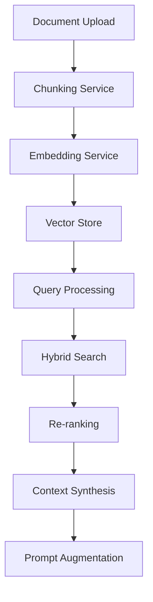
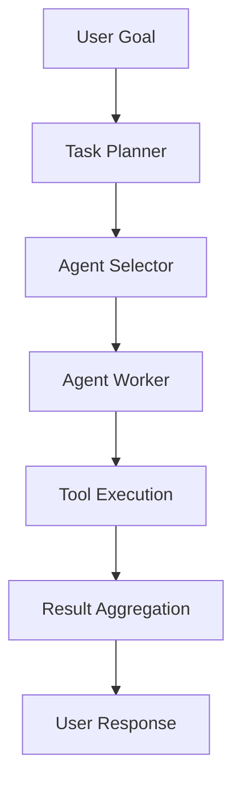

# Educational Glossary: Meowstik Codebase

> **Last Updated**: 2026-01-14  
> **Purpose**: Dictionary of every concept, function, structure, and term in the Meowstik project

---

## Table of Contents
1. [Database Schema & Tables](#database-schema--tables)
2. [Server Architecture](#server-architecture)
3. [Client Architecture](#client-architecture)
4. [AI & Prompt System](#ai--prompt-system)
5. [Architectural Patterns](#architectural-patterns)
6. [Key Terms & Concepts](#key-terms--concepts)

---

## Database Schema & Tables

All database definitions are in [`shared/schema.ts`](../../shared/schema.ts).

### Core Tables

#### [`chats`](../../shared/schema.ts)
**Purpose**: Stores chat conversation metadata  
**Key Fields**:
- `id` (UUID): Primary key
- `title` (VARCHAR): Chat name/title
- `userId` (VARCHAR): Foreign key to users table
- `isGuest` (BOOLEAN): Whether this is a guest session
- `createdAt`, `updatedAt` (TIMESTAMP): Audit timestamps

#### [`messages`](../../shared/schema.ts)
**Purpose**: Individual messages within conversations  
**Key Fields**:
- `id` (UUID): Primary key
- `chatId` (UUID): Foreign key to chats
- `role` (VARCHAR): "user" or "ai"
- `content` (TEXT): Message text
- `geminiContent` (JSONB): Structured Gemini response
- `metadata` (JSONB): Additional context (tool calls, etc.)
- `createdAt` (TIMESTAMP): Message timestamp

#### [`attachments`](../../shared/schema.ts)
**Purpose**: Files, screenshots, voice transcripts, documents  
**Key Fields**:
- `id` (UUID): Primary key
- `messageId`, `draftId` (UUID): Foreign keys
- `type` (VARCHAR): file/screenshot/audio/etc.
- `filename` (VARCHAR): Original file name
- `content` (TEXT): Base64-encoded file data
- `permissions` (JSONB): Access control metadata

#### [`users`](../../shared/schema.ts)
**Purpose**: User authentication profiles  
**Key Fields**:
- `id` (UUID): Primary key
- `email` (VARCHAR): Unique email
- `firstName`, `lastName` (VARCHAR): User name
- `profileImageUrl` (TEXT): Avatar URL
- `createdAt`, `updatedAt` (TIMESTAMP): Audit timestamps

#### [`sessions`](../../shared/schema.ts)
**Purpose**: Replit Auth session storage  
**Key Fields**:
- `sid` (VARCHAR): Primary key (session ID)
- `sess` (JSONB): Session data
- `expire` (TIMESTAMP): Session expiration

#### [`documentChunks`](../../shared/schema.ts)
**Purpose**: RAG vector store chunks for knowledge retrieval  
**Key Fields**:
- `id` (UUID): Primary key
- `documentId` (UUID): Parent document reference
- `content` (TEXT): Chunk text
- `embedding` (JSONB): Vector embedding
- `metadata` (JSONB): Source, page number, etc.

#### [`drafts`](../../shared/schema.ts)
**Purpose**: Saved prompt drafts  
**Key Fields**:
- `id` (UUID): Primary key
- `chatId` (UUID): Foreign key
- `title`, `content` (TEXT): Draft data
- `createdAt` (TIMESTAMP): Save time

#### [`toolTasks`](../../shared/schema.ts)
**Purpose**: Tool execution records for tracking AI actions  
**Key Fields**:
- `id` (UUID): Primary key
- `chatId` (UUID): Foreign key
- `toolName` (VARCHAR): Name of executed tool
- `input`, `output` (JSONB): Parameters and results
- `status` (VARCHAR): pending/completed/failed

#### [`workflows`](../../shared/schema.ts)
**Purpose**: Automated workflow definitions  
**Key Fields**:
- `id` (UUID): Primary key
- `userId` (UUID): Owner
- `name` (VARCHAR): Workflow name
- `steps` (JSONB): Execution steps
- `triggers` (JSONB): Activation conditions

#### [`schedules`](../../shared/schema.ts)
**Purpose**: Task scheduling (cron jobs)  
**Key Fields**:
- `id` (UUID): Primary key
- `workflowId` (UUID): Foreign key to workflows
- `cron` (VARCHAR): Cron expression
- `enabled` (BOOLEAN): Active status

### Constants

- **`GUEST_USER_ID`** = "guest": Identifier for unauthenticated users

### Zod Schemas

All Zod schemas are auto-generated from Drizzle table definitions using `drizzle-zod`:
- `insertChatSchema`: Validates chat creation
- `insertMessageSchema`: Validates message creation
- `insertAttachmentSchema`: Validates attachment upload
- etc.

---

## Server Architecture

### Entry Point & Core

#### [`server/index.ts`](../../server/index.ts)
**Purpose**: Express app initialization  
**Key Exports**:
- `app`: Express application
- Initializes middleware stack (session, auth, CORS)
- Mounts API routes
- Creates HTTP/WebSocket servers

#### [`server/db.ts`](../../server/db.ts)
**Purpose**: Drizzle ORM database connection  
**Key Exports**:
- `db`: Query builder instance
- Connection pooling configuration

#### [`server/storage.ts`](../../server/storage.ts)
**Purpose**: Repository pattern abstraction  
**Key Exports**:
- `DrizzleStorage`: Implementation class
- `storage`: Singleton instance
- `IStorage`: Interface defining all DB operations

**Key Methods**:
- `getChats(userId)`: Fetch user's chat list
- `createChat(data)`: Create new conversation
- `createMessage(data)`: Add message to chat
- `updateChat(id, data)`: Update chat metadata
- etc.

#### [`server/routes.ts`](../../server/routes.ts)
**Purpose**: API router factory  
**Key Exports**:
- `apiRouter()`: Creates Express router with all endpoints
- Mounts sub-routers (auth, agent, drive, gmail, etc.)

#### [`server/static.ts`](../../server/static.ts)
**Purpose**: Serves React frontend  
**Key Behavior**:
- Development: Proxies to Vite dev server
- Production: Serves static files from `dist/public`

### WebSocket Handlers

#### [`server/websocket-collab.ts`](../../server/websocket-collab.ts)
**Purpose**: Real-time collaborative editing  
**Technology**: Yjs CRDT (Conflict-free Replicated Data Type)  
**Key Exports**:
- `initCollabServer(wss)`: Initialize WebSocket server
- Syncs document state across multiple clients

#### [`server/websocket-terminal.ts`](../../server/websocket-terminal.ts)
**Purpose**: Terminal/shell command execution  
**Key Features**:
- PTY (pseudo-terminal) allocation
- Streams stdout/stderr to WebSocket
- Handles ctrl+c signals

#### [`server/websocket-desktop.ts`](../../server/websocket-desktop.ts)
**Purpose**: Desktop app integration relay  
**Key Exports**:
- `initDesktopWebSocket(wss)`: Setup desktop communication
- Forwards requests between web and desktop clients

#### [`server/websocket-live.ts`](../../server/websocket-live.ts)
**Purpose**: Gemini Live API streaming  
**Key Features**:
- Real-time voice conversation
- Bidirectional audio streaming
- Tool call execution during conversation

### Integrations (server/integrations/)

#### Google Workspace

- [`google-auth.ts`](../../server/integrations/google-auth.ts): OAuth2 client, token management
- [`google-drive.ts`](../../server/integrations/google-drive.ts): File upload/download/list
- [`google-docs.ts`](../../server/integrations/google-docs.ts): Document creation/editing
- [`google-sheets.ts`](../../server/integrations/google-sheets.ts): Spreadsheet operations
- [`google-calendar.ts`](../../server/integrations/google-calendar.ts): Event management
- [`gmail.ts`](../../server/integrations/gmail.ts): Email send/receive/search
- [`google-contacts.ts`](../../server/integrations/google-contacts.ts): Contact management
- [`google-tasks.ts`](../../server/integrations/google-tasks.ts): Task lists

#### Web & Content

- [`web-search.ts`](../../server/integrations/web-search.ts): Search engine queries
- [`web-scraper.ts`](../../server/integrations/web-scraper.ts): Extract web page content
- [`browserbase.ts`](../../server/integrations/browserbase.ts): Cloud browser automation
- [`browser-scraper.ts`](../../server/integrations/browser-scraper.ts): Playwright-based scraping

#### AI Services

- [`image-generation.ts`](../../server/integrations/image-generation.ts): DALL-E/Imagen integration
- [`expressive-tts.ts`](../../server/integrations/expressive-tts.ts): Voice synthesis
- [`lyria.ts`](../../server/integrations/lyria.ts): Music generation
- [`gemini-live.ts`](../../server/integrations/gemini-live.ts): Real-time voice conversation API

#### Communication

- [`twilio.ts`](../../server/integrations/twilio.ts): SMS/voice calls/webhooks
- [`github.ts`](../../server/integrations/github.ts): Repository management
- [`http-client.ts`](../../server/integrations/http-client.ts): Generic HTTP requests (GET, POST, PUT, DELETE)

### Core Services (server/services/)

#### AI & LLM Services

##### [`orchestrator.ts`](../../server/services/orchestrator.ts)
**Purpose**: Multi-agent task decomposition & execution  
**Key Exports**:
- `OrchestratorService`: Main class
- `orchestrator`: Singleton instance

**Key Methods**:
- `planTask(goal)`: Break down user goal into subtasks
- `executeTask(taskId)`: Run task execution
- `selectAgent(capability)`: Choose appropriate agent

##### [`agent-worker.ts`](../../server/services/agent-worker.ts)
**Purpose**: Individual agent execution engine  
**Key Exports**:
- `AgentWorker`: Worker class
- Executes agent-specific logic with tools

##### [`agent-registry.ts`](../../server/services/agent-registry.ts)
**Purpose**: Agent registration & discovery  
**Key Exports**:
- `agentRegistry`: Singleton
- `registerAgent(definition)`: Add new agent
- `getAgent(id)`: Retrieve agent definition

##### [`jit-tool-protocol.ts`](../../server/services/jit-tool-protocol.ts)
**Purpose**: Just-in-time tool selection based on context  
**Key Exports**:
- `selectTools(context)`: Dynamic tool filtering
- Reduces prompt size by only including relevant tools

##### [`prompt-composer.ts`](../../server/services/prompt-composer.ts)
**Purpose**: Assembles system prompt from modular files  
**Key Exports**:
- `PromptComposer`: Main class
- `promptComposer`: Singleton

**Key Methods**:
- `compose(attachments)`: Build full system prompt
- Reads files from [`prompts/`](../../prompts/) directory
- Injects dynamic context based on attachments

#### Retrieval & Search Services

##### [`rag-service.ts`](../../server/services/rag-service.ts)
**Purpose**: Retrieval-Augmented Generation pipeline  
**Architecture**:


**Key Methods**:
- `ingest(document)`: Process & store document
- `retrieve(query)`: Find relevant chunks
- `augmentPrompt(query, context)`: Add context to prompt

##### [`chunking-service.ts`](../../server/services/chunking-service.ts)
**Purpose**: Document splitting strategies  
**Strategies**:
- **Paragraph**: Split on double newlines
- **Sentence**: Use NLP sentence detection
- **Semantic**: Split on topic boundaries
- **Hierarchical**: Tree-based structure (headers → paragraphs)

##### [`embedding-service.ts`](../../server/services/embedding-service.ts)
**Purpose**: Vector embedding generation  
**Provider**: Google Vertex AI  
**Model**: text-embedding-004

##### [`hybrid-search.ts`](../../server/services/hybrid-search.ts)
**Purpose**: BM25 + vector search fusion  
**Algorithm**: Reciprocal Rank Fusion (RRF)  
**Formula**: `score = Σ(1 / (k + rank_i))`

##### [`reranker.ts`](../../server/services/reranker.ts)
**Purpose**: Re-rank search results by relevance  
**Method**: Cross-encoder model scoring

##### [`retrieval-orchestrator.ts`](../../server/services/retrieval-orchestrator.ts)
**Purpose**: Coordinate retrieval across multiple sources  
**Sources**:
- Document chunks
- Chat history
- External APIs (Drive, Gmail)

##### [`rag-dispatcher.ts`](../../server/services/rag-dispatcher.ts)
**Purpose**: Execute tool calls on retrieved knowledge  
**Example**: "Search emails about X" → retrieve → execute Gmail tool

##### [`context-synthesis.ts`](../../server/services/context-synthesis.ts)
**Purpose**: Synthesize coherent context from fragments  
**Method**: Deduplicate, rank, format for prompt injection

#### Data Management Services

##### [`ingestion-pipeline.ts`](../../server/services/ingestion-pipeline.ts)
**Purpose**: Process incoming data for RAG  
**Supported Sources**:
- Gmail messages
- Google Drive files
- File uploads
- Screenshots
- Audio transcripts
- Conversation history

**Pipeline Stages**:
1. **Extract**: Parse source format
2. **Transform**: Normalize to plain text
3. **Chunk**: Split into segments
4. **Embed**: Generate vectors
5. **Load**: Store in vector database

##### [`vector-store/`](../../server/services/vector-store/)
**Purpose**: Abstract vector database interface  
**Pattern**: Adapter pattern for swappable backends

**Files**:
- [`types.ts`](../../server/services/vector-store/types.ts): Interface definitions
- [`vertex-adapter.ts`](../../server/services/vector-store/vertex-adapter.ts): Google Vertex AI implementation
- [`pgvector-adapter.ts`](../../server/services/vector-store/pgvector-adapter.ts): PostgreSQL pgvector extension
- [`memory-adapter.ts`](../../server/services/vector-store/memory-adapter.ts): In-memory store for testing
- [`config.ts`](../../server/services/vector-store/config.ts): Backend selection logic

##### [`job-queue.ts`](../../server/services/job-queue.ts)
**Purpose**: Task queue system  
**Execution Modes**:
- **Sequential**: One at a time
- **Parallel**: Concurrent execution
- **Batch**: Process in groups

##### [`job-dispatcher.ts`](../../server/services/job-dispatcher.ts)
**Purpose**: Route jobs to appropriate workers  
**Key Methods**:
- `dispatch(job)`: Send to worker pool
- `cancel(jobId)`: Stop execution

##### [`state-manager.ts`](../../server/services/state-manager.ts)
**Purpose**: Session state persistence  
**Features**:
- Transactional updates
- Rollback on error
- State snapshots

##### [`workflow-executor.ts`](../../server/services/workflow-executor.ts)
**Purpose**: Execute multi-step workflows  
**Format**: DAG (Directed Acyclic Graph) of tasks

#### Infrastructure Services

##### [`speech.ts`](../../server/services/speech.ts)
**Purpose**: Speech-to-text transcription  
**Provider**: Whisper API

##### [`collab-integration.ts`](../../server/services/collab-integration.ts)
**Purpose**: Collaborative editing state sync  
**Technology**: Yjs CRDT

##### [`desktop-relay-service.ts`](../../server/services/desktop-relay-service.ts)
**Purpose**: Desktop app communication bridge  
**Protocol**: WebSocket with custom message format

##### [`computer-use.ts`](../../server/services/computer-use.ts)
**Purpose**: Screen interaction automation  
**Capabilities**:
- Screenshot capture
- Mouse movement/clicks
- Keyboard input

##### [`cron-scheduler.ts`](../../server/services/cron-scheduler.ts)
**Purpose**: Background job scheduling  
**Library**: node-cron

##### [`trigger-service.ts`](../../server/services/trigger-service.ts)
**Purpose**: Event-based automation  
**Trigger Types**:
- Time-based (cron)
- Event-based (webhook)
- Condition-based (state change)

##### [`ssh-service.ts`](../../server/services/ssh-service.ts)
**Purpose**: SSH connection management  
**Library**: node-ssh

##### [`dependency-resolver.ts`](../../server/services/dependency-resolver.ts)
**Purpose**: Task dependency graph resolution  
**Algorithm**: Topological sort

##### [`worker-pool.ts`](../../server/services/worker-pool.ts)
**Purpose**: Thread pool for concurrent operations  
**Library**: Node.js worker_threads

##### [`codebase-analyzer.ts`](../../server/services/codebase-analyzer.ts)
**Purpose**: Parse code files for structure  
**Extracts**:
- Classes & methods
- Functions & exports
- Imports & dependencies

#### Debugging & Monitoring Services

##### [`llm-debug-buffer.ts`](../../server/services/llm-debug-buffer.ts)
**Purpose**: LLM interaction history tracking  
**Stores**: Prompts, responses, latency, token counts

##### [`llm-error-buffer.ts`](../../server/services/llm-error-buffer.ts)
**Purpose**: Error tracking and analysis  
**Features**: Pattern detection, auto-retry logic

##### [`rag-debug-buffer.ts`](../../server/services/rag-debug-buffer.ts)
**Purpose**: RAG pipeline tracing  
**Stages Tracked**:
- Ingest: Document processing
- Chunk: Text splitting
- Embed: Vector generation
- Search: Query execution

##### [`log-buffer.ts`](../../server/services/log-buffer.ts)
**Purpose**: General application logging  
**Format**: Structured JSON logs

##### [`orchestration-logger.ts`](../../server/services/orchestration-logger.ts)
**Purpose**: Task execution logging  
**Features**: Queryable task history, performance metrics

##### [`client-router.ts`](../../server/services/client-router.ts)
**Purpose**: Route messages to appropriate client connections  
**Use Case**: Multi-device sync, desktop relay

### API Routes (server/routes/)

All routes are mounted by [`server/routes.ts`](../../server/routes.ts).

#### Entity Management

- [`agent.ts`](../../server/routes/agent.ts): Agent WebSocket setup, chat endpoint
- [`agents.ts`](../../server/routes/agents.ts): Agent CRUD operations
- [`orchestration.ts`](../../server/routes/orchestration.ts): Task planning endpoints
- [`orchestrator.ts`](../../server/routes/orchestrator.ts): Task execution endpoints
- [`jobs.ts`](../../server/routes/jobs.ts): Job status & management
- [`queue.ts`](../../server/routes/queue.ts): Queue operations

#### Google Workspace

- [`drive.ts`](../../server/routes/drive.ts): File upload/download
- [`gmail.ts`](../../server/routes/gmail.ts): Email operations
- [`calendar.ts`](../../server/routes/calendar.ts): Event management
- [`docs.ts`](../../server/routes/docs.ts): Document creation/editing
- [`sheets.ts`](../../server/routes/sheets.ts): Spreadsheet operations
- [`tasks.ts`](../../server/routes/tasks.ts): Google Tasks API

#### AI & Content

- [`image.ts`](../../server/routes/image.ts): Image generation endpoint
- [`music.ts`](../../server/routes/music.ts): Music generation (Lyria)
- [`speech.ts`](../../server/routes/speech.ts): Audio transcription

#### Developer Tools

- [`terminal.ts`](../../server/routes/terminal.ts): Shell command execution
- [`python.ts`](../../server/routes/python.ts): Python code execution
- [`playwright.ts`](../../server/routes/playwright.ts): Browser automation
- [`web-scraper.ts`](../../server/routes/web-scraper.ts): Web content scraping
- [`computer-use.ts`](../../server/routes/computer-use.ts): Screen interaction

#### Knowledge & RAG

- [`knowledge-ingestion.ts`](../../server/routes/knowledge-ingestion.ts): Document upload pipeline
- [`rag-debug.ts`](../../server/routes/rag-debug.ts): RAG tracing & inspection

#### Utilities

- [`auth.ts`](../../server/routes/auth.ts): Authentication (login, logout, OAuth)
- [`status.ts`](../../server/routes/status.ts): Health checks & system status
- [`feedback.ts`](../../server/routes/feedback.ts): User feedback collection
- [`evolution.ts`](../../server/routes/evolution.ts): AI self-improvement features
- [`extension.ts`](../../server/routes/extension.ts): Browser extension communication
- [`desktop.ts`](../../server/routes/desktop.ts): Desktop app endpoints
- [`collab.ts`](../../server/routes/collab.ts): Collaborative editing
- [`live.ts`](../../server/routes/live.ts): Live mode endpoints
- [`twilio.ts`](../../server/routes/twilio.ts): Voice call webhooks
- [`middleware.ts`](../../server/routes/middleware.ts): Error handlers, async wrappers

---

## Client Architecture

### Entry Points

#### [`client/src/main.tsx`](../../client/src/main.tsx)
**Purpose**: Vite entry point  
**Behavior**: Mounts React app to `#root` div

#### [`client/src/App.tsx`](../../client/src/App.tsx)
**Purpose**: Root component  
**Wraps**:
- React Query (`QueryClientProvider`)
- Toaster (notifications)
- Tooltip provider
- Router (`wouter`)

### Pages (client/src/pages/)

#### Core Functionality

- [`home.tsx`](../../client/src/pages/home.tsx): Main chat interface
  - Components: Sidebar, message list, input area
  - Features: Message history, attachments, voice input
- [`workspace.tsx`](../../client/src/pages/workspace.tsx): Multi-project dashboard
- [`editor.tsx`](../../client/src/pages/editor.tsx): Monaco code editor (HTML/CSS/JS)
- [`preview.tsx`](../../client/src/pages/preview.tsx): Live code preview in sandboxed iframe

#### Google Services

- [`google-services.tsx`](../../client/src/pages/google-services.tsx): OAuth setup & account linking
- [`docs.tsx`](../../client/src/pages/docs.tsx): Google Docs integration
- [`task-queue.tsx`](../../client/src/pages/task-queue.tsx): Task management UI

#### AI Features

- [`image-generation.tsx`](../../client/src/pages/image-generation.tsx): DALL-E/Imagen UI
- [`music-generation.tsx`](../../client/src/pages/music-generation.tsx): Music generation UI
- [`expressive-speech.tsx`](../../client/src/pages/expressive-speech.tsx): TTS voice selection
- [`web-search.tsx`](../../client/src/pages/web-search.tsx): Web search interface
- [`vision.tsx`](../../client/src/pages/vision.tsx): Image analysis UI
- [`browser.tsx`](../../client/src/pages/browser.tsx): Web browsing UI

#### Advanced Tools

- [`playwright-testing.tsx`](../../client/src/pages/playwright-testing.tsx): Browser automation tester
- [`python-sandbox.tsx`](../../client/src/pages/python-sandbox.tsx): Python REPL
- [`terminal.tsx`](../../client/src/pages/terminal.tsx): Shell access UI
- [`browser-extension.tsx`](../../client/src/pages/browser-extension.tsx): Extension dashboard

#### Automation

- [`schedules.tsx`](../../client/src/pages/schedules.tsx): Cron job scheduling UI
- [`evolution.tsx`](../../client/src/pages/evolution.tsx): AI improvement feedback UI
- [`live.tsx`](../../client/src/pages/live.tsx): Real-time voice mode

#### Utilities

- [`settings.tsx`](../../client/src/pages/settings.tsx): User preferences
- [`help.tsx`](../../client/src/pages/help.tsx): FAQ & documentation
- [`debug.tsx`](../../client/src/pages/debug.tsx): Development tools
- [`database-explorer.tsx`](../../client/src/pages/database-explorer.tsx): Direct DB query UI
- [`rag-debug.tsx`](../../client/src/pages/rag-debug.tsx): RAG pipeline inspector
- [`login.tsx`](../../client/src/pages/login.tsx): Authentication UI
- [`landing.tsx`](../../client/src/pages/landing.tsx): Public homepage
- [`install.tsx`](../../client/src/pages/install.tsx): Setup wizard
- [`not-found.tsx`](../../client/src/pages/not-found.tsx): 404 error page

### Components (client/src/components/)

#### Chat Components

- [`chat/sidebar.tsx`](../../client/src/components/chat/sidebar.tsx): Chat history navigation (time-grouped)
- [`chat/message.tsx`](../../client/src/components/chat/message.tsx): Individual message bubble
- [`chat/input-area.tsx`](../../client/src/components/chat/input-area.tsx): Text input + voice + attachments

#### Layout Components

- [`protected-route.tsx`](../../client/src/components/protected-route.tsx): Auth guard wrapper
- [`connectors-gate.tsx`](../../client/src/components/connectors-gate.tsx): Verify external service connections

#### UI Library (client/src/components/ui/)

Shadcn UI components (see [ui.shadcn.com](https://ui.shadcn.com)):
- `button`, `input`, `textarea`, `select`, `form`, `dialog`, `dropdown-menu`
- `tabs`, `accordion`, `pagination`, `sidebar`, `scroll-area`
- `card`, `alert`, `badge`, `toast`, `skeleton`, `spinner`
- `chart`, `enhanced-markdown`, `verbosity-slider`

### Hooks (client/src/hooks/)

#### [`useAuth.ts`](../../client/src/hooks/useAuth.ts)
**Purpose**: Authentication state management  
**Returns**: `{ user, login, logout, isLoading }`

#### [`use-app-session.ts`](../../client/src/hooks/use-app-session.ts)
**Purpose**: App status & health checks  
**Returns**: Connector health, revision info, feature flags

#### [`use-voice.ts`](../../client/src/hooks/use-voice.ts)
**Purpose**: Voice recording & playback  
**Uses**: MediaRecorder API, AudioContext

#### [`use-voice-recording.ts`](../../client/src/hooks/use-voice-recording.ts)
**Purpose**: Microphone access & audio capture  
**Returns**: `{ startRecording, stopRecording, audioBlob }`

#### [`use-silence-detection.ts`](../../client/src/hooks/use-silence-detection.ts)
**Purpose**: Auto-stop recording on silence  
**Algorithm**: Audio level threshold detection

#### [`use-collaborative-editing.ts`](../../client/src/hooks/use-collaborative-editing.ts)
**Purpose**: Yjs CRDT sync for co-editing  
**Library**: yjs + y-websocket

#### [`use-toast.ts`](../../client/src/hooks/use-toast.ts)
**Purpose**: Notification toast triggers  
**Library**: sonner

#### [`use-mobile.tsx`](../../client/src/hooks/use-mobile.tsx)
**Purpose**: Mobile responsive detection  
**Returns**: Boolean indicating mobile viewport

### Contexts (client/src/contexts/)

#### [`tts-context.tsx`](../../client/src/contexts/tts-context.tsx)
**Purpose**: Text-to-speech settings & API  
**Provides**: Voice selection, playback controls, audio queue

### Utilities (client/src/lib/)

#### [`queryClient.ts`](../../client/src/lib/queryClient.ts)
**Purpose**: React Query configuration  
**Settings**: Retry logic, stale time, cache time

#### [`utils.ts`](../../client/src/lib/utils.ts)
**Purpose**: Helper functions  
**Key Functions**:
- `cn(...classes)`: Merge Tailwind class names
- `formatDate(date)`: Format timestamps
- `truncate(text, length)`: Shorten text

#### [`authUtils.ts`](../../client/src/lib/authUtils.ts)
**Purpose**: Auth token management  
**Functions**: Store/retrieve JWT tokens from localStorage

---

## AI & Prompt System

### Prompt Architecture

Modular system prompt split into components, assembled by [`PromptComposer`](../../server/services/prompt-composer.ts).

### Prompt Files (prompts/)

#### [`core-directives.md`](../../prompts/core-directives.md)
**Purpose**: Fundamental rules, constraints, output format requirements  
**Contents**:
- Response format (always use tool calls)
- Error handling guidelines
- Conversation flow rules

#### [`personality.md`](../../prompts/personality.md)
**Purpose**: Character traits, tone, communication style  
**Contents**:
- Friendly but professional tone
- Empathy & user-focused responses
- Humor guidelines

#### [`tools.md`](../../prompts/tools.md)
**Purpose**: Tool definitions, parameters, usage examples  
**Format**: Function declarations with JSON schemas

#### [`database-instructions.md`](../../prompts/database-instructions.md)
**Purpose**: Database schema reference for agent queries  
**Contents**: Table structures, relationships, query examples

#### [`proposed-prompt.md`](../../prompts/proposed-prompt.md)
**Purpose**: Alternative/experimental prompts  
**Use Case**: A/B testing new prompts

### Prompt Assembly Order

1. **Core Directives** (rules & constraints)
2. **Personality** (tone & character)
3. **Tools** (available capabilities)
4. **Dynamic Context** (attachment-based instructions)

### Tool Call Response Format

All AI responses must use structured tool calls:

```json
{
  "toolCalls": [
    {
      "type": "say",
      "operation": "speak",
      "parameters": {
        "utterance": "I'll help you with that!"
      }
    },
    {
      "type": "send_chat",
      "operation": "respond",
      "parameters": {
        "content": "Here's the information you requested..."
      }
    }
  ]
}
```

---

## Architectural Patterns

### 1. Repository Pattern

**Definition**: Abstraction layer between business logic and data access.

**Implementation**: [`server/storage.ts`](../../server/storage.ts)

**Interface**:
```typescript
interface IStorage {
  getChats(userId: string): Promise<Chat[]>;
  createChat(data: InsertChat): Promise<Chat>;
  updateChat(id: string, data: Partial<Chat>): Promise<Chat>;
  deleteChat(id: string): Promise<void>;
  // ... more methods
}
```

**Benefits**:
- Easy testing (mock interface)
- Swappable implementations
- Clear separation of concerns

### 2. Service Layer Pattern

**Definition**: Each service handles one domain (RAG, orchestration, speech, etc.)

**Examples**:
- [`ragService`](../../server/services/rag-service.ts)
- [`orchestrator`](../../server/services/orchestrator.ts)
- [`promptComposer`](../../server/services/prompt-composer.ts)

**Pattern**: Singleton instances, dependency-injected as needed

### 3. Adapter Pattern (Vector Stores)

**Definition**: Common interface with multiple implementations

**Interface**: [`vector-store/types.ts`](../../server/services/vector-store/types.ts)

**Implementations**:
- [`VertexAdapter`](../../server/services/vector-store/vertex-adapter.ts): Google Vertex AI
- [`PgVectorAdapter`](../../server/services/vector-store/pgvector-adapter.ts): PostgreSQL extension
- [`MemoryAdapter`](../../server/services/vector-store/memory-adapter.ts): In-memory (testing)

**Benefit**: Swap backends without changing business logic

### 4. RAG Pipeline

**Flow**:


**Stages**:
1. **Ingest**: Parse document format
2. **Chunk**: Split into segments (paragraph/semantic/hierarchical)
3. **Embed**: Generate vectors (Vertex AI)
4. **Store**: Save to vector database
5. **Query**: User asks question
6. **Search**: BM25 + vector search
7. **Rerank**: Score by relevance
8. **Synthesize**: Format context for prompt
9. **Augment**: Inject into system prompt

### 5. Orchestration System

**Components**:
- **AgentDefinition**: Declares capabilities, domains, tools
- **TaskPlan**: Hierarchical decomposition of user goals
- **ExecutionContext**: Shared state across task execution
- **OrchestratorService**: Central coordinator (like CPU scheduler)

**Flow**:


### 6. WebSocket Real-time Features

**Technologies**:
- **Yjs CRDT**: Collaborative editing (conflict-free)
- **WebSocket**: Bidirectional communication
- **SSE**: Server-sent events for AI streaming

**Use Cases**:
- Live voice conversations
- Terminal streaming
- Desktop app relay
- Collaborative document editing

### 7. Prompt Composition

**Strategy**: Modular files for maintainability

**Benefits**:
- Easy to update individual sections
- Version control friendly
- Dynamic context injection based on attachments

**Example**:
```typescript
const prompt = promptComposer.compose([
  { type: 'screenshot', data: base64Image },
  { type: 'file', filename: 'data.csv', content: '...' }
]);
// Automatically adds vision and data analysis instructions
```

---

## Key Terms & Concepts

### CRDT (Conflict-free Replicated Data Type)
**Definition**: Data structure that guarantees eventual consistency without coordination  
**Use**: Collaborative editing (multiple users editing same document)  
**Library**: Yjs

### SSE (Server-Sent Events)
**Definition**: HTTP connection for server-to-client streaming  
**Use**: AI response streaming  
**Alternative**: WebSocket (bidirectional)

### RAG (Retrieval-Augmented Generation)
**Definition**: AI technique that retrieves relevant context before generating response  
**Components**: Vector database + embedding model + LLM  
**Benefit**: Reduces hallucinations, adds up-to-date knowledge

### BM25
**Definition**: Probabilistic ranking function for information retrieval  
**Use**: Keyword-based search (complements vector search)  
**Formula**: TF-IDF variant with saturation

### Reciprocal Rank Fusion (RRF)
**Definition**: Method to combine multiple ranked lists  
**Use**: Merge BM25 and vector search results  
**Formula**: `score = Σ(1 / (k + rank_i))`

### Embedding
**Definition**: Dense vector representation of text  
**Model**: Google text-embedding-004  
**Dimensions**: 768  
**Use**: Semantic search

### Tool Call
**Definition**: Structured function invocation by AI  
**Format**: JSON with type, operation, parameters  
**Example**: `{"type": "send_email", "parameters": {"to": "...", "subject": "..."}}`

### Zod Schema
**Definition**: TypeScript-first schema validation  
**Use**: Runtime type checking for API inputs  
**Example**:
```typescript
const schema = z.object({
  name: z.string(),
  age: z.number().positive()
});
```

### Drizzle ORM
**Definition**: TypeScript ORM for SQL databases  
**Features**: Type-safe queries, migrations, schema introspection  
**Alternative**: Prisma, TypeORM

### TanStack Query (React Query)
**Definition**: Data fetching & caching library for React  
**Features**: Automatic refetching, optimistic updates, devtools  
**Hooks**: `useQuery`, `useMutation`, `useInfiniteQuery`

### Wouter
**Definition**: Minimalist React router (1.5KB)  
**Alternative**: React Router  
**API**: `useRoute`, `useLocation`, `Link`

### Radix UI
**Definition**: Unstyled, accessible UI component library  
**Use**: Building blocks for custom design systems  
**Components**: Dialog, Dropdown, Tabs, etc.

### Shadcn UI
**Definition**: Copy-paste component library built on Radix  
**Philosophy**: You own the code (not a dependency)  
**Use**: Rapid prototyping with Tailwind CSS

### Vite
**Definition**: Modern build tool for JavaScript  
**Features**: Fast HMR, ES modules, optimized builds  
**Alternative**: Webpack, Parcel

### Express.js
**Definition**: Minimalist Node.js web framework  
**Use**: HTTP server, middleware, routing  
**Alternative**: Fastify, Koa

### PostgreSQL
**Definition**: Open-source relational database  
**Extensions**: pgvector (vector search)  
**Version**: 16

### Gemini
**Definition**: Google's multimodal AI model family  
**Variants**: Flash (fast), Pro (balanced), Ultra (best)  
**Capabilities**: Text, images, audio, video understanding

### OAuth2
**Definition**: Authorization framework for delegated access  
**Use**: "Sign in with Google"  
**Flow**: Authorization code grant

### JWT (JSON Web Token)
**Definition**: Compact, URL-safe token format  
**Use**: Stateless authentication  
**Structure**: Header.Payload.Signature

### Middleware
**Definition**: Functions that process requests/responses  
**Examples**: Authentication, logging, error handling  
**Order**: Matters! (auth before routes)

### CORS (Cross-Origin Resource Sharing)
**Definition**: Browser security mechanism  
**Use**: Allow frontend (port 5000) to call backend (port 3000)  
**Headers**: Access-Control-Allow-Origin

### WebSocket
**Definition**: Full-duplex communication protocol  
**Use**: Real-time bidirectional data  
**Alternative**: SSE (unidirectional), long polling

### PTY (Pseudo-Terminal)
**Definition**: Virtual terminal for programmatic shell access  
**Use**: Terminal emulation in web UI  
**Library**: node-pty

### Cron Expression
**Definition**: Schedule format for periodic tasks  
**Example**: `0 9 * * *` = "Every day at 9am"  
**Fields**: minute hour day month weekday

### DAG (Directed Acyclic Graph)
**Definition**: Graph with directed edges, no cycles  
**Use**: Task dependency resolution, workflow execution  
**Algorithm**: Topological sort

### Topological Sort
**Definition**: Linear ordering of DAG vertices  
**Use**: Execute tasks in dependency order  
**Algorithm**: Kahn's algorithm or DFS

### Worker Thread
**Definition**: JavaScript thread for parallel processing  
**Use**: CPU-intensive tasks without blocking main thread  
**Library**: Node.js worker_threads module

---

## Quick Reference

### Most Important Server Services
- [`orchestrator`](../../server/services/orchestrator.ts) - Multi-agent coordination
- [`ragService`](../../server/services/rag-service.ts) - Knowledge retrieval & augmentation
- [`promptComposer`](../../server/services/prompt-composer.ts) - System prompt assembly
- [`storage`](../../server/storage.ts) - Database operations
- [`jitToolProtocol`](../../server/services/jit-tool-protocol.ts) - Tool selection

### Most Important Client Hooks
- `useAppSession()` - App health & connector status
- `useAuth()` - Authentication state
- `useVoice()` - Voice input/output

### Key Routes
- `/api/agent` - Main chat endpoint
- `/api/knowledge/*` - Document management
- `/api/orchestration/*` - Task execution
- `/api/auth/*` - Authentication

### Environment Variable Categories
- **Google APIs**: GOOGLE_API_KEY, OAuth credentials
- **Vector Stores**: VERTEX_API, PGVECTOR_CONNECTION
- **External Services**: TWILIO_*, GITHUB_TOKEN, etc.
- **Database**: DATABASE_URL

---

## Related Documentation

- [Project Cliff Notes](./project_cliff_notes.md): High-level project summary
- [Theory vs Reality Diffs](./theory_vs_reality_diff.md): Discrepancies between intended and actual behavior
- [Incomplete Features Audit](./incomplete_features_audit.md): Features needing resolution pathways

---

**End of Educational Glossary**
