# Incomplete Features Audit: Meowstik

> **Last Updated**: 2026-01-14  
> **Purpose**: Catalog incomplete features with illustrated resolution pathways  
> **Phase**: 🚧 Recovery & Refactor

---

## Table of Contents
1. [Overview](#overview)
2. [Computer Use & Desktop Integration](#computer-use--desktop-integration)
3. [Vector Store - Pinecone Integration](#vector-store---pinecone-integration)
4. [Short-Term Memory System](#short-term-memory-system)
5. [Evolution Engine - Feedback Loop](#evolution-engine---feedback-loop)
6. [Workflow Orchestration](#workflow-orchestration)
7. [AR Glasses & Vision](#ar-glasses--vision)
8. [Priority Matrix](#priority-matrix)

---

## Overview

This document provides **Illustrated Guides** and **Implementation Plans** for incomplete or broken features identified in the codebase. Each section includes:

- 📋 **Current State**: What exists now
- 🎯 **Desired State**: What we want to achieve
- 🗺️ **Pathway to Resolution**: Step-by-step implementation plan
- 📊 **Architecture Diagrams**: Visual guides using MermaidJS or ASCII
- ⚠️ **Pitfalls to Avoid**: Common mistakes

---

## Computer Use & Desktop Integration

### Feature Overview

**What It Should Do**:
Enable AI to see, understand, and interact with a user's desktop—clicking buttons, filling forms, navigating applications, and executing complex multi-step tasks autonomously.

**Current State**: 🟡 Partially Implemented
- ✅ Gemini Computer Use API integration scaffolded
- ✅ `analyzeScreen()` method implemented
- ✅ `planActionsWithComputerUse()` implemented
- ❌ Action execution route returns 501 Not Implemented
- ❌ Desktop agent bridge incomplete
- ❌ Frame processing in Desktop Relay Service is stubbed

**Files Involved**:
- [`server/services/computer-use.ts`](../../server/services/computer-use.ts)
- [`server/routes/computer-use.ts`](../../server/routes/computer-use.ts)
- [`server/services/desktop-relay-service.ts`](../../server/services/desktop-relay-service.ts)
- [`client/src/pages/computer-use.tsx`](../../client/src/pages/computer-use.tsx)

---

### Current Architecture (Incomplete)

```mermaid
graph TD
    A[User Request] --> B[Computer Use Service]
    B --> C[Screen Analysis]
    C --> D[Gemini Vision API]
    D --> E[Action Plan Generated]
    E --> F{Execute Actions?}
    F -->|YES| G[❌ 501 Not Implemented]
    F -->|NO| H[Return Plan to User]
    
    style G fill:#f99,stroke:#f00
```



---

### Desired Architecture (Complete)


---

### Pathway to Resolution

#### Step 1: Implement Desktop Agent Protocol

**File**: Create [`server/services/desktop-agent-protocol.ts`](../../server/services/desktop-agent-protocol.ts)

**Interface**:
```typescript
interface DesktopAgentProtocol {
  // Core actions
  click(x: number, y: number, button?: 'left' | 'right'): Promise<void>;
  type(text: string): Promise<void>;
  keyPress(key: string, modifiers?: string[]): Promise<void>;
  scroll(direction: 'up' | 'down', amount: number): Promise<void>;
  
  // Screen capture
  screenshot(region?: ScreenRegion): Promise<Buffer>;
  
  // Window management
  focusWindow(title: string): Promise<void>;
  getActiveWindow(): Promise<WindowInfo>;
  
  // Verification
  waitForElement(description: string, timeout: number): Promise<boolean>;
  verifyAction(expectedState: string): Promise<boolean>;
}
```

**Implementation Approach**:
```typescript
export class DesktopAgentProtocol {
  private wsConnection: WebSocket;
  
  constructor(private relayService: DesktopRelayService) {
    this.wsConnection = relayService.getConnection();
  }
  
  async click(x: number, y: number, button = 'left'): Promise<void> {
    return new Promise((resolve, reject) => {
      const messageId = generateId();
      
      this.wsConnection.send(JSON.stringify({
        type: 'ACTION',
        id: messageId,
        action: 'click',
        params: { x, y, button }
      }));
      
      this.waitForResponse(messageId, 5000)
        .then(resolve)
        .catch(reject);
    });
  }
  
  // ... implement other methods
}
```

#### Step 2: Complete Desktop Relay Frame Processing

**File**: Update [`server/services/desktop-relay-service.ts`](../../server/services/desktop-relay-service.ts)

**Current Implementation** (Stub):
```typescript
async processFrame(frame: Buffer): Promise<VisionAnalysis> {
  console.log("TODO: Implement Gemini Vision processing");
  return { objects: [], actions: [] };
}
```

**Target Implementation**:
```typescript
import { GoogleGenerativeAI } from '@google/genai';

async processFrame(frame: Buffer): Promise<VisionAnalysis> {
  // 1. Encode frame as base64
  const base64Image = frame.toString('base64');
  
  // 2. Send to Gemini Vision API
  const genAI = new GoogleGenerativeAI(process.env.GOOGLE_API_KEY!);
  const model = genAI.getGenerativeModel({ model: 'gemini-2.0-flash-exp' });
  
  const result = await model.generateContent([
    {
      inlineData: {
        mimeType: 'image/png',
        data: base64Image
      }
    },
    {
      text: `Analyze this desktop screenshot. Identify:
      1. All interactive elements (buttons, links, forms)
      2. Current application/window
      3. Text content visible
      4. Any error messages or alerts
      Return structured JSON.`
    }
  ]);
  
  // 3. Parse response
  const analysis = JSON.parse(result.response.text());
  
  // 4. Return structured analysis
  return {
    objects: analysis.elements,
    text: analysis.textContent,
    window: analysis.activeWindow,
    suggestedActions: analysis.possibleActions
  };
}
```

#### Step 3: Implement Action Execution Route

**File**: Update [`server/routes/computer-use.ts`](../../server/routes/computer-use.ts)

**Current Implementation**:
```typescript
app.post('/api/computer-use/execute', async (req, res) => {
  res.status(501).json({ error: "Action execution not yet implemented" });
});
```

**Target Implementation**:
```typescript
app.post('/api/computer-use/execute', async (req, res) => {
  try {
    const { actions, requireApproval } = req.body;
    
    // 1. Validate actions
    const validationResult = validateActionPlan(actions);
    if (!validationResult.valid) {
      return res.status(400).json({ error: validationResult.errors });
    }
    
    // 2. Check if approval required
    if (requireApproval && !req.body.approved) {
      return res.json({ 
        status: 'awaiting_approval',
        actions: actions,
        approvalToken: generateApprovalToken()
      });
    }
    
    // 3. Execute actions via Desktop Agent
    const protocol = new DesktopAgentProtocol(desktopRelayService);
    const results = [];
    
    for (const action of actions) {
      try {
        const result = await executeAction(protocol, action);
        results.push({
          action: action.type,
          status: 'success',
          result: result
        });
        
        // Wait between actions
        await sleep(action.delayMs || 500);
        
      } catch (error) {
        results.push({
          action: action.type,
          status: 'failed',
          error: error.message
        });
        
        // Stop on critical failure
        if (action.critical) break;
      }
    }
    
    // 4. Return results
    res.json({
      status: 'completed',
      results: results,
      summary: generateSummary(results)
    });
    
  } catch (error) {
    console.error('Computer use execution error:', error);
    res.status(500).json({ error: error.message });
  }
});

// Helper function
async function executeAction(
  protocol: DesktopAgentProtocol, 
  action: Action
): Promise<any> {
  switch (action.type) {
    case 'click':
      await protocol.click(action.x, action.y);
      break;
    case 'type':
      await protocol.type(action.text);
      break;
    case 'key_press':
      await protocol.keyPress(action.key, action.modifiers);
      break;
    case 'scroll':
      await protocol.scroll(action.direction, action.amount);
      break;
    default:
      throw new Error(`Unknown action type: ${action.type}`);
  }
  
  // Verify action success
  if (action.verification) {
    return await protocol.verifyAction(action.verification);
  }
}
```

#### Step 4: Update Frontend UI

**File**: Update [`client/src/pages/computer-use.tsx`](../../client/src/pages/computer-use.tsx)

**Add Action Approval UI**:
```typescript
function ActionApprovalDialog({ actions, onApprove, onReject }) {
  return (
    <Dialog>
      <DialogHeader>
        <DialogTitle>Approve Desktop Actions</DialogTitle>
        <DialogDescription>
          The AI wants to perform the following actions on your desktop:
        </DialogDescription>
      </DialogHeader>
      
      <div className="space-y-2">
        {actions.map((action, index) => (
          <ActionPreview key={index} action={action} />
        ))}
      </div>
      
      <DialogFooter>
        <Button variant="outline" onClick={onReject}>
          Cancel
        </Button>
        <Button onClick={onApprove}>
          Approve & Execute
        </Button>
      </DialogFooter>
    </Dialog>
  );
}
```

#### Step 5: Testing & Validation

**Create Test Suite**: [`server/services/__tests__/computer-use.test.ts`](../../server/services/__tests__/)

**Test Cases**:
1. **Screen Analysis**: Verify Gemini Vision correctly identifies elements
2. **Action Planning**: Validate generated action plans are logical
3. **Action Execution**: Mock desktop agent and verify correct commands sent
4. **Error Handling**: Test failure recovery and rollback
5. **Approval Flow**: Verify user confirmation workflow
6. **End-to-End**: Full workflow from request to execution

**Integration Testing**:
```bash
# 1. Start desktop agent
npm run desktop-agent

# 2. Start server
npm run dev

# 3. Test scenario: "Open Chrome and navigate to google.com"
curl -X POST http://localhost:3000/api/computer-use/execute \
  -H "Content-Type: application/json" \
  -d '{
    "goal": "Open Chrome and go to google.com",
    "requireApproval": true
  }'

# 4. Verify actions generated correctly
# 5. Approve actions via UI
# 6. Verify Chrome opens and navigates
```

---

### ⚠️ Pitfalls to Avoid

1. **Security**: ALWAYS require user approval for destructive actions (delete, close, etc.)
2. **Rate Limiting**: Add delays between actions to avoid overwhelming desktop
3. **Error Recovery**: Implement rollback for failed multi-step operations
4. **Screen Resolution**: Handle different screen sizes in coordinate calculations
5. **Focus Issues**: Ensure target window is focused before executing actions
6. **Verification**: Always verify action success before proceeding to next step

---

### 📋 Implementation Checklist

- [ ] Create `DesktopAgentProtocol` class
- [ ] Implement frame processing in `DesktopRelayService`
- [ ] Complete action execution route
- [ ] Add approval dialog to frontend
- [ ] Write test suite
- [ ] Test with real desktop agent
- [ ] Document security considerations
- [ ] Add rate limiting
- [ ] Implement error recovery
- [ ] Update user documentation

**Estimated Effort**: 3-5 days  
**Priority**: High  
**Blocked By**: None  
**Blocks**: Desktop collaboration features

---

## Vector Store - Pinecone Integration

### Feature Overview

**What It Should Do**:
Provide Pinecone as a production-ready vector store backend for RAG, enabling persistent vector embeddings across server restarts.

**Current State**: 🔴 Silently Falls Back to Memory
- Configuration accepts `"pinecone"` as backend
- No actual Pinecone adapter implemented
- Falls back to in-memory storage with warning
- Users lose embeddings on restart

**Files Involved**:
- [`server/services/vector-store/index.ts`](../../server/services/vector-store/index.ts)
- [`server/services/vector-store/types.ts`](../../server/services/vector-store/types.ts)

---

### Current Architecture (Broken)

```
Configuration: backend = "pinecone"
         ↓
    [Factory Check]
         ↓
    Is Pinecone? → YES → ❌ Warning + MemoryAdapter
                           (Data lost on restart!)
```

---

### Desired Architecture (Fixed)

```
Configuration: backend = "pinecone"
         ↓
    [Factory Check]
         ↓
    Is Pinecone? → YES → PineconeAdapter
         ↓                     ↓
    Initialize              Connect to
    Pinecone Client      ← Pinecone Cloud
         ↓
    Upsert/Query
    Operations
         ↓
    Persistent Storage
    (Survives restarts)
```

---

### Pathway to Resolution

#### Option A: Implement Pinecone Adapter (Recommended)

**Step 1: Install Pinecone SDK**

```bash
npm install @pinecone-database/pinecone
```

**Step 2: Create Pinecone Adapter**

**File**: Create [`server/services/vector-store/pinecone-adapter.ts`](../../server/services/vector-store/pinecone-adapter.ts)

```typescript
import { Pinecone } from '@pinecone-database/pinecone';
import type { 
  VectorStoreAdapter, 
  VectorDocument, 
  SearchOptions, 
  SearchResult 
} from './types';

export class PineconeAdapter implements VectorStoreAdapter {
  private client: Pinecone;
  private indexName: string;
  
  constructor(config: {
    apiKey: string;
    environment: string;
    indexName: string;
  }) {
    this.client = new Pinecone({
      apiKey: config.apiKey,
      environment: config.environment
    });
    this.indexName = config.indexName;
  }
  
  async initialize(): Promise<void> {
    // Check if index exists
    const indexes = await this.client.listIndexes();
    const indexExists = indexes.some(idx => idx.name === this.indexName);
    
    if (!indexExists) {
      // Create index with correct dimensions (768 for Google embeddings)
      await this.client.createIndex({
        name: this.indexName,
        dimension: 768,
        metric: 'cosine',
        spec: {
          serverless: {
            cloud: 'aws',
            region: 'us-east-1'
          }
        }
      });
      
      // Wait for index to be ready
      await this.waitForIndexReady();
    }
  }
  
  async upsert(documents: VectorDocument[]): Promise<void> {
    const index = this.client.index(this.indexName);
    
    // Convert to Pinecone format
    const vectors = documents.map(doc => ({
      id: doc.id,
      values: doc.embedding,
      metadata: {
        content: doc.content,
        ...doc.metadata
      }
    }));
    
    // Batch upsert (max 100 per batch)
    const batchSize = 100;
    for (let i = 0; i < vectors.length; i += batchSize) {
      const batch = vectors.slice(i, i + batchSize);
      await index.upsert(batch);
    }
  }
  
  async search(
    query: number[], 
    options: SearchOptions = {}
  ): Promise<SearchResult[]> {
    const index = this.client.index(this.indexName);
    
    const response = await index.query({
      vector: query,
      topK: options.limit || 10,
      includeMetadata: true,
      filter: options.filter
    });
    
    return response.matches.map(match => ({
      id: match.id,
      score: match.score || 0,
      content: match.metadata?.content as string,
      metadata: match.metadata || {}
    }));
  }
  
  async delete(ids: string[]): Promise<void> {
    const index = this.client.index(this.indexName);
    await index.deleteMany(ids);
  }
  
  async clear(): Promise<void> {
    const index = this.client.index(this.indexName);
    await index.deleteAll();
  }
  
  private async waitForIndexReady(): Promise<void> {
    let ready = false;
    let attempts = 0;
    const maxAttempts = 30;
    
    while (!ready && attempts < maxAttempts) {
      const indexInfo = await this.client.describeIndex(this.indexName);
      ready = indexInfo.status?.ready || false;
      
      if (!ready) {
        await new Promise(resolve => setTimeout(resolve, 2000));
        attempts++;
      }
    }
    
    if (!ready) {
      throw new Error(`Pinecone index ${this.indexName} not ready after ${maxAttempts * 2}s`);
    }
  }
}
```

**Step 3: Update Factory**

**File**: Update [`server/services/vector-store/index.ts`](../../server/services/vector-store/index.ts)

```typescript
import { PineconeAdapter } from './pinecone-adapter';

export function createVectorStore(config: VectorStoreConfig): VectorStoreAdapter {
  switch (config.backend) {
    case 'vertex':
      return new VertexAdapter(config.vertex);
    
    case 'pgvector':
      return new PgVectorAdapter(config.pgvector);
    
    case 'pinecone':
      // ✅ Return real adapter instead of warning
      if (!config.pinecone) {
        throw new Error('Pinecone config required when backend is "pinecone"');
      }
      return new PineconeAdapter(config.pinecone);
    
    case 'memory':
    default:
      return new MemoryAdapter();
  }
}
```

**Step 4: Update Configuration**

**File**: Update [`server/services/vector-store/config.ts`](../../server/services/vector-store/config.ts)

```typescript
export interface PineconeConfig {
  apiKey: string;
  environment: string;
  indexName: string;
}

export interface VectorStoreConfig {
  backend: 'vertex' | 'pgvector' | 'pinecone' | 'memory';
  vertex?: VertexConfig;
  pgvector?: PgVectorConfig;
  pinecone?: PineconeConfig;
}

// Load from environment
export function getVectorStoreConfig(): VectorStoreConfig {
  const backend = process.env.VECTOR_STORE_BACKEND as any || 'memory';
  
  const config: VectorStoreConfig = { backend };
  
  if (backend === 'pinecone') {
    config.pinecone = {
      apiKey: process.env.PINECONE_API_KEY!,
      environment: process.env.PINECONE_ENVIRONMENT || 'us-east-1-aws',
      indexName: process.env.PINECONE_INDEX_NAME || 'meowstik'
    };
    
    // Validate required config
    if (!config.pinecone.apiKey) {
      throw new Error('PINECONE_API_KEY required when VECTOR_STORE_BACKEND=pinecone');
    }
  }
  
  return config;
}
```

**Step 5: Update Environment Variables**

**File**: Update [`.env.example`](../../.env.example)

```bash
# Vector Store Configuration
VECTOR_STORE_BACKEND=pinecone  # Options: vertex, pgvector, pinecone, memory

# Pinecone Settings (if using Pinecone)
PINECONE_API_KEY=your-api-key-here
PINECONE_ENVIRONMENT=us-east-1-aws
PINECONE_INDEX_NAME=meowstik
```

**Step 6: Testing**

```typescript
// Test file: server/services/vector-store/__tests__/pinecone-adapter.test.ts

import { PineconeAdapter } from '../pinecone-adapter';

describe('PineconeAdapter', () => {
  let adapter: PineconeAdapter;
  
  beforeAll(async () => {
    adapter = new PineconeAdapter({
      apiKey: process.env.PINECONE_API_KEY!,
      environment: 'us-east-1-aws',
      indexName: 'test-index'
    });
    
    await adapter.initialize();
  });
  
  test('upsert and search vectors', async () => {
    const docs = [
      {
        id: 'doc1',
        content: 'Hello world',
        embedding: new Array(768).fill(0.1),
        metadata: { source: 'test' }
      }
    ];
    
    await adapter.upsert(docs);
    
    const results = await adapter.search(docs[0].embedding, { limit: 1 });
    
    expect(results).toHaveLength(1);
    expect(results[0].id).toBe('doc1');
    expect(results[0].score).toBeGreaterThan(0.9);
  });
  
  afterAll(async () => {
    await adapter.clear();
  });
});
```

---

#### Option B: Remove Pinecone Support (Quick Fix)

If Pinecone integration is not needed:

**Step 1: Remove from Config**

```typescript
// server/services/vector-store/config.ts
export type VectorStoreBackend = 'vertex' | 'pgvector' | 'memory';
// Remove 'pinecone' from union type
```

**Step 2: Update Factory**

```typescript
// server/services/vector-store/index.ts
export function createVectorStore(config: VectorStoreConfig): VectorStoreAdapter {
  switch (config.backend) {
    case 'vertex':
      return new VertexAdapter(config.vertex);
    case 'pgvector':
      return new PgVectorAdapter(config.pgvector);
    case 'memory':
    default:
      return new MemoryAdapter();
    // Remove Pinecone case entirely
  }
}
```

**Step 3: Update Documentation**

Document supported backends clearly in [`docs/refactor/educational_glossary.md`](./educational_glossary.md).

---

### 📋 Implementation Checklist (Option A)

- [ ] Install Pinecone SDK
- [ ] Create `PineconeAdapter` class
- [ ] Update factory to instantiate adapter
- [ ] Add Pinecone config to environment
- [ ] Write test suite
- [ ] Test with real Pinecone account
- [ ] Document setup in README
- [ ] Update `.env.example`

**Estimated Effort**: 1-2 days  
**Priority**: Medium  
**Blocked By**: Pinecone account setup

---

## Short-Term Memory System

### Feature Overview

**What It Should Do**:
Maintain conversation context across sessions by persisting important information to a `Short_Term_Memory.md` file, enabling the AI to remember user preferences, ongoing tasks, and conversation history.

**Current State**: 🔴 Referenced But Not Implemented
- `PromptComposer` has comments referencing `Short_Term_Memory.md`
- File doesn't exist in repository
- No STM append logic implemented
- Comment says "placeholder for full implementation"

**Files Involved**:
- [`server/services/prompt-composer.ts`](../../server/services/prompt-composer.ts)
- [`prompts/Short_Term_Memory.md`](../../prompts/) (missing)

---

### Desired Architecture


---

### Pathway to Resolution

#### Step 1: Create STM File Template

**File**: Create [`prompts/Short_Term_Memory.md`](../../prompts/Short_Term_Memory.md)

```markdown
# Short-Term Memory

> **Last Updated**: {TIMESTAMP}  
> **Session**: {SESSION_ID}

---

## User Preferences

- **Name**: {USER_NAME}
- **Preferred Communication Style**: {STYLE}
- **Active Projects**: {PROJECTS}
- **Time Zone**: {TIMEZONE}

---

## Active Tasks

<!-- Tasks the user is currently working on -->

1. {TASK_1}
2. {TASK_2}

---

## Key Facts to Remember

<!-- Important information from recent conversations -->

- {FACT_1}
- {FACT_2}

---

## Recent Context (Last 24 Hours)

<!-- Summary of recent conversations -->

### {DATE}
- {SUMMARY_1}
- {SUMMARY_2}

---

## Ongoing Threads

<!-- Conversations that span multiple sessions -->

### Thread: {TOPIC}
- **Started**: {DATE}
- **Last Updated**: {DATE}
- **Context**: {CONTEXT}
- **Next Steps**: {NEXT_STEPS}

---

## Reminders & Follow-ups

- [ ] {REMINDER_1}
- [ ] {REMINDER_2}

---

_This file is automatically updated by the system. Manual edits will be preserved._
```

#### Step 2: Implement STM Service

**File**: Create [`server/services/stm-service.ts`](../../server/services/stm-service.ts)

```typescript
import fs from 'fs/promises';
import path from 'path';

interface STMEntry {
  type: 'preference' | 'task' | 'fact' | 'context' | 'thread' | 'reminder';
  content: string;
  timestamp: Date;
  metadata?: Record<string, any>;
}

export class ShortTermMemoryService {
  private stmPath: string;
  private userId: string;
  
  constructor(userId: string) {
    this.userId = userId;
    this.stmPath = path.join(
      process.cwd(), 
      'prompts', 
      `Short_Term_Memory_${userId}.md`
    );
  }
  
  async initialize(): Promise<void> {
    // Create STM file if it doesn't exist
    try {
      await fs.access(this.stmPath);
    } catch {
      const template = await fs.readFile(
        path.join(process.cwd(), 'prompts', 'Short_Term_Memory.md'),
        'utf-8'
      );
      await fs.writeFile(this.stmPath, template);
    }
  }
  
  async load(): Promise<string> {
    try {
      return await fs.readFile(this.stmPath, 'utf-8');
    } catch (error) {
      console.warn(`STM file not found for user ${this.userId}`);
      return '';
    }
  }
  
  async append(entry: STMEntry): Promise<void> {
    const content = await this.load();
    
    // Parse existing content
    const sections = this.parseSections(content);
    
    // Add new entry to appropriate section
    switch (entry.type) {
      case 'preference':
        sections.preferences.push(entry.content);
        break;
      case 'task':
        sections.tasks.push(entry.content);
        break;
      case 'fact':
        sections.facts.push(entry.content);
        break;
      case 'context':
        sections.context.push(entry.content);
        break;
      case 'thread':
        sections.threads.push(entry.content);
        break;
      case 'reminder':
        sections.reminders.push(entry.content);
        break;
    }
    
    // Rebuild file
    const updated = this.buildContent(sections);
    await fs.writeFile(this.stmPath, updated);
  }
  
  async update(section: string, content: string): Promise<void> {
    const existing = await this.load();
    const sections = this.parseSections(existing);
    sections[section] = content;
    const updated = this.buildContent(sections);
    await fs.writeFile(this.stmPath, updated);
  }
  
  async clear(): Promise<void> {
    const template = await fs.readFile(
      path.join(process.cwd(), 'prompts', 'Short_Term_Memory.md'),
      'utf-8'
    );
    await fs.writeFile(this.stmPath, template);
  }
  
  private parseSections(content: string): Record<string, string[]> {
    // Parse markdown sections
    const sections: Record<string, string[]> = {
      preferences: [],
      tasks: [],
      facts: [],
      context: [],
      threads: [],
      reminders: []
    };
    
    // Simple parser (enhance as needed)
    const lines = content.split('\n');
    let currentSection = '';
    
    for (const line of lines) {
      if (line.startsWith('## User Preferences')) {
        currentSection = 'preferences';
      } else if (line.startsWith('## Active Tasks')) {
        currentSection = 'tasks';
      } else if (line.startsWith('## Key Facts')) {
        currentSection = 'facts';
      } else if (line.startsWith('## Recent Context')) {
        currentSection = 'context';
      } else if (line.startsWith('## Ongoing Threads')) {
        currentSection = 'threads';
      } else if (line.startsWith('## Reminders')) {
        currentSection = 'reminders';
      } else if (currentSection && line.trim().startsWith('-')) {
        sections[currentSection].push(line.trim());
      }
    }
    
    return sections;
  }
  
  private buildContent(sections: Record<string, string[]>): string {
    return `# Short-Term Memory

> **Last Updated**: ${new Date().toISOString()}

---

## User Preferences

${sections.preferences.join('\n')}

---

## Active Tasks

${sections.tasks.join('\n')}

---

## Key Facts to Remember

${sections.facts.join('\n')}

---

## Recent Context (Last 24 Hours)

${sections.context.join('\n')}

---

## Ongoing Threads

${sections.threads.join('\n')}

---

## Reminders & Follow-ups

${sections.reminders.join('\n')}

---

_This file is automatically updated by the system. Manual edits will be preserved._
`;
  }
}

export function createSTMService(userId: string): ShortTermMemoryService {
  return new ShortTermMemoryService(userId);
}
```

#### Step 3: Integrate with Prompt Composer

**File**: Update [`server/services/prompt-composer.ts`](../../server/services/prompt-composer.ts)

```typescript
import { createSTMService } from './stm-service';

export class PromptComposer {
  // ... existing code ...
  
  async compose(
    attachments: Attachment[] = [],
    userId: string = 'guest'
  ): Promise<string> {
    // Load base prompts
    const coreDirectives = await this.loadPromptFile('core-directives.md');
    const personality = await this.loadPromptFile('personality.md');
    const tools = await this.loadPromptFile('tools.md');
    
    // ✅ Load Short-Term Memory
    const stmService = createSTMService(userId);
    await stmService.initialize();
    const stm = await stmService.load();
    
    // Assemble prompt
    let prompt = `${coreDirectives}\n\n${personality}\n\n${tools}`;
    
    // Add STM if available
    if (stm) {
      prompt += `\n\n## Your Memory\n\n${stm}`;
    }
    
    // Add attachment context
    if (attachments.length > 0) {
      prompt += `\n\n## Current Context\n\n`;
      prompt += this.formatAttachments(attachments);
    }
    
    return prompt;
  }
  
  // ... existing code ...
}
```

#### Step 4: Auto-Update STM from Conversations

**File**: Update [`server/routes/agent.ts`](../../server/routes/agent.ts)

```typescript
import { createSTMService } from '../services/stm-service';

app.post('/api/agent', async (req, res) => {
  // ... existing code ...
  
  // After AI response is generated
  const response = await geminiAPI.generateContent(prompt);
  
  // Extract important info from response
  const stmService = createSTMService(req.user.id);
  
  // Check if response contains memorable information
  if (shouldRemember(response.text)) {
    await stmService.append({
      type: 'context',
      content: extractKeyInfo(response.text),
      timestamp: new Date()
    });
  }
  
  // ... rest of response handling ...
});

function shouldRemember(text: string): boolean {
  // Heuristics to determine if info is memorable
  const keywords = ['remember', 'important', 'note', 'task', 'preference'];
  return keywords.some(kw => text.toLowerCase().includes(kw));
}

function extractKeyInfo(text: string): string {
  // Extract bullet points, tasks, preferences
  // This could use Gemini to summarize
  return text;
}
```

---

### 📋 Implementation Checklist

- [ ] Create `Short_Term_Memory.md` template
- [ ] Implement `STMService` class
- [ ] Integrate with `PromptComposer`
- [ ] Add auto-update logic to agent route
- [ ] Add UI for viewing/editing STM
- [ ] Implement memory pruning (keep only recent context)
- [ ] Add tests for STM service
- [ ] Document STM architecture

**Estimated Effort**: 2-3 days  
**Priority**: Medium  
**Blocked By**: None

---

## Evolution Engine - Feedback Loop

### Feature Overview

**What It Should Do**:
Analyze user feedback patterns, generate improvement suggestions via Gemini, create GitHub branches, and submit PRs with code changes—enabling the AI to self-improve.

**Current State**: 🟡 Partially Implemented
- ✅ Pattern analysis from feedback database
- ✅ Improvement suggestions via Gemini
- ✅ GitHub branch and PR documentation creation
- ❌ `scanMessagesForFeedback()` exported but not implemented
- ❌ PR creation may not be fully wired
- ❌ No automated code generation

**Files Involved**:
- [`server/services/evolution-engine.ts`](../../server/services/evolution-engine.ts)
- [`server/routes/evolution.ts`](../../server/routes/evolution.ts)
- [`client/src/pages/evolution.tsx`](../../client/src/pages/evolution.tsx)

---

### Desired Architecture


---

### Pathway to Resolution

#### Step 1: Implement Feedback Scanning

**File**: Update [`server/services/evolution-engine.ts`](../../server/services/evolution-engine.ts)

```typescript
export async function scanMessagesForFeedback(): Promise<FeedbackPattern[]> {
  // Query database for messages with feedback indicators
  const messages = await storage.query(`
    SELECT * FROM messages 
    WHERE metadata->>'has_feedback' = 'true'
    OR content ILIKE '%problem%'
    OR content ILIKE '%error%'
    OR content ILIKE '%bug%'
    OR content ILIKE '%improve%'
    OR content ILIKE '%feature request%'
    ORDER BY created_at DESC
    LIMIT 1000
  `);
  
  // Group by category
  const patterns = new Map<string, FeedbackPattern>();
  
  for (const message of messages) {
    const category = classifyFeedback(message.content);
    
    if (!patterns.has(category)) {
      patterns.set(category, {
        category,
        count: 0,
        examples: [],
        severity: 'low'
      });
    }
    
    const pattern = patterns.get(category)!;
    pattern.count++;
    pattern.examples.push(message.content);
    
    // Update severity based on frequency
    if (pattern.count > 10) pattern.severity = 'high';
    else if (pattern.count > 5) pattern.severity = 'medium';
  }
  
  return Array.from(patterns.values());
}

function classifyFeedback(content: string): string {
  // Use simple keyword matching or Gemini to classify
  const categories = {
    'ui_bug': ['button not working', 'ui broken', 'layout issue'],
    'performance': ['slow', 'laggy', 'takes too long'],
    'feature_request': ['would be nice', 'can you add', 'i wish'],
    'error': ['error', 'crash', 'failed', 'not working'],
    'unclear': ['confusing', "don't understand", 'unclear']
  };
  
  for (const [category, keywords] of Object.entries(categories)) {
    if (keywords.some(kw => content.toLowerCase().includes(kw))) {
      return category;
    }
  }
  
  return 'general';
}
```

#### Step 2: Generate Code Fixes

**File**: Add to [`server/services/evolution-engine.ts`](../../server/services/evolution-engine.ts)

```typescript
async function generateCodeFix(pattern: FeedbackPattern): Promise<CodeChange[]> {
  const genAI = new GoogleGenerativeAI(process.env.GOOGLE_API_KEY!);
  const model = genAI.getGenerativeModel({ model: 'gemini-2.0-flash-exp' });
  
  const prompt = `You are a senior software engineer tasked with fixing a reported issue.

**Issue Category**: ${pattern.category}
**Frequency**: ${pattern.count} reports
**Severity**: ${pattern.severity}

**Example Feedback**:
${pattern.examples.slice(0, 3).join('\n')}

**Codebase Context**:
- Framework: React + Express + PostgreSQL
- See architectural docs for patterns

**Task**: Generate the specific code changes needed to fix this issue.

**Output Format**:
\`\`\`json
{
  "files": [
    {
      "path": "path/to/file.ts",
      "changes": [
        {
          "lineStart": 42,
          "lineEnd": 45,
          "oldCode": "existing code",
          "newCode": "fixed code",
          "reason": "explanation"
        }
      ]
    }
  ],
  "testPlan": "How to verify the fix works"
}
\`\`\`
`;

  const result = await model.generateContent(prompt);
  const response = JSON.parse(result.response.text());
  
  return response.files;
}
```

#### Step 3: Create GitHub PR

**File**: Update [`server/services/evolution-engine.ts`](../../server/services/evolution-engine.ts)

```typescript
import { Octokit } from '@octokit/rest';

async function createImprovementPR(
  pattern: FeedbackPattern,
  codeChanges: CodeChange[]
): Promise<string> {
  const octokit = new Octokit({
    auth: process.env.GITHUB_TOKEN
  });
  
  const owner = 'jasonbender-c3x';
  const repo = 'Meowstik';
  
  // 1. Create branch
  const branchName = `evolution/fix-${pattern.category}-${Date.now()}`;
  
  const mainBranch = await octokit.repos.getBranch({
    owner,
    repo,
    branch: 'main'
  });
  
  await octokit.git.createRef({
    owner,
    repo,
    ref: `refs/heads/${branchName}`,
    sha: mainBranch.data.commit.sha
  });
  
  // 2. Commit changes
  for (const file of codeChanges) {
    const content = await applyChanges(file);
    
    await octokit.repos.createOrUpdateFileContents({
      owner,
      repo,
      path: file.path,
      message: `Fix: ${pattern.category}`,
      content: Buffer.from(content).toString('base64'),
      branch: branchName
    });
  }
  
  // 3. Create PR
  const pr = await octokit.pulls.create({
    owner,
    repo,
    title: `🤖 Evolution Engine: Fix ${pattern.category}`,
    head: branchName,
    base: 'main',
    body: `## Automated Fix by Evolution Engine

**Issue**: ${pattern.category}
**Reports**: ${pattern.count} instances
**Severity**: ${pattern.severity}

**Changes**:
${codeChanges.map(f => `- \`${f.path}\``).join('\n')}

**Test Plan**:
${codeChanges[0].testPlan}

**Review Notes**:
This PR was generated automatically based on user feedback patterns. Please review carefully before merging.
`
  });
  
  return pr.data.html_url;
}
```

---

### 📋 Implementation Checklist

- [ ] Implement `scanMessagesForFeedback()`
- [ ] Add feedback classification logic
- [ ] Integrate Gemini for code generation
- [ ] Wire up GitHub PR creation
- [ ] Add test suite
- [ ] Test end-to-end flow
- [ ] Add UI for reviewing generated PRs
- [ ] Document evolution workflow

**Estimated Effort**: 4-6 days  
**Priority**: Low (Nice to have)  
**Blocked By**: GitHub token configuration

---

## Priority Matrix

| Feature | Priority | Effort | Impact | Status | Blocked By |
|---------|----------|--------|--------|--------|------------|
| **Computer Use & Desktop Integration** | 🔴 High | 3-5 days | High | 40% | None |
| **Pinecone Vector Store** | 🟡 Medium | 1-2 days | Medium | 0% | Pinecone account |
| **Short-Term Memory System** | 🟡 Medium | 2-3 days | Medium | 10% | None |
| **Evolution Engine** | 🟢 Low | 4-6 days | Low | 60% | GitHub token |
| **Workflow Orchestration** | 🟢 Low | 2-3 days | Low | 70% | None |
| **AR Glasses & Vision** | 🟢 Low | 10+ days | Low | 0% | AR hardware |

### Recommended Implementation Order

1. **Computer Use** (High priority, high impact, no blockers)
2. **Short-Term Memory** (Medium priority, clear benefits, no blockers)
3. **Pinecone Integration** (Medium priority, OR remove from config)
4. **Evolution Engine** (Polish existing 60% implementation)
5. **Workflow Orchestration** (Clarify architecture, refactor or remove)
6. **AR Features** (Future roadmap, defer until hardware available)

---

## Related Documentation

- **[Educational Glossary](./educational_glossary.md)**: Complete codebase reference
- **[Project Cliff Notes](./project_cliff_notes.md)**: High-level overview
- **[Theory vs Reality Diffs](./theory_vs_reality_diff.md)**: All identified discrepancies

---

**End of Incomplete Features Audit**
