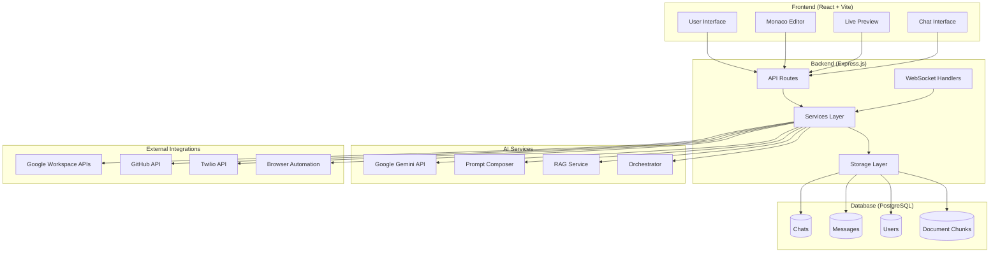
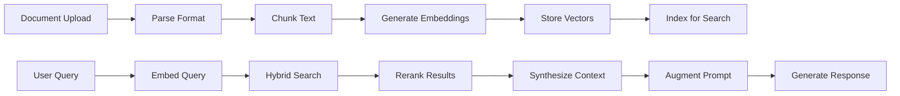
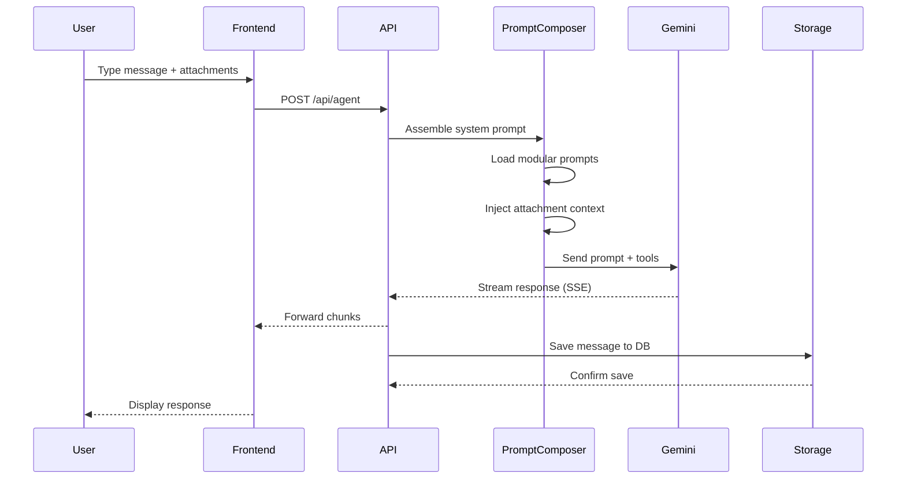
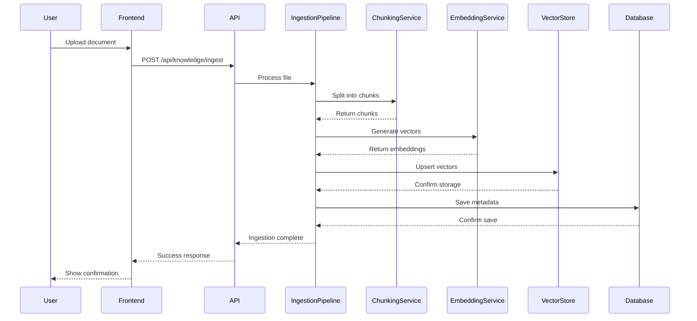
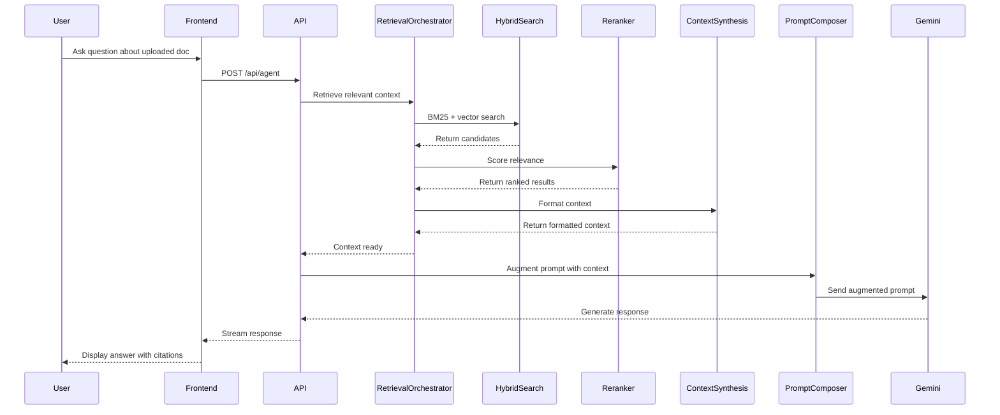

# Project Cliff Notes: Meowstik

> **Last Updated**: 2026-01-14  
> **Purpose**: High-level summary of Meowstik's capabilities, architecture, and key features

---

## Table of Contents
1. [What is Meowstik?](#what-is-meowstik)
2. [Core Capabilities](#core-capabilities)
3. [Architecture at a Glance](#architecture-at-a-glance)
4. [Tech Stack](#tech-stack)
5. [Key Features Deep Dive](#key-features-deep-dive)
6. [Data Flow](#data-flow)
7. [Quick Start for Developers](#quick-start-for-developers)

---

## What is Meowstik?

**Meowstik** is a **next-generation AI assistant platform** that combines conversational AI with deep integrations into Google Workspace, developer tools, and automation systems. Think of it as:

- **ChatGPT** + **Google Workspace** + **Zapier** + **VS Code** + **Browser Automation**

Built for both **end users** (chat interface, productivity tools) and **developers** (code execution, terminal access, browser automation), Meowstik bridges the gap between AI capabilities and real-world task execution.

### Key Differentiators

1. **Multi-Agent Orchestration**: Break down complex tasks into subtasks and delegate to specialized agents
2. **RAG-Powered Knowledge**: Retrieve information from Gmail, Drive, and uploaded documents before responding
3. **Real-World Integrations**: Actually send emails, create docs, schedule meetings—not just generate text
4. **Collaborative Features**: Real-time document editing with Yjs CRDT
5. **Developer Tools**: Built-in code editor, terminal, Python sandbox, browser automation

---

## Core Capabilities

### 1. Conversational AI (Powered by Google Gemini)

- **Real-time streaming responses** via Server-Sent Events
- **Multimodal understanding**: Text, images, audio, video
- **Chat history persistence** in PostgreSQL
- **Tool-calling architecture**: All responses are structured function calls

### 2. Google Workspace Integration

| Service | Capabilities |
|---------|--------------|
| **Gmail** | Send/receive emails, search, filter, reply |
| **Drive** | Upload/download files, list folders, share |
| **Docs** | Create/edit documents, format text |
| **Sheets** | Create spreadsheets, write formulas, read data |
| **Calendar** | Create events, check availability, send invites |
| **Tasks** | Manage task lists, mark complete |
| **Contacts** | Search contacts, add/update info |

### 3. Knowledge Retrieval (RAG)

- **Ingest** documents, emails, Drive files, chat history
- **Chunk** using paragraph, semantic, or hierarchical strategies
- **Embed** with Google Vertex AI (768-dimensional vectors)
- **Search** using hybrid BM25 + vector search with reranking
- **Augment** prompts with relevant context

### 4. Developer Tools

- **Code Editor**: Monaco (VS Code engine) with syntax highlighting
- **Live Preview**: Sandboxed iframe for HTML/CSS/JS
- **Terminal**: PTY-based shell access via WebSocket
- **Python Sandbox**: Execute Python code in isolated environment
- **Browser Automation**: Playwright integration for web scraping

### 5. Multi-Agent Orchestration

- **Task Decomposition**: Break "Plan a vacation" into "Search flights", "Book hotel", "Create itinerary"
- **Agent Registry**: Specialized agents for different domains (travel, coding, research)
- **Execution Context**: Shared state across multi-step tasks
- **Dependency Resolution**: Execute tasks in correct order using DAG

### 6. Voice & Media

- **Speech-to-Text**: Whisper API for audio transcription
- **Text-to-Speech**: Google Expressive TTS with multiple voices
- **Image Generation**: DALL-E / Imagen integration
- **Music Generation**: Lyria API for audio synthesis
- **Gemini Live**: Real-time voice conversations

### 7. Automation & Workflows

- **Cron Scheduling**: Schedule recurring tasks (daily reports, reminders)
- **Event Triggers**: Respond to webhooks, state changes
- **Multi-Step Workflows**: Define DAG of actions
- **Twilio Integration**: Send SMS, make voice calls

### 8. Collaborative Features

- **Real-time Co-Editing**: Yjs CRDT for conflict-free document collaboration
- **Desktop App Integration**: Bridge between web and native apps
- **Multi-Device Sync**: State synchronization across devices

---

## Architecture at a Glance



### Layers Explained

1. **Frontend**: React app using TanStack Query for state management, Wouter for routing
2. **API Layer**: Express routes handling HTTP and WebSocket connections
3. **Service Layer**: Business logic (orchestration, RAG, prompt composition, integrations)
4. **Storage Layer**: Repository pattern abstracting database operations
5. **Database**: PostgreSQL with Drizzle ORM, stores chats, messages, users, document chunks
6. **AI Services**: Gemini API for chat, Vertex AI for embeddings, prompt composition
7. **External Integrations**: Google Workspace, GitHub, Twilio, Playwright

---

## Tech Stack

### Frontend
- **Framework**: React 19
- **Build Tool**: Vite
- **Styling**: Tailwind CSS
- **UI Library**: Radix UI + Shadcn UI
- **Router**: Wouter
- **State Management**: TanStack Query
- **Code Editor**: Monaco Editor
- **Forms**: React Hook Form + Zod validation

### Backend
- **Runtime**: Node.js 20
- **Framework**: Express.js
- **Database**: PostgreSQL 16
- **ORM**: Drizzle ORM
- **Schema Validation**: Zod
- **WebSocket**: ws library
- **Session Store**: connect-pg-simple

### AI & ML
- **LLM**: Google Gemini (Flash, Pro, Ultra)
- **Embeddings**: Google Vertex AI (text-embedding-004)
- **Vector Search**: Hybrid BM25 + semantic search
- **RAG**: Custom pipeline (chunking, embedding, retrieval, reranking)
- **Orchestration**: Custom multi-agent system

### Integrations
- **Google**: googleapis (Drive, Gmail, Calendar, Docs, Sheets)
- **GitHub**: @octokit/rest
- **Twilio**: twilio SDK
- **Browser**: Playwright
- **SSH**: node-ssh
- **Voice**: Google Cloud Text-to-Speech, Whisper API

### Infrastructure
- **Hosting**: Replit
- **Authentication**: OAuth2 + Replit Auth
- **Real-time**: WebSocket + SSE
- **Collaboration**: Yjs CRDT
- **Task Queue**: Custom job queue system
- **Scheduling**: node-cron

---

## Key Features Deep Dive

### Feature 1: Chat Interface

**Purpose**: Conversational AI interface for natural language interaction

**Components**:
- [`client/src/pages/home.tsx`](../../client/src/pages/home.tsx): Main UI
- [`client/src/components/chat/sidebar.tsx`](../../client/src/components/chat/sidebar.tsx): Chat history
- [`client/src/components/chat/message.tsx`](../../client/src/components/chat/message.tsx): Message rendering
- [`client/src/components/chat/input-area.tsx`](../../client/src/components/chat/input-area.tsx): User input

**Features**:
- Markdown rendering with syntax highlighting
- Attachment support (files, screenshots, voice)
- Voice input via microphone
- Streaming responses
- Chat history organized by time (Today, Yesterday, Last 7 Days, etc.)

**Flow**:
1. User types message or records voice
2. Frontend sends POST to `/api/agent`
3. Backend assembles system prompt with attachments
4. Gemini API processes request
5. Response streams back via SSE
6. Message saved to database

### Feature 2: RAG (Retrieval-Augmented Generation)

**Purpose**: Enhance AI responses with relevant context from documents, emails, and files

**Pipeline**:


**Services**:
- [`ingestion-pipeline.ts`](../../server/services/ingestion-pipeline.ts): Process documents
- [`chunking-service.ts`](../../server/services/chunking-service.ts): Split text
- [`embedding-service.ts`](../../server/services/embedding-service.ts): Generate vectors
- [`hybrid-search.ts`](../../server/services/hybrid-search.ts): BM25 + vector search
- [`reranker.ts`](../../server/services/reranker.ts): Score relevance
- [`context-synthesis.ts`](../../server/services/context-synthesis.ts): Format context

**Use Cases**:
- "What did John say in his email last week?"
- "Summarize the Q4 report I uploaded"
- "Find all mentions of Project X in my Drive files"

### Feature 3: Multi-Agent Orchestration

**Purpose**: Break complex tasks into subtasks and coordinate execution

**Architecture**:
```mermaid
graph TD
    A[User Goal: "Plan team offsite"] --> B[Orchestrator: Decompose]
    B --> C[Task 1: Find venue]
    B --> D[Task 2: Check availability]
    B --> E[Task 3: Send calendar invites]
    C --> F[Agent: Travel]
    D --> G[Agent: Calendar]
    E --> G
    F --> H[Result Aggregation]
    G --> H
    H --> I[Final Response]
```

**Components**:
- **[`orchestrator.ts`](../../server/services/orchestrator.ts)**: Central coordinator
- **[`agent-registry.ts`](../../server/services/agent-registry.ts)**: Agent catalog
- **[`agent-worker.ts`](../../server/services/agent-worker.ts)**: Execute agent tasks
- **[`dependency-resolver.ts`](../../server/services/dependency-resolver.ts)**: Order tasks

**Process**:
1. **Plan**: Break user goal into tasks
2. **Select**: Choose agents for each task
3. **Resolve**: Determine execution order (DAG)
4. **Execute**: Run tasks with appropriate agents
5. **Aggregate**: Combine results
6. **Respond**: Present unified answer

### Feature 4: Google Workspace Integration

**Purpose**: Directly interact with Google services from chat

**Authentication**: OAuth2 flow with token storage

**Capabilities Matrix**:

| Action | Gmail | Drive | Docs | Sheets | Calendar | Tasks |
|--------|-------|-------|------|--------|----------|-------|
| Read | ✅ | ✅ | ✅ | ✅ | ✅ | ✅ |
| Create | ✅ | ✅ | ✅ | ✅ | ✅ | ✅ |
| Update | ✅ | ✅ | ✅ | ✅ | ✅ | ✅ |
| Delete | ✅ | ✅ | ❌ | ❌ | ✅ | ✅ |
| Share | N/A | ✅ | ✅ | ✅ | ✅ | ❌ |

**Example Interactions**:
- "Send an email to john@example.com with the Q4 report"
- "Create a Google Doc titled 'Meeting Notes'"
- "Add 'Buy groceries' to my task list"
- "Schedule a meeting with Sarah tomorrow at 2pm"
- "Upload this file to my Drive"

**Implementation**: Each service has dedicated integration file in [`server/integrations/`](../../server/integrations/)

### Feature 5: Code Editor & Live Preview

**Purpose**: Write and test HTML/CSS/JS code directly in the interface

**Components**:
- **[`editor.tsx`](../../client/src/pages/editor.tsx)**: Monaco editor (VS Code engine)
- **[`preview.tsx`](../../client/src/pages/preview.tsx)**: Sandboxed iframe

**Features**:
- Syntax highlighting for HTML, CSS, JavaScript, TypeScript, JSON, Markdown
- Auto-save to localStorage
- Light/dark themes
- Live preview with viewport simulation (mobile, tablet, desktop)
- Fullscreen mode

**Security**: Preview runs in sandboxed iframe with restricted permissions

### Feature 6: Developer Tools

**Terminal** ([`terminal.tsx`](../../client/src/pages/terminal.tsx)):
- PTY-based shell access
- Real-time output streaming via WebSocket
- Support for interactive commands

**Python Sandbox** ([`python-sandbox.tsx`](../../client/src/pages/python-sandbox.tsx)):
- Execute Python code in isolated environment
- REPL-style interface
- Output capture

**Browser Automation** ([`playwright-testing.tsx`](../../client/src/pages/playwright-testing.tsx)):
- Playwright integration
- Screenshot capture
- Web scraping
- Form filling

**Database Explorer** ([`database-explorer.tsx`](../../client/src/pages/database-explorer.tsx)):
- Direct SQL queries
- Table browsing
- Schema inspection

### Feature 7: Voice & Media

**Speech-to-Text**:
- Whisper API integration
- Real-time transcription
- Silence detection for auto-stop

**Text-to-Speech**:
- Google Expressive TTS
- Multiple voice options
- Playback controls

**Image Generation**:
- DALL-E / Imagen integration
- Text-to-image prompts
- Gallery view

**Music Generation**:
- Lyria API
- Text-to-music prompts
- Audio playback

**Gemini Live**:
- Real-time voice conversations
- Bidirectional audio streaming
- Tool call execution during conversation

### Feature 8: Automation & Workflows

**Cron Scheduling** ([`schedules.tsx`](../../client/src/pages/schedules.tsx)):
- Define recurring tasks
- Cron expression builder
- Enable/disable schedules

**Workflows** ([`workflow-executor.ts`](../../server/services/workflow-executor.ts)):
- Multi-step task definitions
- DAG-based execution
- Conditional logic

**Triggers** ([`trigger-service.ts`](../../server/services/trigger-service.ts)):
- Time-based (cron)
- Event-based (webhooks)
- Condition-based (state changes)

**Example Workflow**:
```yaml
name: Daily Standup Report
trigger: cron("0 9 * * 1-5")  # Weekdays at 9am
steps:
  - task: fetch_calendar_events
    params: { timeRange: "today" }
  - task: fetch_unread_emails
    params: { since: "yesterday" }
  - task: generate_summary
    params: { data: ["$step1", "$step2"] }
  - task: send_email
    params:
      to: "team@company.com"
      subject: "Daily Standup"
      body: "$step3"
```

---

## Data Flow

### User Sends a Message



### Document Ingestion (RAG)



### Query with RAG Context



---

## Quick Start for Developers

### Prerequisites
- Node.js 20+
- PostgreSQL 16+
- Google Cloud account (for Gemini API key)

### Setup

1. **Clone repository**:
   ```bash
   git clone https://github.com/jasonbender-c3x/Meowstik.git
   cd Meowstik
   ```

2. **Install dependencies**:
   ```bash
   npm install
   ```

3. **Configure environment**:
   ```bash
   cp .env.example .env
   # Edit .env with your API keys
   ```

4. **Initialize database**:
   ```bash
   npm run db:push
   ```

5. **Start development server**:
   ```bash
   npm run dev
   ```

6. **Open browser**:
   ```
   http://localhost:5000
   ```

### Project Structure

```
Meowstik/
├── client/                 # React frontend
│   ├── src/
│   │   ├── pages/          # Page components
│   │   ├── components/     # Reusable components
│   │   ├── hooks/          # Custom React hooks
│   │   ├── contexts/       # React contexts
│   │   └── lib/            # Utilities
├── server/                 # Express backend
│   ├── routes/             # API endpoints
│   ├── services/           # Business logic
│   ├── integrations/       # External APIs
│   ├── index.ts            # Entry point
│   ├── storage.ts          # Database layer
│   └── db.ts               # Drizzle connection
├── shared/                 # Shared code
│   └── schema.ts           # Database schema + Zod validation
├── prompts/                # Modular prompt files
├── docs/                   # Documentation
│   └── refactor/           # Refactor phase docs
├── package.json            # Dependencies
├── vite.config.ts          # Vite configuration
├── tsconfig.json           # TypeScript config
└── drizzle.config.ts       # Drizzle ORM config
```

### Key Commands

```bash
npm run dev              # Start full-stack dev server
npm run dev:client       # Frontend only (Vite)
npm run build            # Production build
npm run start            # Start production server
npm run check            # TypeScript type checking
npm run db:push          # Apply database schema changes
```

### Making Changes

1. **Update database schema**:
   - Edit [`shared/schema.ts`](../../shared/schema.ts)
   - Run `npm run db:push`

2. **Add new API route**:
   - Create file in [`server/routes/`](../../server/routes/)
   - Register in [`server/routes.ts`](../../server/routes.ts)

3. **Add new service**:
   - Create file in [`server/services/`](../../server/services/)
   - Export singleton instance
   - Use in routes/other services

4. **Add new page**:
   - Create file in [`client/src/pages/`](../../client/src/pages/)
   - Add route in [`client/src/App.tsx`](../../client/src/App.tsx)

5. **Update prompts**:
   - Edit files in [`prompts/`](../../prompts/)
   - No restart needed (loaded on each request)

### Testing

```bash
# No test suite currently
# Manual testing workflow:
1. Start dev server: npm run dev
2. Open http://localhost:5000
3. Test feature in UI
4. Check logs in terminal
5. Inspect database with Database Explorer
```

### Debugging

- **Frontend**: React DevTools + Browser DevTools
- **Backend**: Console logs + VS Code debugger
- **Database**: Database Explorer page or `psql` CLI
- **RAG Pipeline**: RAG Debug page
- **Orchestration**: Orchestration Logger queries

---

## Related Documentation

- **[Educational Glossary](./educational_glossary.md)**: Dictionary of all terms and concepts
- **[Theory vs Reality Diffs](./theory_vs_reality_diff.md)**: Discrepancies to fix
- **[Incomplete Features Audit](./incomplete_features_audit.md)**: Features needing attention
- **[System Overview](../SYSTEM_OVERVIEW.md)**: Detailed architecture documentation
- **[Features](../FEATURES.md)**: Complete feature list
- **[Quick Start](../QUICK_START.md)**: User-facing getting started guide

---

**End of Project Cliff Notes**
