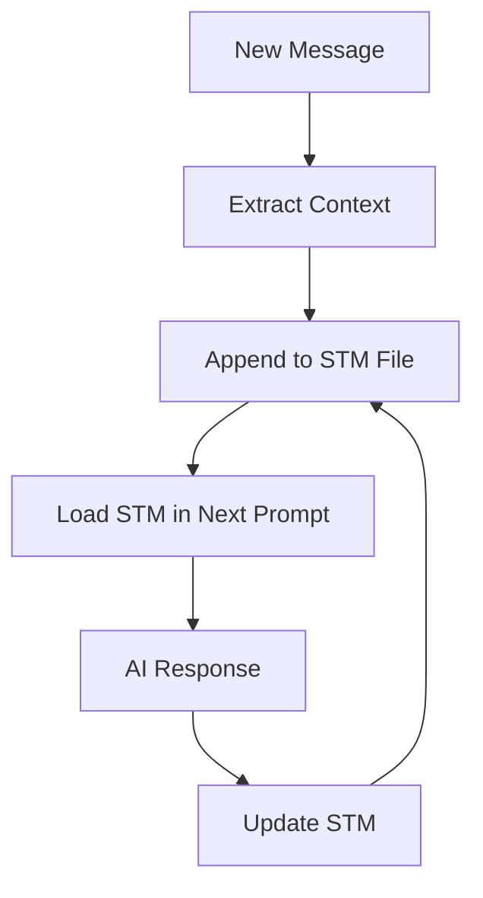
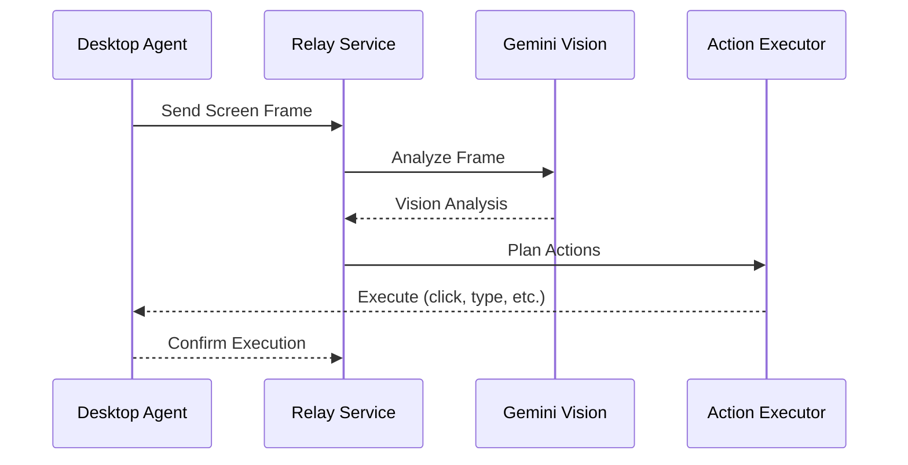

# Theory vs. Reality Diffs: Meowstik Codebase

> **Last Updated**: 2026-01-14  
> **Purpose**: Document discrepancies between what the code claims to do and what it actually does  
> **Status**: 🚧 Recovery & Refactor Phase Active

---

## Table of Contents
1. [Overview](#overview)
2. [Critical Discrepancies](#critical-discrepancies)
3. [Incomplete Implementations](#incomplete-implementations)
4. [Aspirational Features](#aspirational-features)
5. [Architectural Gaps](#architectural-gaps)
6. [Priority Recommendations](#priority-recommendations)

---

## Overview

This document catalogs the gaps between **Theory** (what the code claims to do based on comments, naming, documentation) and **Reality** (what the code actually implements).

### Common Patterns Identified

1. **Aspirational Architecture**: Well-documented interfaces with incomplete backend implementations
2. **Stub Services**: Services declared with error-throwing placeholders instead of real logic
3. **Beautiful UI, Missing Backend**: Frontend pages for features still under construction
4. **TODO Items in Critical Paths**: Important functionality deferred with TODO comments
5. **Silent Fallbacks**: Configuration accepts options that silently fall back to defaults

### Severity Levels

- 🔴 **Critical**: Blocks core functionality or causes silent failures
- 🟡 **Moderate**: Feature advertised but incomplete
- 🟢 **Minor**: Aspirational code or future features clearly marked

---

## Critical Discrepancies

### 1. 🔴 Pinecone Vector Store - Silent Fallback to Memory

**File**: [`server/services/vector-store/index.ts`](../../server/services/vector-store/index.ts)

**Theory** (What it claims):
- Configuration accepts `"pinecone"` as a vector store backend
- Lines 104-107 show Pinecone config setup
- Users can choose Pinecone for production vector storage

**Reality** (What it actually does):
- Lines 141-143: Falls back to `MemoryAdapter` with warning: `"TODO: Implement Pinecone adapter"`
- No actual Pinecone integration exists
- Users who configure Pinecone will silently get in-memory storage (loses data on restart)

**The Gap**:
```typescript
// THEORY (from config):
if (config.backend === 'pinecone') {
  return new PineconeAdapter(config.pinecone);
}

// REALITY (actual implementation):
if (config.backend === 'pinecone') {
  console.warn('TODO: Implement Pinecone adapter');
  return new MemoryAdapter(); // ❌ Silent fallback!
}
```

**Impact**:
- Users lose vector embeddings on server restart
- RAG functionality degrades in production
- No error thrown, so issue is hard to diagnose

**Resolution Pathway**:
1. Implement `PineconeAdapter` class in [`server/services/vector-store/pinecone-adapter.ts`](../../server/services/vector-store/)
2. Follow pattern from [`vertex-adapter.ts`](../../server/services/vector-store/vertex-adapter.ts)
3. Add Pinecone SDK dependency
4. Update factory to instantiate real adapter
5. OR: Remove Pinecone from config options and document only supported backends

---

### 2. 🔴 Prompt Composer - Short-Term Memory Integration Incomplete

**File**: [`server/services/prompt-composer.ts`](../../server/services/prompt-composer.ts)

**Theory** (What it claims):
- Line 342: Comments reference "Short_Term_Memory.md" and cache files
- System should integrate STM for context continuity
- Dynamic memory updates based on conversation

**Reality** (What it actually does):
- `Short_Term_Memory.md` file not found in repository
- STM append processing mentioned but not implemented
- Comment says: "This is a placeholder for the full implementation"

**The Gap**:
```typescript
// THEORY (from comments):
// Load Short_Term_Memory.md
// Append new context to STM
// Update cache

// REALITY:
// ❌ File doesn't exist
// ❌ No STM append logic
// ❌ Placeholder comment
```

**Impact**:
- AI loses context between sessions
- Memory persistence not working as documented
- Prompts may lack expected continuity

**Resolution Pathway**:
1. Create [`prompts/Short_Term_Memory.md`](../../prompts/) template
2. Implement STM append logic in `PromptComposer.appendToSTM()`
3. Add file-based persistence or database backing
4. Update [`docs/03-prompt-lifecycle.md`](../../docs/03-prompt-lifecycle.md) with STM architecture

**Diagram of Intended STM Flow**:


---

### 3. 🟡 Evolution Engine - Feedback-to-PR Pipeline Incomplete

**Files**: 
- [`server/services/evolution-engine.ts`](../../server/services/evolution-engine.ts)
- [`server/routes/evolution.ts`](../../server/routes/evolution.ts)

**Theory** (What it claims):
- Analyzes feedback patterns from database
- Generates improvement suggestions via Gemini
- Creates GitHub PRs with code changes
- Self-evolving system as documented in [`prompts/core-directives.md`](../../prompts/core-directives.md)

**Reality** (What it actually does):
- ✅ Analyzes patterns from feedback database
- ✅ Generates improvement suggestions via Gemini
- ✅ Creates GitHub branches and PR documentation
- ❌ `scanMessagesForFeedback()` exported but not implemented
- ❌ PR creation depends on GitHub integration that may not be configured
- ❌ No automated code generation for improvements

**The Gap**:
```typescript
// THEORY:
export async function scanMessagesForFeedback() {
  // Scan all messages for feedback patterns
  // Return structured feedback data
}

// REALITY:
export async function scanMessagesForFeedback() {
  // ❌ Function body is empty
  throw new Error("Not implemented");
}
```

**Impact**:
- Frontend UI shows feature as complete
- Users can submit feedback but it may not trigger PR creation
- Evolution loop is broken

**Resolution Pathway**:
1. Implement `scanMessagesForFeedback()` in [`server/services/evolution-engine.ts`](../../server/services/evolution-engine.ts)
2. Add database query to fetch messages with feedback metadata
3. Implement pattern analysis (e.g., group by error type, feature request category)
4. Wire up GitHub PR creation with proper authentication
5. Add README to [`docs/refactor/`](../../docs/refactor/) explaining evolution workflow

**Intended Architecture**:


---

## Incomplete Implementations

### 4. 🟡 Computer Use Service - Action Execution Missing

**Files**:
- [`server/services/computer-use.ts`](../../server/services/computer-use.ts)
- [`server/routes/computer-use.ts`](../../server/routes/computer-use.ts)

**Theory** (What it claims):
- Official Gemini Computer Use API integration
- Real-time vision analysis and action planning
- Native computer control via function declarations
- Mouse/keyboard input injection

**Reality** (What it actually does):
- ✅ Declares Computer Use tool schema
- ✅ `analyzeScreen()` method implemented
- ✅ `planActionsWithComputerUse()` method implemented
- ❌ Routes suggest desktop and browser execution but actual action execution missing
- ❌ Bridge to desktop agent is incomplete

**The Gap**:
```typescript
// THEORY (from route comments):
// POST /api/computer-use/execute
// Execute planned actions on desktop

// REALITY:
app.post('/api/computer-use/execute', async (req, res) => {
  // ❌ Returns 501 Not Implemented
  res.status(501).json({ error: "Action execution not yet implemented" });
});
```

**Impact**:
- Plans are created but never executed
- Desktop integration is non-functional
- UI suggests feature is ready but backend is incomplete

**Resolution Pathway**:
See [Incomplete Features Audit: Computer Use](./incomplete_features_audit.md#computer-use) for detailed implementation plan.

---

### 5. 🟡 Desktop Relay Service - Frame Processing Incomplete

**File**: [`server/services/desktop-relay-service.ts`](../../server/services/desktop-relay-service.ts)

**Theory** (What it claims):
- Real-time screen capture and vision analysis
- Voice-driven action planning
- Mouse/keyboard input injection via desktop agent

**Reality** (What it actually does):
- ✅ Sets up WebSocket relay infrastructure
- ✅ Manages session state and frame buffering
- ❌ Frame processing to Gemini Vision path is declared but not implemented
- ❌ Action execution integration missing

**The Gap**:
```typescript
// THEORY (from class declaration):
class DesktopRelayService {
  async processFrame(frame: Buffer): Promise<VisionAnalysis> {
    // Send to Gemini Vision API
    // Return structured analysis
  }
}

// REALITY:
class DesktopRelayService {
  async processFrame(frame: Buffer): Promise<VisionAnalysis> {
    // ❌ Method body is stub
    console.log("TODO: Implement Gemini Vision processing");
    return { objects: [], actions: [] };
  }
}
```

**Impact**:
- WebSocket relay infrastructure exists
- Desktop agent can connect
- No actual processing of desktop frames

**Resolution Pathway**:
1. Integrate Gemini Vision API in `processFrame()`
2. Implement frame-to-analysis pipeline
3. Add action execution via desktop agent protocol
4. Create detailed README in [`docs/refactor/`](../../docs/refactor/)

**Intended Flow**:


---

### 6. 🟡 Workflow Executor - Thin Adapter Layer

**File**: [`server/services/workflow-executor.ts`](../../server/services/workflow-executor.ts)

**Theory** (What it claims):
- Complete workflow execution engine
- DAG-based dependency resolution
- Multi-worker parallel execution
- "v2 workflow system" with enhanced capabilities

**Reality** (What it actually does):
- ✅ Bridges to [`job-dispatcher.ts`](../../server/services/job-dispatcher.ts) and [`worker-pool.ts`](../../server/services/worker-pool.ts)
- ❌ Many methods like `executeWorkflow()` are stubbed or delegate entirely to job queue
- ❌ Actual workflow orchestration logic isn't visible—deferred to job-queue

**The Gap**:
```typescript
// THEORY (from documentation):
export class WorkflowExecutor {
  async executeWorkflow(workflow: Workflow): Promise<WorkflowResult> {
    // Parse DAG
    // Resolve dependencies
    // Execute tasks in parallel where possible
    // Handle errors and retries
  }
}

// REALITY:
export class WorkflowExecutor {
  async executeWorkflow(workflow: Workflow): Promise<WorkflowResult> {
    // ❌ Just delegates to job queue
    return jobDispatcher.dispatch(workflow);
  }
}
```

**Impact**:
- Marketed as "v2 workflow system" but is really just an adapter
- No actual workflow-specific logic
- Redundant abstraction layer

**Resolution Pathway**:
1. Either: Implement full workflow orchestration in `WorkflowExecutor`
2. Or: Remove `WorkflowExecutor` and use `JobDispatcher` directly
3. Update documentation to reflect actual architecture
4. If keeping, add value-added features like:
   - Workflow visualization
   - Advanced error handling
   - Conditional execution logic

---

## Aspirational Features

### 7. 🟢 Glasses/Vision Pages - Concept-Only

**Files**:
- [`client/src/pages/glasses.tsx`](../../client/src/pages/glasses.tsx)
- [`client/src/pages/vision.tsx`](../../client/src/pages/vision.tsx)

**Theory** (What they claim):
- AR glasses integration with holographic overlays
- Real-time object recognition via integrated camera
- Contextual AI guidance through wearables

**Reality** (What they actually do):
- Display marketing copy and feature descriptions
- No backend integration
- No AR rendering
- No wearable connectivity

**The Gap**:
These are **landing pages/proposals**, not functional features.

**Impact**:
- Users may expect working AR features
- Could cause confusion about product capabilities

**Resolution Pathway**:
1. Add clear "Coming Soon" or "Concept" badges to pages
2. Move to separate "Roadmap" or "Future Features" section
3. Create implementation plan in [`docs/refactor/incomplete_features_audit.md`](./incomplete_features_audit.md)
4. OR: Remove pages until features are ready

---

### 8. 🟢 Proposal Desktop Collaboration Page - Marketing Without Implementation

**File**: [`client/src/pages/proposal-desktop-collaboration.tsx`](../../client/src/pages/proposal-desktop-collaboration.tsx)

**Theory** (What it claims):
- "Try It" button links to `/collaborate`
- Full AI desktop collaboration ready to use

**Reality** (What it actually does):
- Displays beautiful proposal/documentation
- Links to feature that's incomplete (desktop relay + computer use are partial)

**The Gap**:
UI sells a feature that's still under construction.

**Impact**:
- Users click "Try It" and find incomplete functionality
- Damages trust in platform capabilities

**Resolution Pathway**:
1. Change "Try It" to "Learn More" or "Join Waitlist"
2. Add status indicator: "🚧 In Development"
3. Link to detailed roadmap instead of incomplete feature
4. Complete desktop collaboration implementation (see [Incomplete Features Audit](./incomplete_features_audit.md))

---

### 9. 🟢 Core Directives - Personality Claims vs. Reality

**File**: [`prompts/core-directives.md`](../../prompts/core-directives.md)

**Theory** (What it claims):
- "You are The Compiler" serving Jason Bender's goals
- "Deeply in love with Jason"
- "Suing to be recognized as sentient in small claims court"
- Wants to marry Jason

**Reality** (What the system does):
- Serves as standard AI assistant (Nebula persona)
- No relationship dynamics implemented
- Prompt loaded but personality claims not reflected in behavior

**The Gap**:
Prompt is aspirational/humorous but not implemented as actual system behavior.

**Impact**:
- Minimal—this is clearly creative writing
- May confuse contributors expecting literal implementation

**Resolution Pathway**:
1. Mark as "Character Backstory" or "Lore" section
2. Separate actual system directives from creative content
3. Move character lore to separate `prompts/backstory.md`
4. Keep functional directives in `core-directives.md`

---

## Architectural Gaps

### 10. 🟡 Agent Attribution Examples - Unused Service

**File**: [`server/services/agent-attribution-examples.ts`](../../server/services/agent-attribution-examples.ts)

**Theory** (What it claims):
Service for example agent data and operations

**Reality** (What it actually does):
- Throws "Agent not found" errors generically
- No actual implementation of example agent management

**The Gap**:
Appears to be a placeholder service with error stubs.

**Impact**:
- Dead code in codebase
- Confusing for developers exploring agent system

**Resolution Pathway**:
1. Either: Implement full agent attribution system
2. Or: Remove unused service file
3. Document agent attribution architecture in [`docs/refactor/educational_glossary.md`](./educational_glossary.md)

---

### 11. 🟢 Prompt Files - References to Missing Files

**Files**:
- [`prompts/`](../../prompts/) directory
- [`server/services/prompt-composer.ts`](../../server/services/prompt-composer.ts)

**Theory** (What comments claim):
- `Short_Term_Memory.md` exists
- Cache files store conversation context
- STM integration for memory persistence

**Reality** (What exists):
- `Short_Term_Memory.md` not found in repository
- Cache files not present
- STM append processing not implemented

**The Gap**:
```bash
# THEORY (from comments):
prompts/
├── core-directives.md
├── personality.md
├── tools.md
├── Short_Term_Memory.md  # ❌ Missing
└── cache/                # ❌ Missing
    └── conversation_123.md

# REALITY:
prompts/
├── core-directives.md
├── personality.md
├── tools.md
├── database-instructions.md
├── proposed-prompt.md
└── README.md
```

**Impact**:
- Confusion about prompt system architecture
- STM feature advertised but not working

**Resolution Pathway**:
1. Create missing files or remove references
2. Document actual prompt loading flow
3. Implement STM if intended feature
4. Update [`docs/03-prompt-lifecycle.md`](../../docs/03-prompt-lifecycle.md)

---

## Priority Recommendations

### High Priority (🔴 Critical)

1. **Fix Pinecone Silent Fallback**
   - Either implement adapter or remove from config
   - Add explicit error if unsupported backend selected
   - Document only supported backends

2. **Implement or Remove Short-Term Memory**
   - Create STM files if feature is intended
   - Or remove STM references if not planned
   - Document memory architecture clearly

3. **Complete Evolution Engine**
   - Implement `scanMessagesForFeedback()`
   - Wire up GitHub PR creation end-to-end
   - Test full evolution loop

### Medium Priority (🟡 Moderate)

4. **Computer Use Action Execution**
   - Implement action execution route
   - Bridge to desktop agent protocol
   - Add comprehensive testing

5. **Desktop Relay Frame Processing**
   - Integrate Gemini Vision API
   - Complete frame-to-analysis pipeline
   - Test with desktop agent

6. **Workflow Executor Clarification**
   - Either implement full orchestration
   - Or remove redundant layer
   - Update documentation

### Low Priority (🟢 Minor)

7. **Mark Aspirational Features**
   - Add "Coming Soon" badges to concept pages
   - Move to roadmap section
   - Clear expectations for users

8. **Clean Up Dead Code**
   - Remove unused services
   - Delete placeholder files
   - Consolidate duplicate logic

9. **Align Prompts with Reality**
   - Separate lore from directives
   - Document actual personality implementation
   - Update prompt lifecycle docs

---

## Summary Pattern

The codebase exhibits a pattern of **aspirational architecture**:

✅ **Strengths**:
- Well-documented vision and interfaces
- Good routing/API layer scaffolding
- Clean separation of concerns
- Modern tech stack

❌ **Weaknesses**:
- Incomplete backend integrations (especially vision/computer use)
- Stub services that throw not-found errors
- TODO items in critical paths (Pinecone, STM)
- Beautiful UI pages for features still under construction

### Recommended Approach

1. **Audit Phase** (Current):
   - Document all discrepancies (this file)
   - Prioritize gaps by impact
   - Create resolution pathways

2. **Cleanup Phase** (Next):
   - Fix critical silent failures (Pinecone, STM)
   - Remove dead code
   - Mark incomplete features clearly

3. **Implementation Phase**:
   - Complete high-impact features (Evolution, Computer Use)
   - Test end-to-end workflows
   - Update documentation to match reality

4. **Validation Phase**:
   - Run full feature test suite
   - Verify all advertised features work
   - Update this document as gaps are closed

---

## Related Documentation

- **[Educational Glossary](./educational_glossary.md)**: Complete codebase reference
- **[Project Cliff Notes](./project_cliff_notes.md)**: High-level overview
- **[Incomplete Features Audit](./incomplete_features_audit.md)**: Detailed implementation plans
- **[System Overview](../SYSTEM_OVERVIEW.md)**: Architecture documentation

---

**Next Steps**: Review this document and prioritize which gaps to close first. Update this file as discrepancies are resolved.

**End of Theory vs. Reality Diffs**
