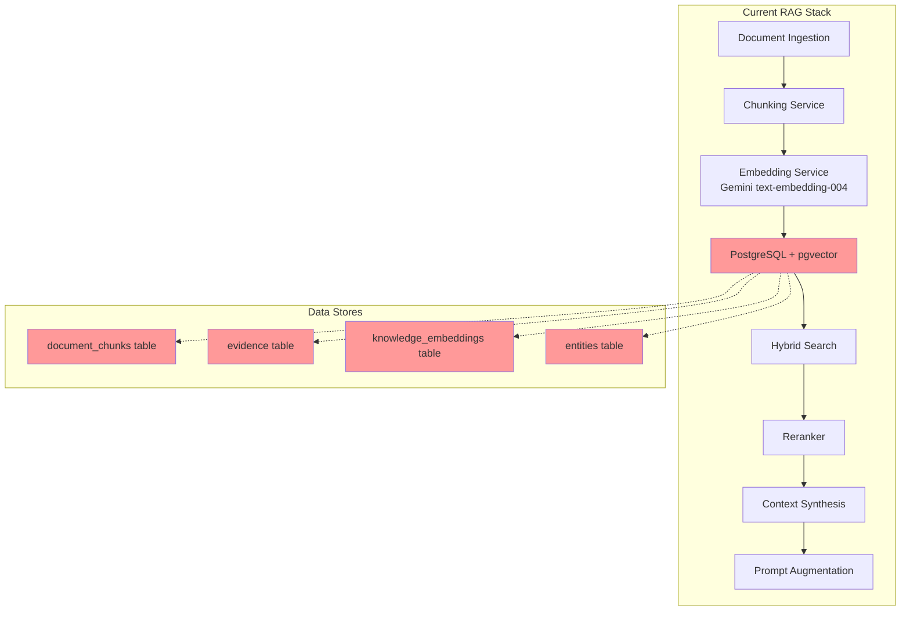
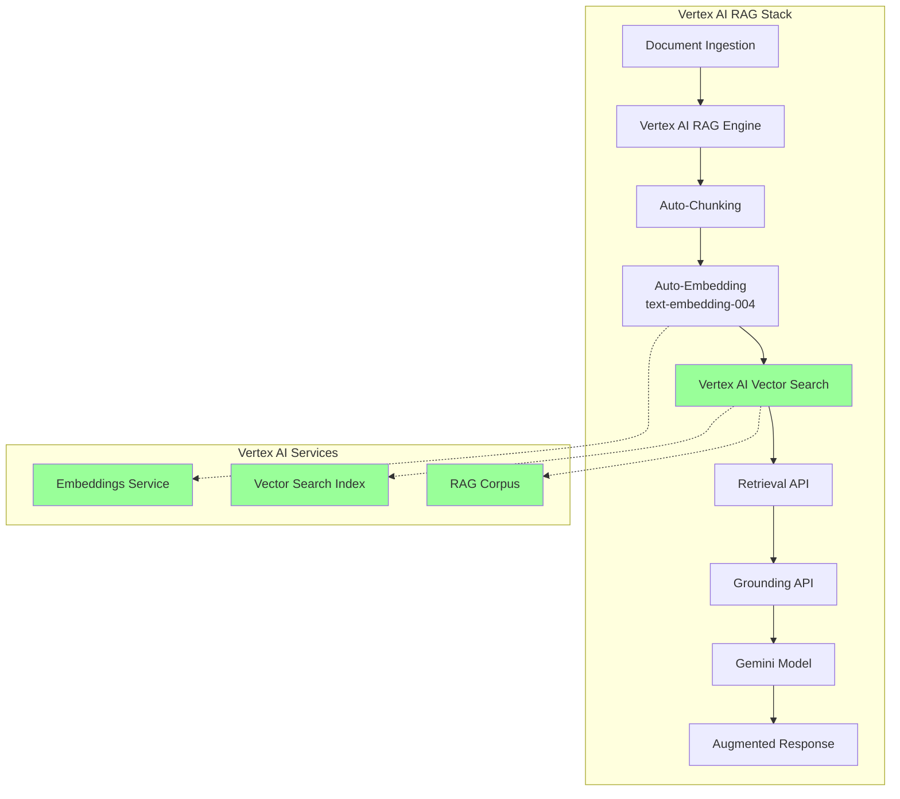
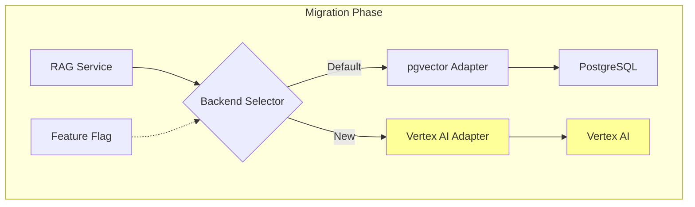

# Vertex AI RAG Migration: Architectural Document

> **Objective**: Migrate Meowstik's RAG processing stack to Google Cloud's Vertex AI for platform independence, scalability, and reduced maintenance burden.
>
> **Status**: Architecture Phase  
> **Author**: Meowstik AI Architecture Team  
> **Date**: January 15, 2026

---

## Executive Summary

This document outlines the migration of Meowstik's Retrieval-Augmented Generation (RAG) processing stack from a hybrid PostgreSQL/pgvector solution to Google Cloud's Vertex AI managed services. This migration advances the goal of **platform independence** by leveraging fully managed, cloud-native services that eliminate infrastructure management overhead.

### Key Benefits

1. **Platform Independence**: Vertex AI is cloud-agnostic and can be deployed across multiple environments
2. **Reduced Operational Overhead**: Fully managed service eliminates database tuning, index optimization, and scaling concerns
3. **Enterprise-Grade Infrastructure**: Built on Google Cloud's battle-tested infrastructure with automatic scaling
4. **Advanced Features**: Built-in support for hybrid search, reranking, and grounding
5. **Cost Efficiency**: Pay-per-use pricing with generous free tier ($300 credits for 90 days)

---

## Current State Analysis

### Existing Architecture



### Current Components

| Component | Location | Technology | Status |
|-----------|----------|------------|--------|
| **Embedding Service** | `server/services/embedding-service.ts` | Gemini API (text-embedding-004) | ✅ Working |
| **Chunking Service** | `server/services/chunking-service.ts` | Custom (paragraph/sentence/semantic) | ✅ Working |
| **Vector Store** | `server/services/vector-store/pgvector-adapter.ts` | PostgreSQL + pgvector extension | ✅ Working |
| **Ingestion Pipeline** | `server/services/ingestion-pipeline.ts` | Custom pipeline | ✅ Working |
| **Retrieval Orchestrator** | `server/services/retrieval-orchestrator.ts` | Hybrid search (semantic + keyword) | ✅ Working |
| **RAG Service** | `server/services/rag-service.ts` | Orchestration layer | ✅ Working |

### Current Data Flow

```
Input Document
    ↓
Extract Text (based on MIME type)
    ↓
Chunk Document (paragraph/sentence/fixed/semantic)
    ↓
Generate Embeddings (Gemini API - 768 dimensions)
    ↓
Store in PostgreSQL (pgvector extension)
    ↓
    ├─→ document_chunks table (for RAG)
    ├─→ evidence table (for knowledge ingestion)
    └─→ knowledge_embeddings table (linked to evidence)
    ↓
Query Processing
    ↓
Generate Query Embedding (Gemini API)
    ↓
Hybrid Search (Semantic + Keyword)
    ↓
Rerank Results (optional)
    ↓
Synthesize Context
    ↓
Augment Prompt
```

### Pain Points with Current Architecture

1. **Infrastructure Management**: Requires PostgreSQL maintenance, pgvector extension management, and index optimization
2. **Scaling Complexity**: Manual tuning of IVFFlat indices and connection pooling
3. **Limited Platform Portability**: Tight coupling to PostgreSQL infrastructure
4. **Index Maintenance**: IVFFlat indices require periodic rebuilding as data grows
5. **Custom Implementation**: Many RAG features (reranking, hybrid search) implemented from scratch

---

## Target State Architecture

### Vertex AI RAG Engine Overview

Vertex AI RAG Engine is Google Cloud's fully managed RAG service that provides:

- **Managed Vector Search**: High-performance vector similarity search
- **Automatic Chunking**: Built-in document chunking strategies
- **Native Grounding**: Direct integration with Gemini models for grounding
- **Hybrid Search**: Semantic + keyword search out of the box
- **Corpus Management**: Organized storage of knowledge bases
- **Access Control**: Fine-grained IAM permissions

### Target Architecture



### New Data Flow

```
Input Document
    ↓
Upload to Vertex AI RAG Corpus
    ↓
[Vertex AI Handles Internally]
    ├─→ Automatic Chunking (configurable)
    ├─→ Automatic Embedding (text-embedding-004)
    └─→ Vector Index Creation/Update
    ↓
Query Processing
    ↓
Call Vertex AI retrieveContexts API
    ↓
[Vertex AI Handles Internally]
    ├─→ Query Embedding
    ├─→ Vector Similarity Search
    ├─→ Hybrid Search (semantic + keyword)
    └─→ Optional Reranking
    ↓
Receive Ranked Contexts
    ↓
Ground with Gemini (via Grounding API)
    ↓
Return Augmented Response
```

---

## Migration Strategy

### Phased Approach

We will use a **phased migration** strategy to minimize risk and maintain service continuity:

#### Phase 1: Parallel Operation (Safe Mode)
- Deploy Vertex AI adapter alongside existing pgvector adapter
- Use feature flags to control which backend is active
- Run both systems in parallel for validation
- No breaking changes to existing APIs

#### Phase 2: Gradual Traffic Shift
- Start with 10% of traffic to Vertex AI
- Monitor performance, costs, and errors
- Gradually increase traffic (25%, 50%, 75%, 100%)
- Keep pgvector as fallback

#### Phase 3: Full Migration
- All traffic routed to Vertex AI
- pgvector maintained as read-only archive
- Remove feature flags after stability confirmed

#### Phase 4: Cleanup (Optional)
- Deprecate pgvector adapter
- Migrate historical data if needed
- Remove legacy code

### Migration Architecture



---

## Component-by-Component Migration Plan

### 1. Embedding Service

**Current**: Direct calls to Gemini API for embeddings

```typescript
// Current implementation
async embed(text: string): Promise<EmbeddingResult> {
  const result = await client.models.embedContent({
    model: "text-embedding-004",
    contents: [{ role: "user", parts: [{ text }] }],
  });
  return { embedding: result.embeddings[0].values || [] };
}
```

**Target**: Use Vertex AI Embeddings API (still using text-embedding-004, but through Vertex AI)

```typescript
// New implementation (via Vertex AI)
async embed(text: string): Promise<EmbeddingResult> {
  const request = {
    instances: [{ content: text }],
  };
  
  const endpoint = `projects/${projectId}/locations/${location}/publishers/google/models/text-embedding-004`;
  const [response] = await predictionServiceClient.predict(endpoint, request);
  
  return { embedding: response.predictions[0].embeddings.values };
}
```

**Migration Notes**:
- Same model (text-embedding-004), different API
- Add fallback to direct Gemini API if Vertex AI unavailable
- Batch operations supported in both

### 2. Vector Storage

**Current**: pgvector in PostgreSQL

```typescript
// Current storage
await getDb().execute(sql`
  INSERT INTO vector_store (id, content, embedding, metadata)
  VALUES (${id}, ${content}, ${embedding}::vector, ${metadata}::jsonb)
`);
```

**Target**: Vertex AI RAG Corpus

```typescript
// New storage
await vertexClient.importRagFiles({
  parent: corpusName,
  importRagFilesConfig: {
    ragFileChunkingConfig: {
      chunkSize: 512,
      chunkOverlap: 100,
    },
    inlineSource: {
      ragFiles: [{
        displayName: id,
        description: JSON.stringify(metadata),
        inlineContent: {
          mimeType: "text/plain",
          data: Buffer.from(content).toString("base64"),
        },
      }],
    },
  },
});
```

**Migration Notes**:
- Vertex AI handles chunking automatically
- Need to adjust chunking strategy to match Vertex AI's capabilities
- Metadata stored in `description` field (requires serialization)

### 3. Retrieval / Search

**Current**: Custom hybrid search (semantic + keyword)

```typescript
// Current retrieval
const results = await getDb().execute(sql`
  SELECT id, content, 
         1 - (embedding <=> ${queryEmbedding}::vector) as similarity
  FROM vector_store
  ORDER BY embedding <=> ${queryEmbedding}::vector
  LIMIT ${topK}
`);
```

**Target**: Vertex AI retrieveContexts API

```typescript
// New retrieval
const response = await vertexClient.retrieveContexts({
  parent: corpusName,
  query: { text: queryText },
  similarityTopK: topK,
  // Optional: hybrid search, reranking, filtering
});

return response.contexts.map(ctx => ({
  content: ctx.text,
  score: ctx.score,
  sourceUri: ctx.sourceUri,
}));
```

**Migration Notes**:
- Vertex AI returns text chunks, not raw embeddings
- Built-in hybrid search (no custom implementation needed)
- Native support for metadata filtering

### 4. Ingestion Pipeline

**Current**: Custom pipeline with multiple storage tables

```typescript
// Current ingestion
const chunks = await chunkingService.chunkDocument(content);
const embeddings = await embeddingService.embedBatch(chunks);
await storage.createDocumentChunk({ content, embedding, metadata });
await storage.createEvidence({ extractedText, bucket, ... });
await storage.createKnowledgeEmbedding({ evidenceId, embedding, ... });
```

**Target**: Simplified pipeline using Vertex AI

```typescript
// New ingestion
await vertexRagService.ingestDocument({
  content,
  metadata: {
    filename,
    bucket,
    sourceType,
    // ... other metadata
  },
  chunkingOptions: {
    strategy: 'paragraph',
    maxChunkSize: 512,
    overlap: 100,
  },
});

// Keep evidence table for metadata tracking
await storage.createEvidence({ extractedText, bucket, ... });
```

**Migration Notes**:
- Vertex AI handles chunking + embedding + storage
- Still maintain `evidence` table for metadata and cross-references
- Simpler code, fewer error points

---

## Data Model Changes

### Current Database Schema

```sql
-- Current RAG tables
CREATE TABLE document_chunks (
  id UUID PRIMARY KEY,
  document_id TEXT,
  attachment_id TEXT,
  chunk_index INTEGER,
  content TEXT,
  embedding REAL[],  -- 768-dimensional vector
  metadata JSONB,
  created_at TIMESTAMP
);

CREATE TABLE evidence (
  id UUID PRIMARY KEY,
  source_type TEXT,
  extracted_text TEXT,
  summary TEXT,
  bucket TEXT,  -- PERSONAL_LIFE, CREATOR, PROJECTS
  metadata JSONB
);

CREATE TABLE knowledge_embeddings (
  id UUID PRIMARY KEY,
  evidence_id UUID REFERENCES evidence,
  chunk_index INTEGER,
  embedding REAL[],  -- 768-dimensional vector
  chunk_text TEXT
);
```

### Target Schema

```sql
-- Simplified schema (Vertex AI handles vectors)
CREATE TABLE evidence (
  id UUID PRIMARY KEY,
  source_type TEXT,
  extracted_text TEXT,
  summary TEXT,
  bucket TEXT,
  metadata JSONB,
  vertex_rag_file_id TEXT,  -- NEW: Reference to Vertex AI file
  vertex_corpus_name TEXT    -- NEW: Which corpus this belongs to
);

-- Optional: Mapping table for migration
CREATE TABLE rag_migration_mapping (
  old_chunk_id UUID,
  vertex_file_id TEXT,
  migrated_at TIMESTAMP,
  status TEXT  -- 'pending', 'success', 'failed'
);
```

**Key Changes**:
1. Remove `document_chunks` table (Vertex AI stores chunks)
2. Remove `knowledge_embeddings` table (Vertex AI stores embeddings)
3. Keep `evidence` table for metadata and business logic
4. Add Vertex AI reference fields for tracking

---

## API Changes

### Existing API Endpoints

| Endpoint | Method | Purpose | Change Required |
|----------|--------|---------|-----------------|
| `/api/knowledge/pipeline/ingest` | POST | Ingest document | ⚠️ Update backend |
| `/api/knowledge/pipeline/retrieve` | POST | Retrieve contexts | ⚠️ Update backend |
| `/api/knowledge/pipeline/retrieval-stats` | GET | Get statistics | ⚠️ Update data source |

### API Contract (No Breaking Changes)

```typescript
// Request/Response interfaces remain the same

// POST /api/knowledge/pipeline/ingest
interface IngestRequest {
  content: string;
  filename: string;
  mimeType?: string;
  options?: {
    strategy?: 'paragraph' | 'sentence' | 'fixed' | 'semantic';
    maxChunkSize?: number;
  };
}

interface IngestResponse {
  documentId: string;
  chunksCreated: number;
  success: boolean;
  error?: string;
}

// POST /api/knowledge/pipeline/retrieve
interface RetrieveRequest {
  query: string;
  maxTokens?: number;
  includeEntities?: boolean;
}

interface RetrieveResponse {
  items: Array<{
    type: string;
    content: string;
    score: number;
  }>;
  totalTokensUsed: number;
}
```

**Backend Implementation Changes**:
- Swap out vector store adapter
- Maintain same interface to calling code
- Add feature flag for gradual rollout

---

## Configuration Management

### Environment Variables

```bash
# Current Configuration
DATABASE_URL=postgresql://...           # pgvector database
GEMINI_API_KEY=...                       # For embeddings

# New Configuration (Additive)
GOOGLE_CLOUD_PROJECT=my-project          # GCP project ID
GOOGLE_CLOUD_LOCATION=us-central1        # Vertex AI region
VERTEX_RAG_CORPUS=meowstik-kb            # RAG corpus name
GOOGLE_APPLICATION_CREDENTIALS=/path...   # Service account key

# Feature Flags
VECTOR_STORE_BACKEND=vertex              # 'pgvector' | 'vertex' | 'hybrid'
VERTEX_AI_ENABLED=true                   # Enable Vertex AI features
MIGRATION_MODE=parallel                  # 'parallel' | 'vertex-only' | 'pgvector-only'
```

### Configuration Precedence

1. **Development**: Use pgvector (no GCP credentials needed)
2. **Staging**: Use hybrid mode (both backends)
3. **Production**: Use Vertex AI (pgvector as fallback)

---

## Cost Analysis

### Current Costs (pgvector)

| Component | Cost Driver | Monthly Estimate |
|-----------|-------------|------------------|
| PostgreSQL Database | Storage + Compute | $10-50 (Replit) |
| Gemini Embeddings API | API calls | ~$0.10 per 1M tokens |
| Infrastructure | Maintenance time | (Ops overhead) |

### Projected Costs (Vertex AI)

| Component | Cost Driver | Monthly Estimate |
|-----------|-------------|------------------|
| Vertex AI Vector Search | Storage + Queries | $20-100 (scales with usage) |
| Vertex AI Embeddings | API calls (same as before) | ~$0.10 per 1M tokens |
| Managed Service | Fully managed (no ops) | $0 (included) |

**Cost-Benefit Analysis**:
- Slightly higher infrastructure cost (~$10-50/month more)
- Significantly reduced operational overhead (no DB tuning, indexing, scaling)
- Better scaling characteristics (automatic)
- Enterprise-grade SLA

**Free Tier**:
- New GCP accounts: $300 credits for 90 days
- Covers development and testing phase
- Production costs scale with actual usage

---

## Performance Considerations

### Latency Comparison

| Operation | pgvector | Vertex AI | Notes |
|-----------|----------|-----------|-------|
| Embed single text | ~50-100ms | ~50-100ms | Same API (via Vertex) |
| Embed batch (10 texts) | ~200-300ms | ~200-300ms | Parallel batch support |
| Store chunk | ~10-20ms | ~100-200ms | Vertex has ingestion lag |
| Search (top 5) | ~10-50ms | ~50-150ms | Network latency to GCP |
| Search (top 20) | ~20-100ms | ~80-200ms | Better at scale |

**Key Takeaways**:
- Slightly higher latency for individual operations (network round-trip)
- Better performance at scale (optimized index structures)
- Automatic scaling handles traffic spikes
- Suitable for production workloads with proper caching

### Optimization Strategies

1. **Batch Operations**: Group multiple ingestions/retrievals
2. **Caching**: Cache frequent queries at application layer
3. **Regional Deployment**: Deploy in same region as Vertex AI
4. **Connection Pooling**: Reuse gRPC connections to Vertex AI
5. **Async Processing**: Offload ingestion to background jobs

---

## Risk Assessment

### Technical Risks

| Risk | Severity | Mitigation |
|------|----------|------------|
| **Vendor Lock-in** | Medium | Maintain adapter pattern for easy switching |
| **API Changes** | Low | Vertex AI has stable API; use versioned endpoints |
| **Performance Regression** | Medium | Parallel operation during migration; rollback capability |
| **Data Migration** | Low | Phased approach; no data loss with hybrid mode |
| **Cost Overrun** | Low | Monitor costs; free tier for development |

### Operational Risks

| Risk | Severity | Mitigation |
|------|----------|------------|
| **GCP Outage** | Medium | Fallback to pgvector; multi-region deployment |
| **Authentication Issues** | Low | Well-documented setup; service account best practices |
| **Rate Limiting** | Low | Batch operations; respect quota limits |
| **Team Learning Curve** | Low | Comprehensive documentation; similar to existing flow |

---

## Success Metrics

### Key Performance Indicators (KPIs)

1. **Migration Completeness**
   - Target: 100% of ingestion using Vertex AI
   - Measure: Percentage of documents in Vertex AI vs. pgvector

2. **Query Performance**
   - Target: <500ms p95 latency for retrieval
   - Measure: Application performance monitoring

3. **Cost Efficiency**
   - Target: <20% increase in infrastructure costs
   - Measure: GCP billing dashboard

4. **System Reliability**
   - Target: 99.9% uptime
   - Measure: Error rates, fallback usage

5. **Operational Overhead**
   - Target: 50% reduction in RAG-related maintenance
   - Measure: Time tracking on DB tuning, index management

---

## Timeline and Milestones

### Estimated Timeline: 2-3 Weeks

#### Week 1: Architecture & Setup
- **Days 1-2**: Architecture document (this document)
- **Days 3-4**: Implementation guide
- **Day 5**: Review and approval

#### Week 2: Implementation
- **Days 1-2**: Vertex AI adapter implementation
- **Days 3-4**: Ingestion pipeline integration
- **Day 5**: Retrieval orchestrator integration

#### Week 3: Testing & Deployment
- **Days 1-2**: Integration testing
- **Days 3-4**: Parallel operation and validation
- **Day 5**: Gradual traffic shift

#### Week 4: Stabilization (if needed)
- Monitor and optimize
- Handle edge cases
- Complete documentation

---

## Next Steps

1. ✅ Review this architectural document
2. ⏭️ Create detailed implementation guide
3. ⏭️ Set up GCP project and Vertex AI access
4. ⏭️ Implement Vertex AI adapter
5. ⏭️ Deploy in parallel mode
6. ⏭️ Validate and migrate traffic

---

## References

- [Vertex AI RAG Engine Documentation](https://cloud.google.com/vertex-ai/docs/generative-ai/rag-engine)
- [Vertex AI Vector Search](https://cloud.google.com/vertex-ai/docs/vector-search/overview)
- [Current RAG Pipeline Documentation](../RAG_PIPELINE.md)
- [Vector Store README](../../server/services/vector-store/README.md)

---

*This document is part of the Meowstik platform independence initiative.*  
*Version 1.0 - January 2026*
