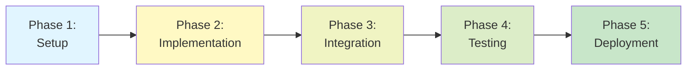

# Vertex AI RAG Migration Documentation

> **Complete documentation for migrating Meowstik's RAG processing stack to Google Cloud Vertex AI**

---

## 📚 Documentation Index

### Core Documents

1. **[ARCHITECTURE.md](./ARCHITECTURE.md)** - Comprehensive architectural analysis
   - Current vs. target state comparison
   - Component-by-component migration strategy
   - Data model changes
   - Risk assessment and success metrics
   - **Read this first** to understand the big picture

2. **[IMPLEMENTATION_GUIDE.md](./IMPLEMENTATION_GUIDE.md)** - Step-by-step implementation instructions
   - Prerequisites and GCP setup
   - Detailed code implementation steps
   - Testing and validation procedures
   - Deployment and rollback strategies
   - Troubleshooting guide
   - **Use this as your implementation checklist**

---

## 🎯 Quick Start

### For Architects and Decision Makers

Read: [ARCHITECTURE.md](./ARCHITECTURE.md)

**Key Sections**:
- Executive Summary
- Current State Analysis
- Target State Architecture
- Cost Analysis
- Risk Assessment

### For Developers and Implementers

Read: [IMPLEMENTATION_GUIDE.md](./IMPLEMENTATION_GUIDE.md)

**Key Sections**:
- Prerequisites
- Phase 2: Vertex AI Adapter Implementation
- Phase 4: Testing and Validation
- Troubleshooting

---

## 🏗️ Migration Phases



### Phase 1: Setup and Configuration (Days 1-2)
- GCP project setup
- Service account creation
- Environment configuration
- Dependency installation

### Phase 2: Implementation (Days 3-5)
- Enhance Vertex AI adapter
- Create hybrid adapter for migration
- Update configuration system

### Phase 3: Integration (Days 6-7)
- Integrate with existing services
- Update RAG service
- Add feature flags

### Phase 4: Testing (Days 8-10)
- Unit tests
- Integration tests
- Performance benchmarks
- Migration validation

### Phase 5: Deployment (Days 11-14)
- Gradual rollout (10% → 100%)
- Data migration
- Monitoring and optimization

---

## 🔑 Key Concepts

### Adapter Pattern

The migration uses the **Adapter Pattern** to abstract vector storage:

```
Application Code
      ↓
VectorStoreAdapter Interface
      ↓
  ┌───┴───┐
  ↓       ↓
pgvector  Vertex AI
```

This allows:
- Seamless backend switching
- Parallel operation during migration
- Easy rollback if needed

### Hybrid Mode

During migration, both backends run in parallel:

```
Write Operations: → Both pgvector AND Vertex AI
Read Operations:  → Vertex AI (with pgvector fallback)
```

Benefits:
- Zero downtime migration
- Data redundancy
- Safe rollback path

---

## 📊 Success Metrics

| Metric | Target | Current | Status |
|--------|--------|---------|--------|
| Migration Completeness | 100% | 0% | 🔄 In Progress |
| Query Latency (p95) | <500ms | - | ⏸️ Not Started |
| Cost Increase | <20% | - | ⏸️ Not Started |
| System Uptime | 99.9% | - | ⏸️ Not Started |
| Ops Overhead Reduction | 50% | - | ⏸️ Not Started |

---

## 🛠️ Prerequisites Checklist

Before starting implementation:

- [ ] Read and understand [ARCHITECTURE.md](./ARCHITECTURE.md)
- [ ] Review [IMPLEMENTATION_GUIDE.md](./IMPLEMENTATION_GUIDE.md)
- [ ] GCP account with billing enabled
- [ ] `gcloud` CLI installed and configured
- [ ] Vertex AI API enabled in GCP project
- [ ] Service account created with appropriate permissions
- [ ] Service account key downloaded securely
- [ ] Environment variables configured
- [ ] Team approval and stakeholder buy-in

---

## 🚀 Getting Started

### Step 1: Setup GCP

```bash
# Create project
gcloud projects create meowstik-vertex-ai

# Enable APIs
gcloud services enable aiplatform.googleapis.com

# Create service account
gcloud iam service-accounts create meowstik-vertex-ai

# Grant permissions
gcloud projects add-iam-policy-binding $PROJECT_ID \
  --member="serviceAccount:meowstik-vertex-ai@$PROJECT_ID.iam.gserviceaccount.com" \
  --role="roles/aiplatform.user"

# Create key
gcloud iam service-accounts keys create ~/vertex-ai-key.json \
  --iam-account=meowstik-vertex-ai@$PROJECT_ID.iam.gserviceaccount.com
```

### Step 2: Configure Environment

```bash
# Add to .env
echo "GOOGLE_CLOUD_PROJECT=meowstik-vertex-ai" >> .env
echo "GOOGLE_CLOUD_LOCATION=us-central1" >> .env
echo "GOOGLE_APPLICATION_CREDENTIALS=$HOME/vertex-ai-key.json" >> .env
echo "VECTOR_STORE_BACKEND=hybrid" >> .env
```

### Step 3: Install Dependencies

```bash
npm install @google-cloud/aiplatform @google-cloud/vertexai google-auth-library
```

### Step 4: Run Tests

```bash
npx tsx scripts/test-vertex-ai-migration.ts
```

---

## 🔍 Verification

After implementation, verify with:

```bash
# Health check
curl http://localhost:5000/api/vector-store/health

# Run benchmarks
npx tsx scripts/benchmark-vector-store.ts

# Check logs
tail -f logs/vertex-ai-migration.log
```

---

## ⚠️ Important Notes

### Security

- **Never commit** service account keys to git
- Store keys in secure locations (environment variables, secrets manager)
- Rotate keys regularly
- Use least-privilege IAM roles

### Cost Management

- Monitor GCP billing dashboard daily during migration
- Set up billing alerts ($50, $100, $500)
- Vertex AI has a generous free tier ($300 credits)
- Consider regional deployment to reduce data transfer costs

### Data Safety

- The hybrid adapter writes to BOTH backends during migration
- No data loss risk - redundancy built-in
- Rollback is instant (just change environment variable)
- Keep pgvector as read-only archive after migration

---

## 📞 Support and Feedback

### Questions?

- Review the troubleshooting section in [IMPLEMENTATION_GUIDE.md](./IMPLEMENTATION_GUIDE.md)
- Check Vertex AI documentation: https://cloud.google.com/vertex-ai/docs
- Open an issue in the repository

### Feedback

After completing the migration, please update this documentation with:
- Lessons learned
- Issues encountered and solutions
- Performance metrics
- Cost analysis

---

## 📅 Timeline

| Week | Focus | Deliverables |
|------|-------|--------------|
| Week 1 | Architecture & Setup | ✅ Architecture doc<br/>✅ Implementation guide<br/>✅ GCP setup |
| Week 2 | Implementation | Vertex AI adapter<br/>Hybrid adapter<br/>Integration |
| Week 3 | Testing & Deployment | Tests passing<br/>Parallel operation<br/>Gradual rollout |
| Week 4 | Stabilization | 100% traffic<br/>Performance tuning<br/>Documentation |

---

## 🔗 Related Documentation

- [RAG Pipeline Documentation](../RAG_PIPELINE.md)
- [Vector Store README](../../server/services/vector-store/README.md)
- [System Overview](../SYSTEM_OVERVIEW.md)
- [Database Schemas](../01-database-schemas.md)

---

## 📝 Change Log

| Date | Version | Changes |
|------|---------|---------|
| 2026-01-15 | 1.0 | Initial documentation created |

---

*This documentation is part of the Meowstik platform independence initiative.*  
*For questions or contributions, please open an issue or pull request.*
